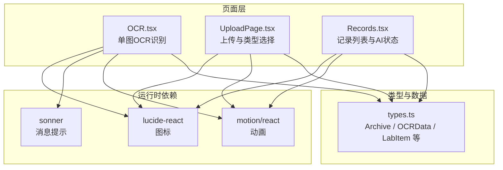
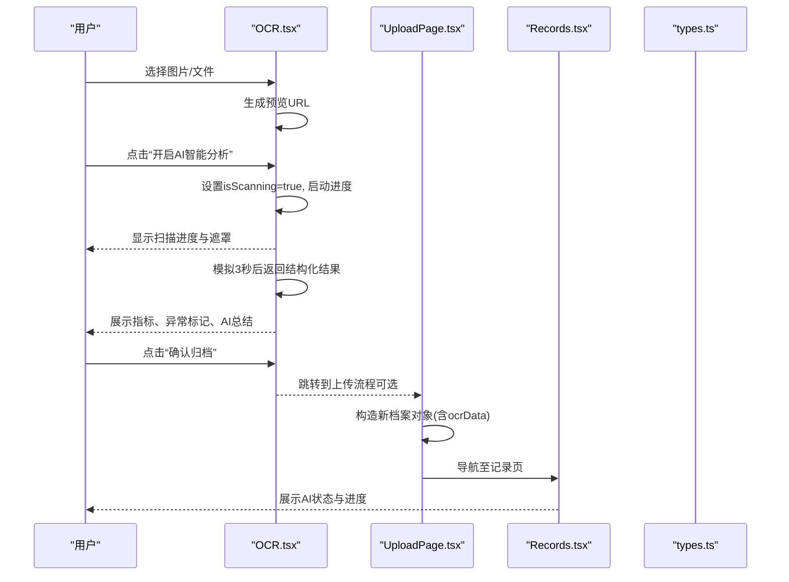
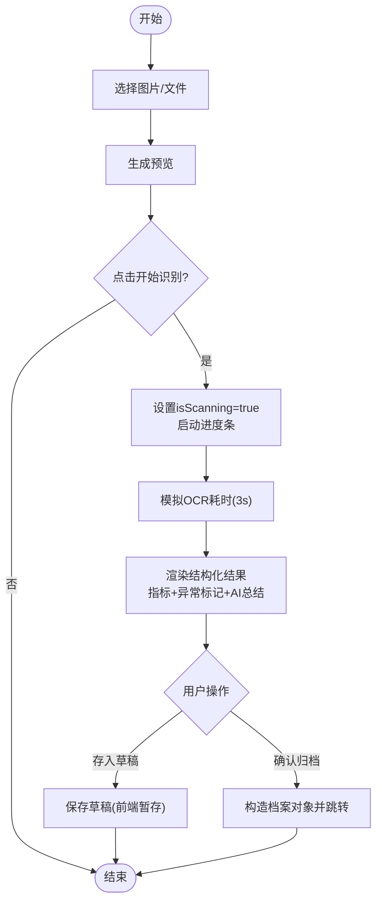
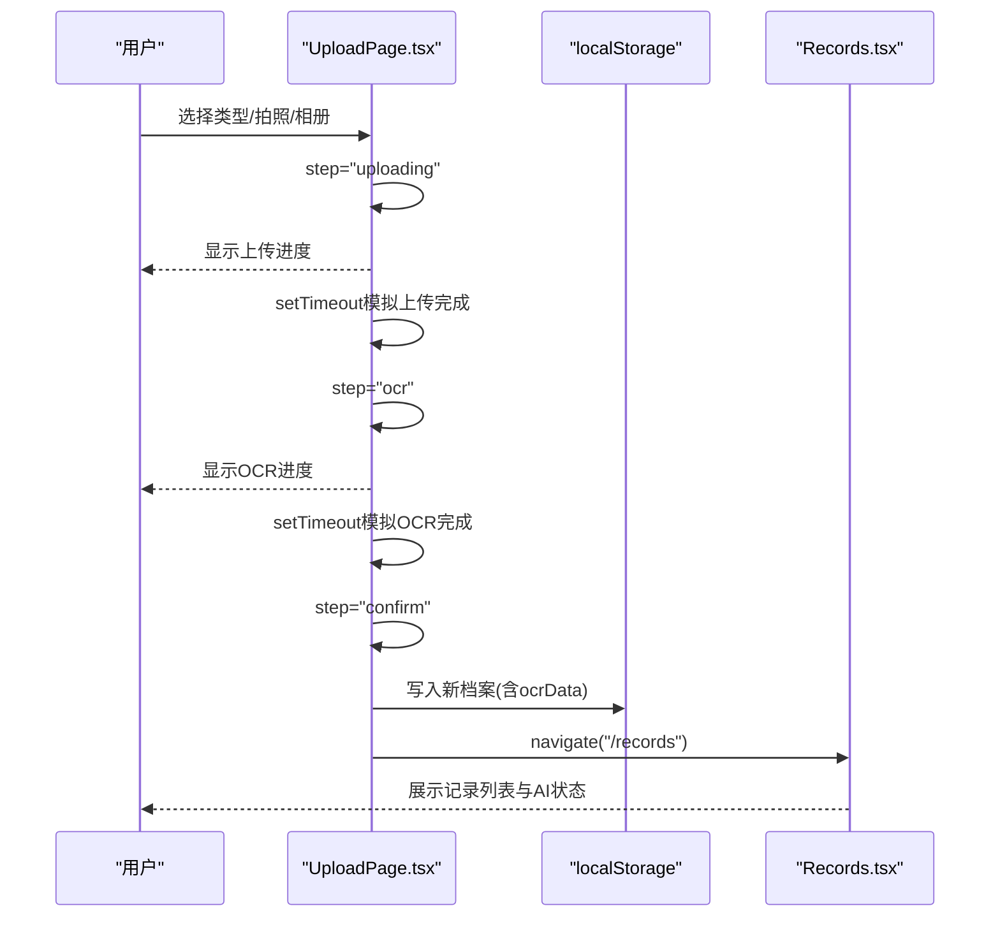
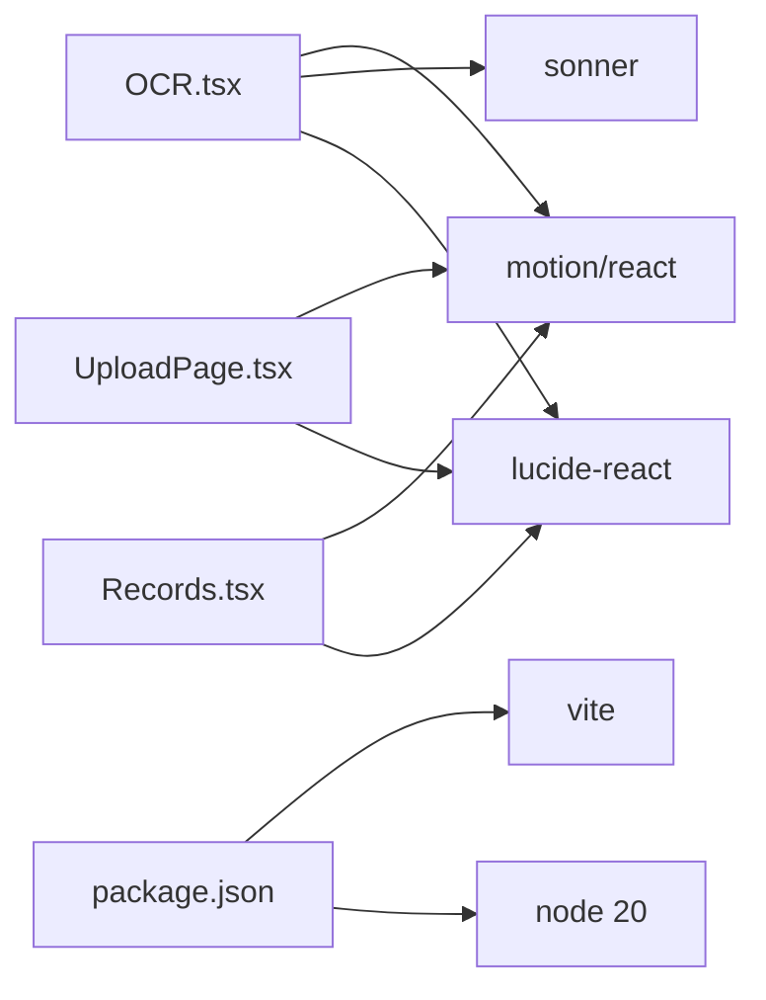

# OCR识别模块

<cite>
**本文引用的文件**
- [OCR.tsx](file://figma-ui/src/app/pages/OCR.tsx)
- [UploadPage.tsx](file://figma-ui/src/app/pages/UploadPage.tsx)
- [Records.tsx](file://figma-ui/src/app/pages/Records.tsx)
- [types.ts](file://figma-ui/src/app/types.ts)
- [package.json](file://figma-ui/package.json)
</cite>

## 目录
1. [简介](#简介)
2. [项目结构](#项目结构)
3. [核心组件](#核心组件)
4. [架构总览](#架构总览)
5. [详细组件分析](#详细组件分析)
6. [依赖分析](#依赖分析)
7. [性能考虑](#性能考虑)
8. [故障排查指南](#故障排查指南)
9. [结论](#结论)
10. [附录](#附录)

## 简介
本模块为医案通医疗档案网站的OCR识别前端实现，聚焦以下目标：
- 图像上传与预览：支持拍照、相册选择与本地文件上传，提供实时预览与扫描进度反馈。
- 文本识别与提取：模拟OCR识别流程，展示结构化数据（医院、科室、日期、医生、指标等）与AI总结。
- 结构化数据展示界面：以卡片形式呈现关键指标、异常提示与智能总结。
- 人工校对与确认流程：提供“存入草稿”和“确认归档”操作，便于用户二次编辑与最终入库。
- 多格式文档支持：前端入口支持图片与PDF导入的交互入口（当前为演示）。
- API集成与错误处理：当前为前端演示态，预留了调用后端OCR服务的接口位置与错误提示机制。
- 性能优化建议：针对大图片、并发请求、渲染性能给出可落地的调优方案。

## 项目结构
OCR相关功能主要位于页面级组件中，采用React + TypeScript构建，使用Tailwind CSS进行样式管理，通过motion/react提供动画效果，sonner用于消息提示。

图表来源
- [OCR.tsx:1-269](file://figma-ui/src/app/pages/OCR.tsx#L1-L269)
- [UploadPage.tsx:1-278](file://figma-ui/src/app/pages/UploadPage.tsx#L1-L278)
- [Records.tsx:1-200](file://figma-ui/src/app/pages/Records.tsx#L1-L200)
- [types.ts:1-95](file://figma-ui/src/app/types.ts#L1-L95)

章节来源
- [OCR.tsx:1-269](file://figma-ui/src/app/pages/OCR.tsx#L1-L269)
- [UploadPage.tsx:1-278](file://figma-ui/src/app/pages/UploadPage.tsx#L1-L278)
- [Records.tsx:1-200](file://figma-ui/src/app/pages/Records.tsx#L1-L200)
- [types.ts:1-95](file://figma-ui/src/app/types.ts#L1-L95)

## 核心组件
- 图像上传与预览：在OCR页面中，用户可选择图片或从相册/相机获取，选择后即时生成预览；支持重置与重新选择。
- 扫描流程与进度：点击“开启AI智能分析”后，显示扫描进度条与遮罩动画，模拟OCR耗时过程。
- 结构化结果展示：识别完成后展示标题、日期、医院、医生签名、关键指标及正常/异常标记，并提供AI总结。
- 人工校对与归档：提供“存入草稿”和“确认归档”两个动作，便于后续编辑或入库。
- 上传页多入口：UploadPage提供拍照、相册、微信文件导入（PDF/Word/Excel）入口，并进入上传→OCR→确认三步流程。
- 记录列表中的AI状态：Records页面展示“AI智能提取中/完成/待处理”的状态与进度条，体现异步处理体验。

章节来源
- [OCR.tsx:24-83](file://figma-ui/src/app/pages/OCR.tsx#L24-L83)
- [OCR.tsx:96-244](file://figma-ui/src/app/pages/OCR.tsx#L96-L244)
- [UploadPage.tsx:7-52](file://figma-ui/src/app/pages/UploadPage.tsx#L7-L52)
- [Records.tsx:193-229](file://figma-ui/src/app/pages/Records.tsx#L193-L229)

## 架构总览
当前实现为前端演示态，未直接调用真实OCR服务。整体流程如下：
- 用户选择文件 → 生成预览 → 触发扫描 → 模拟进度 → 返回结构化结果 → 用户校对 → 归档到本地存储或跳转记录页。

图表来源
- [OCR.tsx:42-75](file://figma-ui/src/app/pages/OCR.tsx#L42-L75)
- [UploadPage.tsx:12-52](file://figma-ui/src/app/pages/UploadPage.tsx#L12-L52)
- [Records.tsx:101-122](file://figma-ui/src/app/pages/Records.tsx#L101-L122)
- [types.ts:11-61](file://figma-ui/src/app/types.ts#L11-L61)

## 详细组件分析

### OCR页面（OCR.tsx）
- 文件选择与预览：通过隐藏的input[type=file]接收图片，使用URL.createObjectURL生成预览。
- 扫描流程：startScan函数设置isScanning与progress，使用定时器模拟进度，并在超时后返回模拟的结构化结果。
- 结果展示：以卡片形式展示标题、日期、医院、医生签名、指标项（含正常/异常图标）、AI总结。
- 操作按钮：提供“存入草稿”“确认归档”，便于后续编辑与入库。
- 用户体验：顶部提供刷新按钮，支持重置状态；底部提供识别贴士，提升拍摄质量。

图表来源
- [OCR.tsx:32-40](file://figma-ui/src/app/pages/OCR.tsx#L32-L40)
- [OCR.tsx:42-75](file://figma-ui/src/app/pages/OCR.tsx#L42-L75)
- [OCR.tsx:197-244](file://figma-ui/src/app/pages/OCR.tsx#L197-L244)

章节来源
- [OCR.tsx:24-83](file://figma-ui/src/app/pages/OCR.tsx#L24-L83)
- [OCR.tsx:96-244](file://figma-ui/src/app/pages/OCR.tsx#L96-L244)

### 上传页（UploadPage.tsx）
- 步骤控制：select → uploading → ocr → confirm 四步流程，分别对应选择、上传、OCR解析、确认。
- 模拟上传与OCR：setTimeout模拟上传与OCR耗时，完成后进入确认页。
- 数据结构：构造包含ocrData的新档案对象，字段包括summary与items（LabItem），并写入localStorage。
- 导航：确认后跳转到记录页，便于查看归档结果。

图表来源
- [UploadPage.tsx:7-52](file://figma-ui/src/app/pages/UploadPage.tsx#L7-L52)
- [UploadPage.tsx:54-186](file://figma-ui/src/app/pages/UploadPage.tsx#L54-L186)
- [Records.tsx:101-122](file://figma-ui/src/app/pages/Records.tsx#L101-L122)

章节来源
- [UploadPage.tsx:7-52](file://figma-ui/src/app/pages/UploadPage.tsx#L7-L52)
- [UploadPage.tsx:54-186](file://figma-ui/src/app/pages/UploadPage.tsx#L54-L186)

### 记录页（Records.tsx）
- AI状态展示：在记录卡片上显示“AI智能提取中/完成/待处理”的状态标签与进度条。
- 搜索与筛选：支持按类别、关键词过滤记录。
- 视觉反馈：使用渐变扫描线与发光效果增强“正在识别”的感知。

章节来源
- [Records.tsx:101-122](file://figma-ui/src/app/pages/Records.tsx#L101-L122)
- [Records.tsx:193-229](file://figma-ui/src/app/pages/Records.tsx#L193-L229)

### 数据类型（types.ts）
- Archive：档案主模型，包含id、memberId、type、title、hospital、department、date、uploadDate、imageUrl、ocrData、tags、isFavorite、isDeleted。
- OCRData：OCR结构化数据，包含医院、科室、日期、医生姓名、诊断、检验项、处方等。
- LabItem：检验项模型，包含名称、值、单位、参考范围、是否异常。
- PrescriptionItem：处方项模型，包含药品名、剂量、频次、疗程。
- 常量映射：ARCHIVE_TYPE_LABELS与ARCHIVE_TYPE_COLORS用于UI展示。

章节来源
- [types.ts:11-61](file://figma-ui/src/app/types.ts#L11-L61)
- [types.ts:74-95](file://figma-ui/src/app/types.ts#L74-L95)

## 依赖分析
- UI与动画：motion/react用于入场与扫描动画；lucide-react提供图标；sonner用于成功/错误提示。
- 构建与运行：Vite作为构建工具；Node 20环境。
- 第三方库：html-to-image/html2canvas可用于截图导出；react-router用于页面导航。

图表来源
- [package.json:1-101](file://figma-ui/package.json#L1-L101)
- [OCR.tsx:1-18](file://figma-ui/src/app/pages/OCR.tsx#L1-L18)
- [UploadPage.tsx:1-5](file://figma-ui/src/app/pages/UploadPage.tsx#L1-L5)
- [Records.tsx:1-20](file://figma-ui/src/app/pages/Records.tsx#L1-L20)

章节来源
- [package.json:1-101](file://figma-ui/package.json#L1-L101)

## 性能考虑
- 图片尺寸与压缩：建议在上传前对图片进行压缩与缩放，减少内存占用与传输体积。
- 懒加载与虚拟滚动：记录列表若数据量大，建议使用虚拟滚动与按需加载。
- 防抖与节流：搜索输入与滚动事件应做防抖/节流，避免频繁重渲染。
- 并发控制：批量OCR任务需限制并发数，避免阻塞UI线程。
- 缓存策略：对已识别结果进行本地缓存（如IndexedDB），减少重复计算。
- 动画性能：复杂动画尽量使用transform与opacity，避免触发布局重排。

[本节为通用性能建议，不直接引用具体代码文件]

## 故障排查指南
- 上传失败：检查文件类型与大小限制；确保浏览器允许文件访问；必要时降级提示。
- 预览异常：确认URL.createObjectURL正确释放，避免内存泄漏。
- OCR无响应：当前为模拟逻辑，接入后端时需增加超时与重试机制；捕获网络错误并提示用户。
- 数据校验失败：对ocrData字段进行必填校验与格式校验（如日期、数值范围），失败时回退到手动编辑模式。
- 状态不同步：确保isScanning、progress、scanResult等状态在重置时正确清空。

章节来源
- [OCR.tsx:32-40](file://figma-ui/src/app/pages/OCR.tsx#L32-L40)
- [OCR.tsx:42-75](file://figma-ui/src/app/pages/OCR.tsx#L42-L75)
- [UploadPage.tsx:12-52](file://figma-ui/src/app/pages/UploadPage.tsx#L12-L52)

## 结论
本OCR模块在前端实现了完整的上传、预览、扫描进度、结构化结果展示与人工校对归档流程，具备良好的用户体验与可扩展性。当前为演示态，未来可无缝对接后端OCR服务，实现真实的图像预处理、字符识别、数据验证与结果编辑能力。通过合理的性能优化与错误处理策略，可进一步提升稳定性与可用性。

[本节为总结性内容，不直接引用具体代码文件]

## 附录

### API调用方式（建议）
- 上传接口：POST /api/ocr/upload，multipart/form-data，返回taskId。
- 查询进度：GET /api/ocr/task/{taskId}，返回status与percent。
- 获取结果：GET /api/ocr/result/{taskId}，返回结构化JSON（符合types.ts中的OCRData/LabItem等）。
- 错误码：统一错误响应体，包含code、message、details。

[本节为建议性接口设计，不直接引用具体代码文件]

### 图像处理技术（建议）
- 预处理：灰度化、去噪、二值化、透视校正、边缘检测。
- 字符识别：基于深度学习模型的OCR引擎（如Tesseract、商业API），结合医学词典与术语库提升准确率。
- 数据验证：规则引擎校验数值范围、单位一致性、日期格式等。
- 结果编辑：富文本编辑器支持字段级编辑与批注。

[本节为通用技术方案建议，不直接引用具体代码文件]

### 多格式文档支持（现状与建议）
- 现状：UploadPage提供“微信文件导入（PDF/Word/Excel）”入口，但当前仅演示。
- 建议：接入文档解析服务，将PDF/Word/Excel转换为图像或文本，再走OCR流程。

[本节为现状说明与建议，不直接引用具体代码文件]