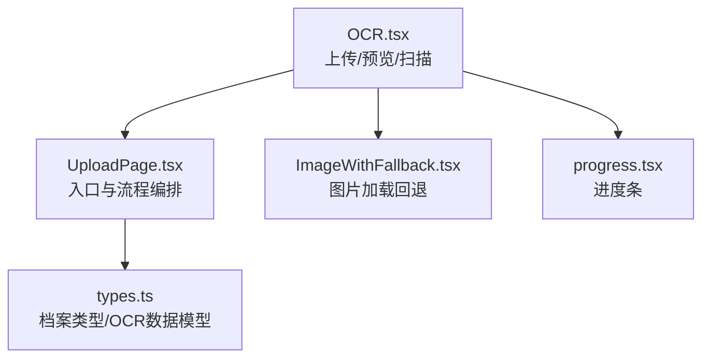
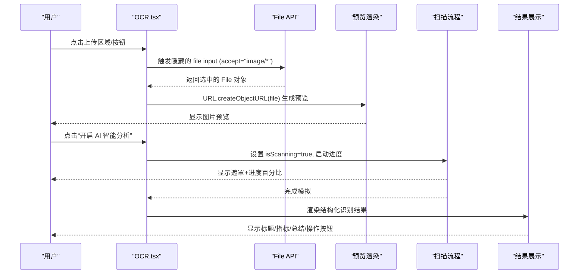
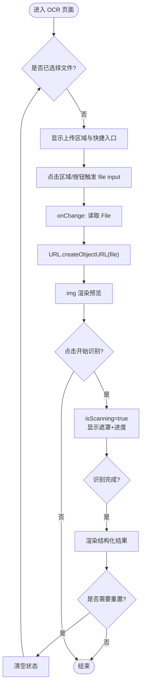
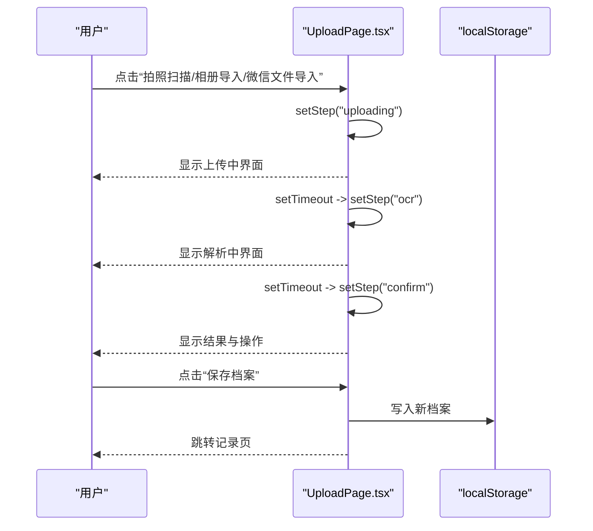
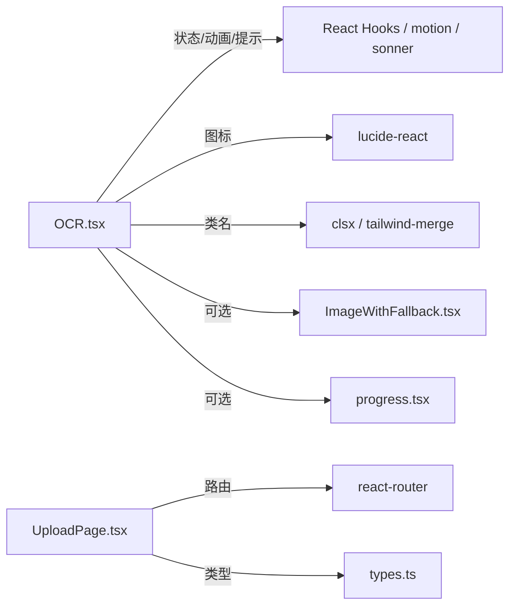

# 图像上传与预览

<cite>
**本文引用的文件**
- [OCR.tsx](file://figma-ui/src/app/pages/OCR.tsx)
- [UploadPage.tsx](file://figma-ui/src/app/pages/UploadPage.tsx)
- [ImageWithFallback.tsx](file://figma-ui/src/app/components/figma/ImageWithFallback.tsx)
- [progress.tsx](file://figma-ui/src/app/components/ui/progress.tsx)
- [types.ts](file://figma-ui/src/app/types.ts)
</cite>

## 目录
1. [简介](#简介)
2. [项目结构](#项目结构)
3. [核心组件](#核心组件)
4. [架构总览](#架构总览)
5. [详细组件分析](#详细组件分析)
6. [依赖关系分析](#依赖关系分析)
7. [性能考量](#性能考量)
8. [故障排查指南](#故障排查指南)
9. [结论](#结论)
10. [附录：实现要点与示例路径](#附录：实现要点与示例路径)

## 简介
本章节面向医案通医疗档案网站的 OCR 识别模块中的“图像上传与预览”能力，聚焦以下目标：
- 文件选择机制：通过隐藏的 file input 触发系统相册/相机/文件选择器，支持移动端拍照、相册选择与本地文件导入。
- 图片预览渲染：使用 File API 与 URL.createObjectURL 生成预览，提供加载占位与错误回退。
- 拖拽上传支持：在现有基础上可扩展 drag/drop 事件以增强桌面端体验（本节给出扩展建议）。
- 多格式兼容：当前实现主要接受 image/*；可结合 accept 属性扩展 PDF 等文档类型。
- 文件验证逻辑：建议在 handleFileChange 中增加类型、大小校验与错误提示（本节给出实现建议）。
- 用户交互与状态管理：包含扫描进度条、遮罩层、成功结果展示与重置流程。
- 移动端适配：利用 accept="image/*" 与按钮触发 file click 的方式，自然唤起相机/相册。

## 项目结构
与图像上传与预览相关的页面与组件分布如下：
- OCR 页面：负责隐藏 file input、点击触发选择、预览图显示、扫描进度与结果展示。
- UploadPage：提供“拍照扫描/相册导入/微信文件导入”入口，并模拟上传与 OCR 流程。
- ImageWithFallback：通用图片加载失败回退组件，可用于预览图的健壮性保障。
- Progress：进度条组件，可用于上传/解析进度可视化。
- types：定义档案类型与 OCR 数据结构，便于后续对接后端返回的识别结果。

图表来源
- [OCR.tsx:24-83](file://figma-ui/src/app/pages/OCR.tsx#L24-L83)
- [UploadPage.tsx:7-24](file://figma-ui/src/app/pages/UploadPage.tsx#L7-L24)
- [ImageWithFallback.tsx:1-27](file://figma-ui/src/app/components/figma/ImageWithFallback.tsx#L1-L27)
- [progress.tsx:1-31](file://figma-ui/src/app/components/ui/progress.tsx#L1-L31)
- [types.ts:11-46](file://figma-ui/src/app/types.ts#L11-L46)

章节来源
- [OCR.tsx:24-83](file://figma-ui/src/app/pages/OCR.tsx#L24-L83)
- [UploadPage.tsx:7-24](file://figma-ui/src/app/pages/UploadPage.tsx#L7-L24)
- [ImageWithFallback.tsx:1-27](file://figma-ui/src/app/components/figma/ImageWithFallback.tsx#L1-L27)
- [progress.tsx:1-31](file://figma-ui/src/app/components/ui/progress.tsx#L1-L31)
- [types.ts:11-46](file://figma-ui/src/app/types.ts#L11-L46)

## 核心组件
- OCR 页面
  - 文件选择：通过 ref 指向隐藏的 <input type="file">，点击区域或按钮触发选择。
  - 预览渲染：选中文件后使用 URL.createObjectURL(file) 生成预览地址并渲染 img。
  - 扫描流程：点击“开启 AI 智能分析”后进入 isScanning 状态，显示进度与遮罩，完成后展示结构化结果。
  - 重置：提供刷新图标重置所有状态。
- UploadPage
  - 入口：提供“拍照扫描/相册导入/微信文件导入”三类入口，点击后进入“上传中/OCR处理中/确认”流程。
  - 流程编排：通过 step 状态切换不同阶段 UI，并在确认后保存至 localStorage 并跳转记录页。
- ImageWithFallback
  - 用于图片加载失败时显示占位图，避免白屏。
- Progress
  - 基于 Radix 的进度条封装，可用于上传/解析进度可视化。

章节来源
- [OCR.tsx:24-83](file://figma-ui/src/app/pages/OCR.tsx#L24-L83)
- [OCR.tsx:96-149](file://figma-ui/src/app/pages/OCR.tsx#L96-L149)
- [OCR.tsx:150-244](file://figma-ui/src/app/pages/OCR.tsx#L150-L244)
- [UploadPage.tsx:7-24](file://figma-ui/src/app/pages/UploadPage.tsx#L7-L24)
- [UploadPage.tsx:54-109](file://figma-ui/src/app/pages/UploadPage.tsx#L54-L109)
- [UploadPage.tsx:111-185](file://figma-ui/src/app/pages/UploadPage.tsx#L111-L185)
- [ImageWithFallback.tsx:1-27](file://figma-ui/src/app/components/figma/ImageWithFallback.tsx#L1-L27)
- [progress.tsx:1-31](file://figma-ui/src/app/components/ui/progress.tsx#L1-L31)

## 架构总览
下图展示了从用户选择文件到预览、再到 OCR 识别与结果展示的完整流程。

图表来源
- [OCR.tsx:32-40](file://figma-ui/src/app/pages/OCR.tsx#L32-L40)
- [OCR.tsx:42-75](file://figma-ui/src/app/pages/OCR.tsx#L42-L75)
- [OCR.tsx:150-244](file://figma-ui/src/app/pages/OCR.tsx#L150-L244)

## 详细组件分析

### OCR 页面：文件选择与预览
- 文件选择机制
  - 使用 useRef 获取隐藏的 <input type="file">，通过 onClick 触发选择。
  - accept="image/*" 限制为图片类型，便于移动端直接调用相机/相册。
  - onChange 回调中读取 selectedFile，并立即生成预览。
- 预览渲染
  - 使用 URL.createObjectURL(selectedFile) 创建临时 URL，赋值给 img src。
  - 可在外层包裹 ImageWithFallback 以增强加载失败的容错。
- 交互与状态
  - 未选择文件：显示上传区域与快捷入口（相册/PDF）。
  - 已选择文件：显示预览图与“开启 AI 智能分析”按钮。
  - 扫描中：全屏遮罩 + 动态扫描线 + 进度百分比。
  - 扫描完成：展示结构化结果与操作按钮（存入草稿/确认归档）。
  - 重置：清空 file/preview/isScanning/scanResult/progress。

图表来源
- [OCR.tsx:32-40](file://figma-ui/src/app/pages/OCR.tsx#L32-L40)
- [OCR.tsx:42-75](file://figma-ui/src/app/pages/OCR.tsx#L42-L75)
- [OCR.tsx:96-149](file://figma-ui/src/app/pages/OCR.tsx#L96-L149)
- [OCR.tsx:150-244](file://figma-ui/src/app/pages/OCR.tsx#L150-L244)

章节来源
- [OCR.tsx:24-83](file://figma-ui/src/app/pages/OCR.tsx#L24-L83)
- [OCR.tsx:96-149](file://figma-ui/src/app/pages/OCR.tsx#L96-L149)
- [OCR.tsx:150-244](file://figma-ui/src/app/pages/OCR.tsx#L150-L244)

### UploadPage：入口与流程编排
- 入口设计
  - “拍照扫描”：引导用户使用相机拍摄。
  - “相册导入”：引导用户从相册选择图片。
  - “微信文件导入”：支持 PDF/Word/Excel 等文档（需结合后端解析能力）。
- 流程编排
  - 选择入口后进入“uploading”阶段，显示上传动画与进度。
  - 随后进入“ocr”阶段，显示解析动画与进度。
  - 最后进入“confirm”阶段，展示提取结果并提供保存/重新上传。
- 数据持久化
  - 将新档案写入 localStorage，并跳转到记录列表页。

图表来源
- [UploadPage.tsx:7-24](file://figma-ui/src/app/pages/UploadPage.tsx#L7-L24)
- [UploadPage.tsx:54-109](file://figma-ui/src/app/pages/UploadPage.tsx#L54-L109)
- [UploadPage.tsx:111-185](file://figma-ui/src/app/pages/UploadPage.tsx#L111-L185)

章节来源
- [UploadPage.tsx:7-24](file://figma-ui/src/app/pages/UploadPage.tsx#L7-L24)
- [UploadPage.tsx:54-109](file://figma-ui/src/app/pages/UploadPage.tsx#L54-L109)
- [UploadPage.tsx:111-185](file://figma-ui/src/app/pages/UploadPage.tsx#L111-L185)

### 图片加载回退与进度条
- 图片加载回退
  - 使用 ImageWithFallback 组件，当图片加载失败时显示内置占位图，提升鲁棒性。
- 进度条
  - 使用 Progress 组件封装 Radix Progress，可通过 value 控制进度指示器位置。
  - 在 OCR 页面中，通过自定义遮罩与百分比文本展示进度；也可替换为 Progress 组件以获得更一致的样式。

章节来源
- [ImageWithFallback.tsx:1-27](file://figma-ui/src/app/components/figma/ImageWithFallback.tsx#L1-L27)
- [progress.tsx:1-31](file://figma-ui/src/app/components/ui/progress.tsx#L1-L31)

## 依赖关系分析
- OCR 页面依赖
  - React Hooks：useState/useRef/useEffect 管理状态与 DOM 引用。
  - 图标库：lucide-react 提供扫描、图片、上传等图标。
  - 动画库：motion/react 提供入场/过渡动画。
  - 提示：sonner 用于成功提示。
  - 工具：clsx/tailwind-merge 用于类名合并。
- UploadPage 依赖
  - React Router：useNavigate 进行页面跳转。
  - 图标库与动画库同上。
  - 类型：ArchiveType 与 ARCHIVE_TYPE_LABELS 来自 types.ts。
- 公共组件
  - ImageWithFallback：图片加载失败回退。
  - Progress：进度条。

图表来源
- [OCR.tsx:1-22](file://figma-ui/src/app/pages/OCR.tsx#L1-L22)
- [UploadPage.tsx:1-10](file://figma-ui/src/app/pages/UploadPage.tsx#L1-L10)
- [types.ts:27-83](file://figma-ui/src/app/types.ts#L27-L83)

章节来源
- [OCR.tsx:1-22](file://figma-ui/src/app/pages/OCR.tsx#L1-L22)
- [UploadPage.tsx:1-10](file://figma-ui/src/app/pages/UploadPage.tsx#L1-L10)
- [types.ts:27-83](file://figma-ui/src/app/types.ts#L27-L83)

## 性能考量
- 预览内存占用
  - URL.createObjectURL 会创建对象 URL，应在组件卸载或切换时释放，避免内存泄漏。建议在 reset 或 useEffect 清理时调用 URL.revokeObjectURL(preview)。
- 大图片处理
  - 对于高分辨率图片，建议在上传前进行压缩或缩放，减少传输与渲染开销。
- 进度反馈
  - 使用定时器模拟进度时，注意 clearInterval 清理，避免重复计时器导致性能问题。
- 图片加载失败
  - 使用 ImageWithFallback 降低白屏概率，提升用户体验。

[本节为通用性能建议，不直接分析具体代码]

## 故障排查指南
- 无法预览图片
  - 检查 accept 属性是否正确设置为 image/*，确保移动端能正确唤起相机/相册。
  - 检查 URL.createObjectURL 返回值是否为有效字符串。
  - 若仍失败，使用 ImageWithFallback 捕获 onError 并显示占位图。
- 进度不更新
  - 检查 setInterval 是否在完成时 clearInterval，避免多次触发。
  - 确认 isScanning 状态在完成后被置为 false。
- 移动端无响应
  - 确认隐藏的 file input 未被 display:none 完全隐藏（建议使用 opacity:0 或绝对定位隐藏），以便移动端正常触发。
  - 检查浏览器权限与沙箱限制。

章节来源
- [OCR.tsx:32-40](file://figma-ui/src/app/pages/OCR.tsx#L32-L40)
- [OCR.tsx:42-75](file://figma-ui/src/app/pages/OCR.tsx#L42-L75)
- [ImageWithFallback.tsx:1-27](file://figma-ui/src/app/components/figma/ImageWithFallback.tsx#L1-L27)

## 结论
当前 OCR 页面已具备完整的“选择文件—预览—扫描—结果展示”闭环，配合 UploadPage 的入口与流程编排，能够满足移动端拍照/相册选择与本地文件导入的基本需求。建议在后续迭代中补充：
- 文件类型与大小校验（如仅允许 JPG/PNG/PDF，限制最大尺寸）。
- 拖拽上传支持（dragover/drop 事件处理）。
- 进度条统一使用 Progress 组件，提升一致性。
- 完善错误提示与边界情况处理（网络异常、权限拒绝、超大文件等）。

[本节为总结性内容，不直接分析具体代码]

## 附录：实现要点与示例路径
- 文件选择与预览
  - 隐藏 file input 并通过 ref 触发：参考 [OCR.tsx:126-132](file://figma-ui/src/app/pages/OCR.tsx#L126-L132)
  - onChange 读取文件并生成预览：参考 [OCR.tsx:32-40](file://figma-ui/src/app/pages/OCR.tsx#L32-L40)
- 扫描进度与遮罩
  - 进度模拟与遮罩显示：参考 [OCR.tsx:42-75](file://figma-ui/src/app/pages/OCR.tsx#L42-L75)
  - 遮罩与进度百分比渲染：参考 [OCR.tsx:158-175](file://figma-ui/src/app/pages/OCR.tsx#L158-L175)
- 结果展示与操作
  - 结构化结果渲染与按钮：参考 [OCR.tsx:197-244](file://figma-ui/src/app/pages/OCR.tsx#L197-L244)
- 入口与流程编排
  - 入口按钮与步骤切换：参考 [UploadPage.tsx:195-221](file://figma-ui/src/app/pages/UploadPage.tsx#L195-L221)
  - 上传/解析/确认流程：参考 [UploadPage.tsx:54-109](file://figma-ui/src/app/pages/UploadPage.tsx#L54-L109)
- 图片回退与进度条
  - 图片加载失败回退：参考 [ImageWithFallback.tsx:1-27](file://figma-ui/src/app/components/figma/ImageWithFallback.tsx#L1-L27)
  - 进度条组件：参考 [progress.tsx:1-31](file://figma-ui/src/app/components/ui/progress.tsx#L1-L31)
- 类型定义
  - 档案类型与 OCR 数据结构：参考 [types.ts:11-46](file://figma-ui/src/app/types.ts#L11-L46)、[types.ts:27-83](file://figma-ui/src/app/types.ts#L27-L83)

[本节为指引性内容，不直接分析具体代码]