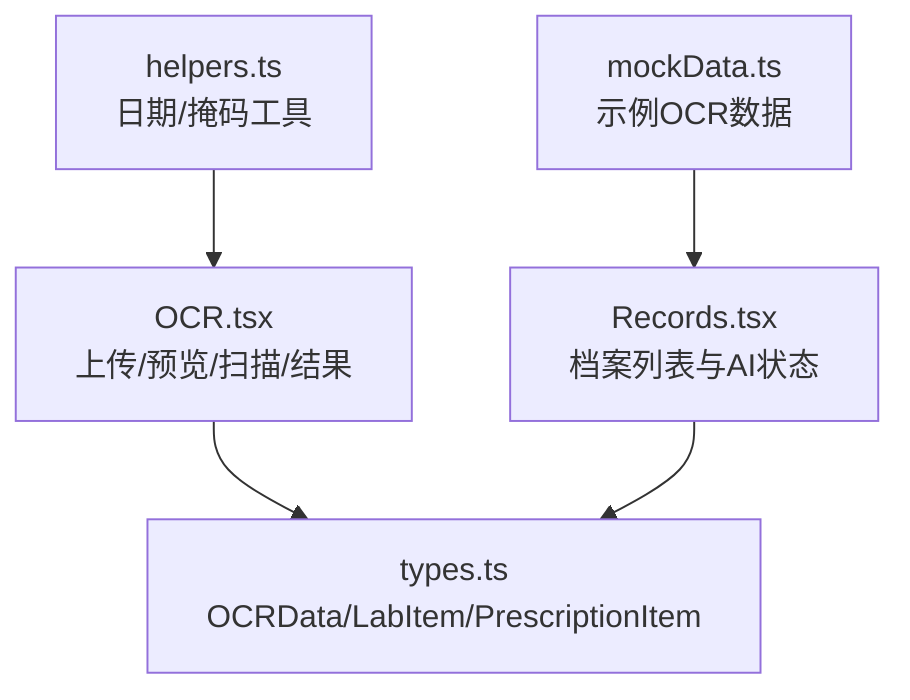
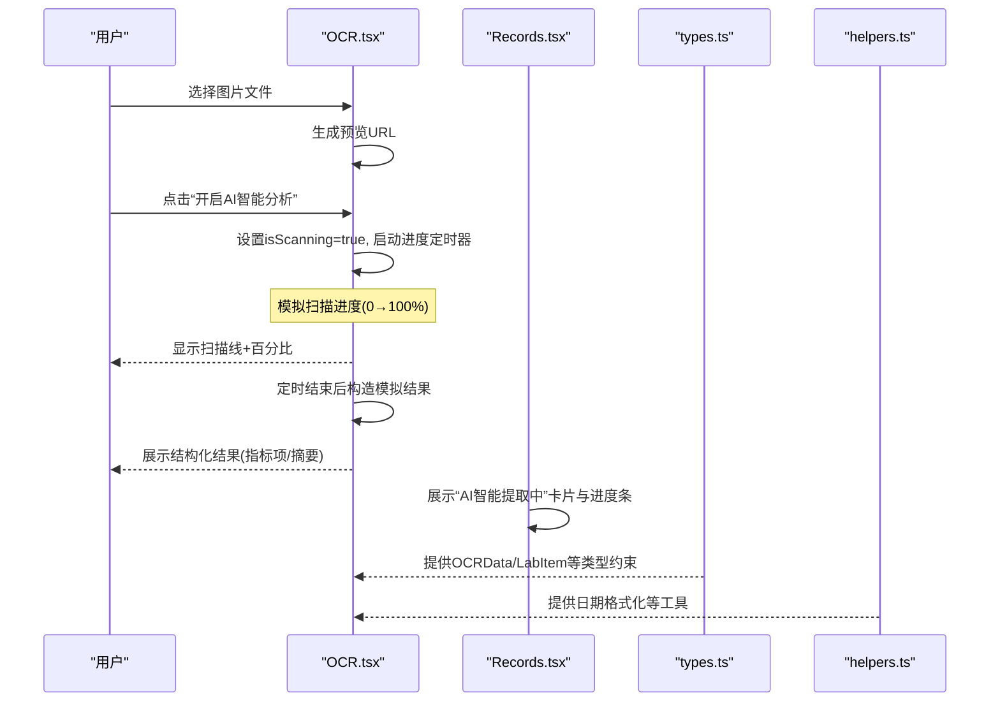
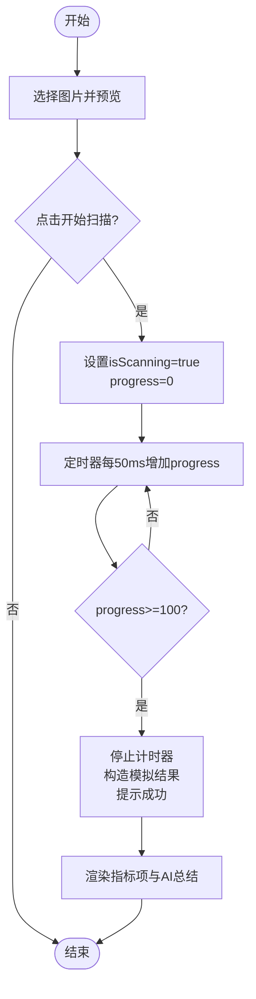
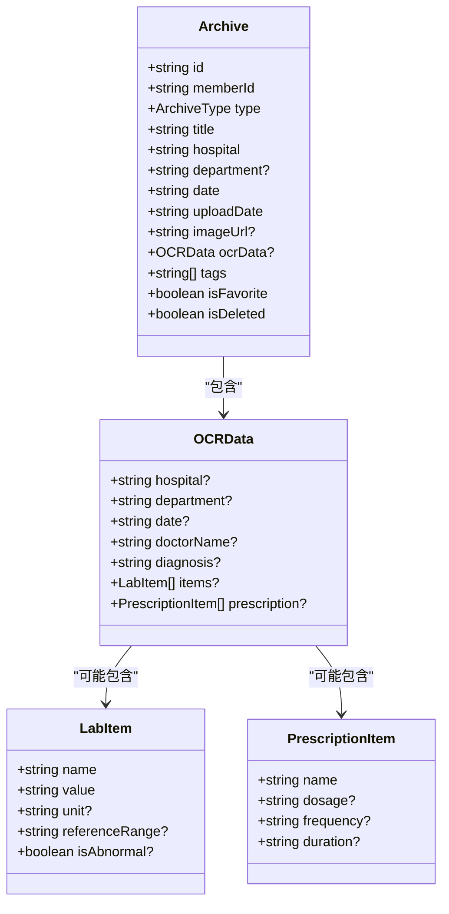
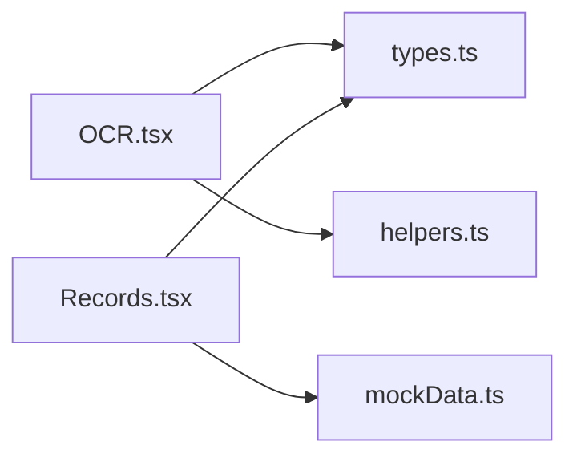

# 文本识别与提取

<cite>
**本文引用的文件**
- [OCR.tsx](file://figma-ui/src/app/pages/OCR.tsx)
- [Records.tsx](file://figma-ui/src/app/pages/Records.tsx)
- [types.ts](file://figma-ui/src/app/types.ts)
- [helpers.ts](file://figma-ui/src/app/utils/helpers.ts)
- [mockData.ts](file://figma-ui/src/app/utils/mockData.ts)
</cite>

## 目录
1. [简介](#简介)
2. [项目结构](#项目结构)
3. [核心组件](#核心组件)
4. [架构总览](#架构总览)
5. [详细组件分析](#详细组件分析)
6. [依赖关系分析](#依赖关系分析)
7. [性能考虑](#性能考虑)
8. [故障排查指南](#故障排查指南)
9. [结论](#结论)
10. [附录](#附录)

## 简介
本章节面向医案通医疗识别模块的“文本识别与提取”能力，聚焦前端在 OCR 流程中的交互、状态管理、进度动画与结果展示。当前仓库实现了完整的模拟扫描流程与 UI 表现，包括：
- 图片上传与预览
- 模拟 OCR 扫描进度条与扫描线动画
- 结构化结果展示（指标项、正常/异常标记、AI 总结）
- 档案列表中的“AI 智能提取中”状态与进度反馈
- 医疗数据模型定义（检验项、处方项、归档类型等）

说明：当前代码未包含真实 OCR 引擎集成、后端 API 调用、错误重试与批量异步处理逻辑；这些内容在本文档中以“扩展建议”形式给出，便于后续落地。

## 项目结构
围绕 OCR 功能的关键文件与职责如下：
- OCR.tsx：OCR 页面主入口，负责文件选择、预览、启动扫描、进度动画与结果渲染
- Records.tsx：档案列表页，演示“AI 智能提取中”的状态与进度条
- types.ts：OCR 数据结构与归档类型定义，支撑结果建模与展示
- helpers.ts：通用工具函数（日期格式化、掩码等），可用于结果展示
- mockData.ts：示例数据，体现 OCR 提取后的结构化字段（如检验项、诊断等）

图表来源
- [OCR.tsx:24-83](file://figma-ui/src/app/pages/OCR.tsx#L24-L83)
- [Records.tsx:101-122](file://figma-ui/src/app/pages/Records.tsx#L101-L122)
- [types.ts:11-61](file://figma-ui/src/app/types.ts#L11-L61)
- [helpers.ts:1-52](file://figma-ui/src/app/utils/helpers.ts#L1-L52)
- [mockData.ts:1-47](file://figma-ui/src/app/utils/mockData.ts#L1-L47)

章节来源
- [OCR.tsx:24-83](file://figma-ui/src/app/pages/OCR.tsx#L24-L83)
- [Records.tsx:101-122](file://figma-ui/src/app/pages/Records.tsx#L101-L122)
- [types.ts:11-61](file://figma-ui/src/app/types.ts#L11-L61)
- [helpers.ts:1-52](file://figma-ui/src/app/utils/helpers.ts#L1-L52)
- [mockData.ts:1-47](file://figma-ui/src/app/utils/mockData.ts#L1-L47)

## 核心组件
- OCR 页面（OCR.tsx）
  - 文件选择与预览：通过 input[type=file] 获取图片并生成预览 URL
  - 扫描流程：点击“开启 AI 智能分析”后进入 isScanning=true，使用定时器推进 progress，并在固定时长后输出模拟结果
  - 结果展示：标题、日期、医院/医生、指标项数组（含正常/异常标识）、AI 总结
  - 操作按钮：存入草稿、确认归档（占位实现）
- 档案列表（Records.tsx）
  - 展示“AI 智能提取中”卡片，带扫描线与进度条动画
  - 支持分类筛选与搜索，用于演示不同状态的记录展示

章节来源
- [OCR.tsx:32-75](file://figma-ui/src/app/pages/OCR.tsx#L32-L75)
- [OCR.tsx:157-195](file://figma-ui/src/app/pages/OCR.tsx#L157-L195)
- [OCR.tsx:197-241](file://figma-ui/src/app/pages/OCR.tsx#L197-L241)
- [Records.tsx:193-235](file://figma-ui/src/app/pages/Records.tsx#L193-L235)

## 架构总览
从用户视角看，OCR 流程为“上传 → 预览 → 启动扫描 → 进度反馈 → 结果展示”。当前实现为纯前端模拟，不涉及真实 OCR 服务。

图表来源
- [OCR.tsx:42-75](file://figma-ui/src/app/pages/OCR.tsx#L42-L75)
- [OCR.tsx:157-195](file://figma-ui/src/app/pages/OCR.tsx#L157-L195)
- [OCR.tsx:197-241](file://figma-ui/src/app/pages/OCR.tsx#L197-L241)
- [Records.tsx:193-235](file://figma-ui/src/app/pages/Records.tsx#L193-L235)
- [types.ts:11-61](file://figma-ui/src/app/types.ts#L11-L61)
- [helpers.ts:1-52](file://figma-ui/src/app/utils/helpers.ts#L1-L52)

## 详细组件分析

### OCR 页面（OCR.tsx）
- 状态设计
  - file/preview：控制文件与预览图
  - isScanning/progress：控制扫描状态与进度
  - scanResult：保存识别结果（模拟）
- 关键流程
  - 文件变更：更新 file、preview，重置扫描状态
  - 启动扫描：设置 isScanning=true，启动定时器递增 progress，固定时长后输出结果并提示成功
  - 结果渲染：按 label/value/normal 展示指标项，展示 AI 总结
- 交互细节
  - 扫描时覆盖层显示扫描线与百分比
  - 非扫描态提供“存入草稿/确认归档”按钮（占位）

图表来源
- [OCR.tsx:32-75](file://figma-ui/src/app/pages/OCR.tsx#L32-L75)
- [OCR.tsx:157-195](file://figma-ui/src/app/pages/OCR.tsx#L157-L195)
- [OCR.tsx:197-241](file://figma-ui/src/app/pages/OCR.tsx#L197-L241)

章节来源
- [OCR.tsx:32-75](file://figma-ui/src/app/pages/OCR.tsx#L32-L75)
- [OCR.tsx:157-195](file://figma-ui/src/app/pages/OCR.tsx#L157-L195)
- [OCR.tsx:197-241](file://figma-ui/src/app/pages/OCR.tsx#L197-L241)

### 档案列表（Records.tsx）
- “AI 智能提取中”卡片
  - 顶部标签“AI 智能提取中”，配合扫描线动画
  - 进度条根据 isScanning 切换宽度，增强感知
- 列表与筛选
  - 支持按分类筛选与关键词搜索
  - 展示 AI 摘要与标签，便于快速理解

章节来源
- [Records.tsx:101-122](file://figma-ui/src/app/pages/Records.tsx#L101-L122)
- [Records.tsx:193-235](file://figma-ui/src/app/pages/Records.tsx#L193-L235)

### 数据模型（types.ts）
- ArchiveType：归档类型枚举（门诊病历、检验报告、影像报告、处方、体检报告、出院记录、发票、其他）
- OCRData：OCR 提取结果的结构化字段（医院、科室、日期、医生、诊断、检验项、处方项等）
- LabItem/PrescriptionItem：检验项与处方项的数据结构，支持单位、参考范围、是否异常等

图表来源
- [types.ts:11-61](file://figma-ui/src/app/types.ts#L11-L61)

章节来源
- [types.ts:11-61](file://figma-ui/src/app/types.ts#L11-L61)

### 工具函数（helpers.ts）
- formatDate/formatDateShort：将日期格式化为中文本地化字符串
- isExpired/daysUntilExpiry：判断过期与剩余天数
- generateId/maskPhone：生成唯一ID与手机号掩码
- 用途：在 OCR 结果展示中统一日期格式、隐私脱敏等

章节来源
- [helpers.ts:1-52](file://figma-ui/src/app/utils/helpers.ts#L1-L52)

### 示例数据（mockData.ts）
- MOCK_ARCHIVES：包含多种类型的归档样例，其中 OCRData 展示了检验项、诊断等信息
- 用途：演示 OCR 结果在不同归档类型下的呈现方式

章节来源
- [mockData.ts:1-47](file://figma-ui/src/app/utils/mockData.ts#L1-L47)

## 依赖关系分析
- OCR.tsx 依赖 types.ts 的 OCRData/LabItem/PrescriptionItem 进行结果建模与展示
- Records.tsx 依赖 types.ts 的 ArchiveType 进行归档分类与颜色映射
- OCR.tsx 与 Records.tsx 均使用 helpers.ts 的日期格式化等工具
- mockData.ts 提供示例数据，辅助 Records.tsx 的列表展示

图表来源
- [OCR.tsx:24-83](file://figma-ui/src/app/pages/OCR.tsx#L24-L83)
- [Records.tsx:101-122](file://figma-ui/src/app/pages/Records.tsx#L101-L122)
- [types.ts:11-61](file://figma-ui/src/app/types.ts#L11-L61)
- [helpers.ts:1-52](file://figma-ui/src/app/utils/helpers.ts#L1-L52)
- [mockData.ts:1-47](file://figma-ui/src/app/utils/mockData.ts#L1-L47)

章节来源
- [OCR.tsx:24-83](file://figma-ui/src/app/pages/OCR.tsx#L24-L83)
- [Records.tsx:101-122](file://figma-ui/src/app/pages/Records.tsx#L101-L122)
- [types.ts:11-61](file://figma-ui/src/app/types.ts#L11-L61)
- [helpers.ts:1-52](file://figma-ui/src/app/utils/helpers.ts#L1-L52)
- [mockData.ts:1-47](file://figma-ui/src/app/utils/mockData.ts#L1-L47)

## 性能考虑
- 当前为前端模拟流程，无网络请求与重型计算，性能开销主要来自 DOM 更新与动画
- 建议优化点（未来接入真实 OCR 时）：
  - 图片预处理：压缩、旋转校正、去噪、二值化，减少传输体积与提升识别率
  - 分块/分页加载：大文档或长表格采用分块识别与增量渲染
  - 防抖/节流：输入与滚动场景下避免频繁重绘
  - Web Worker：将图像处理与 OCR 推理移至 Worker，避免阻塞主线程
  - 缓存策略：对已识别结果做本地缓存，减少重复计算

[本节为通用指导，不直接分析具体文件]

## 故障排查指南
- 常见问题定位
  - 进度卡住：检查定时器清理逻辑，确保达到 100% 时清除 interval
  - 结果未显示：确认 isScanning 正确关闭且 scanResult 已赋值
  - 动画异常：检查 motion/react 的 key 与条件渲染是否导致不必要的重渲染
- 建议的错误处理（未来接入 API 时）
  - 网络错误：捕获超时/失败，提示用户并重试
  - 解析错误：校验返回结构，降级展示原始文本
  - 资源错误：图片加载失败时提供重试与占位图

[本节为通用指导，不直接分析具体文件]

## 结论
当前仓库实现了医案通 OCR 的前端交互与状态管理，具备完整的模拟扫描流程、进度动画与结构化结果展示。数据模型清晰，便于后续接入真实 OCR 引擎与后端 API。建议在后续迭代中补充：
- 真实 OCR 引擎集成与 API 调用
- 错误重试机制与健壮性保障
- 批量与异步处理能力
- 医疗术语与表格专项优化，以提升识别准确率与可用性

[本节为总结，不直接分析具体文件]

## 附录

### 模拟扫描流程与进度条动画
- 触发：点击“开启 AI 智能分析”
- 过程：isScanning=true，progress 每 50ms 递增，直至 100%
- 完成：停止计时器，输出模拟结果并提示成功

章节来源
- [OCR.tsx:42-75](file://figma-ui/src/app/pages/OCR.tsx#L42-L75)
- [OCR.tsx:157-195](file://figma-ui/src/app/pages/OCR.tsx#L157-L195)

### 识别状态管理
- 状态字段：file、preview、isScanning、progress、scanResult
- 生命周期：选择文件 → 预览 → 扫描 → 结果 → 重置

章节来源
- [OCR.tsx:24-83](file://figma-ui/src/app/pages/OCR.tsx#L24-L83)

### 医疗文档特定优化（建议）
- 专业术语识别：结合医学词典与上下文模型，提高术语准确率
- 表格数据处理：行列检测、单元格对齐、跨行合并识别
- 印章/签名识别：区域裁剪与模板匹配，辅助医院/医生信息抽取

[本节为概念性建议，不直接分析具体文件]

### API 调用接口（建议）
- 上传与识别：POST /api/ocr/upload，返回任务 ID
- 查询结果：GET /api/ocr/result/{taskId}，轮询或 WebSocket 推送
- 批量处理：POST /api/ocr/batch，支持多文件队列与进度回调

[本节为概念性建议，不直接分析具体文件]

### 错误重试机制（建议）
- 指数退避重试：针对网络抖动与临时失败
- 最大重试次数与超时控制
- 失败降级：回退到原始文本展示

[本节为概念性建议，不直接分析具体文件]

### 性能优化策略（建议）
- 图片压缩与格式转换（WebP）
- 分片识别与增量渲染
- 使用 Web Worker 执行 CPU 密集任务
- 结果缓存与去重

[本节为概念性建议，不直接分析具体文件]

### 识别准确率提升方法（建议）
- 图像预处理：去噪、对比度增强、透视校正
- 领域微调：基于医疗语料训练/微调 OCR 模型
- 后处理规则：正则校验、单位/数值范围校验、术语归一化

[本节为概念性建议，不直接分析具体文件]

### 批量处理能力（建议）
- 任务队列：支持并发与优先级
- 进度聚合：整体进度与单项进度
- 失败隔离：单任务失败不影响整体队列

[本节为概念性建议，不直接分析具体文件]

### 异步处理模式（建议）
- 事件驱动：WebSocket/SSE 推送识别进度与结果
- 任务状态机：pending → processing → completed/failed
- 取消与重试：支持用户主动取消与自动重试

[本节为概念性建议，不直接分析具体文件]