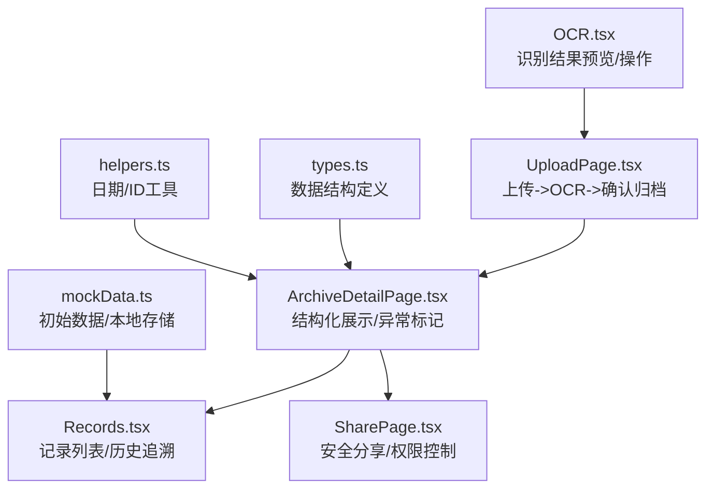
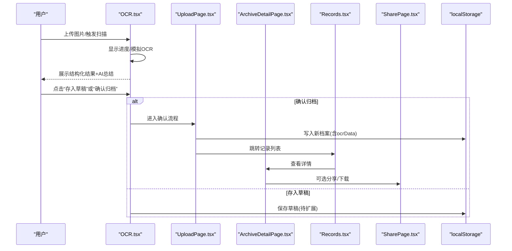
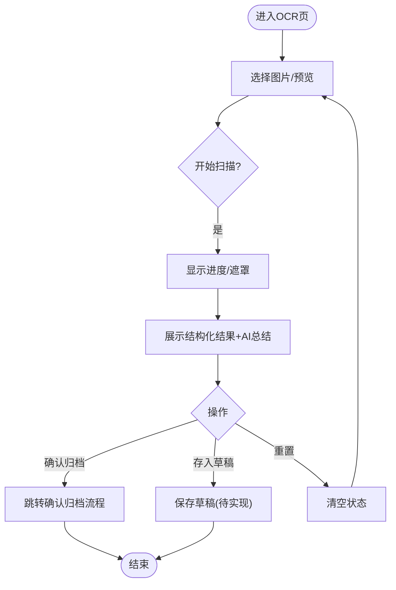
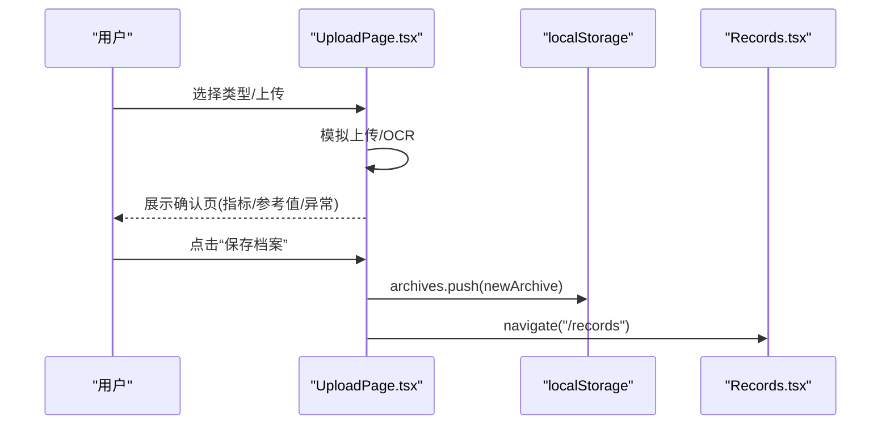
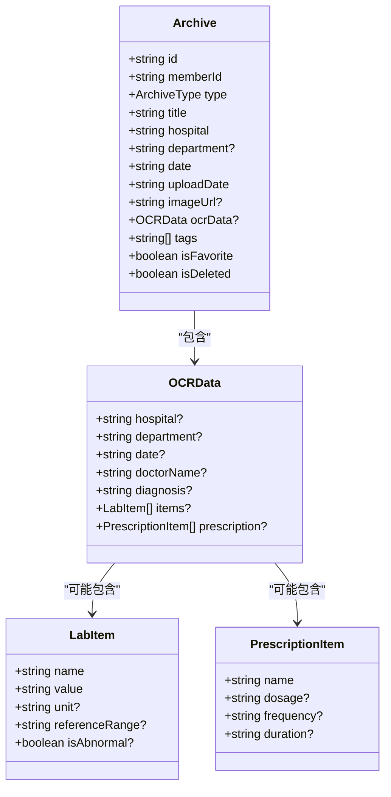
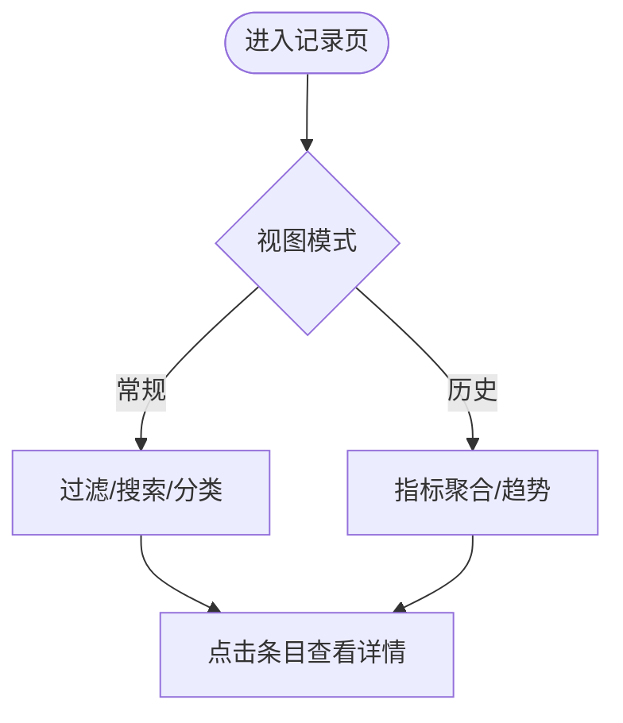
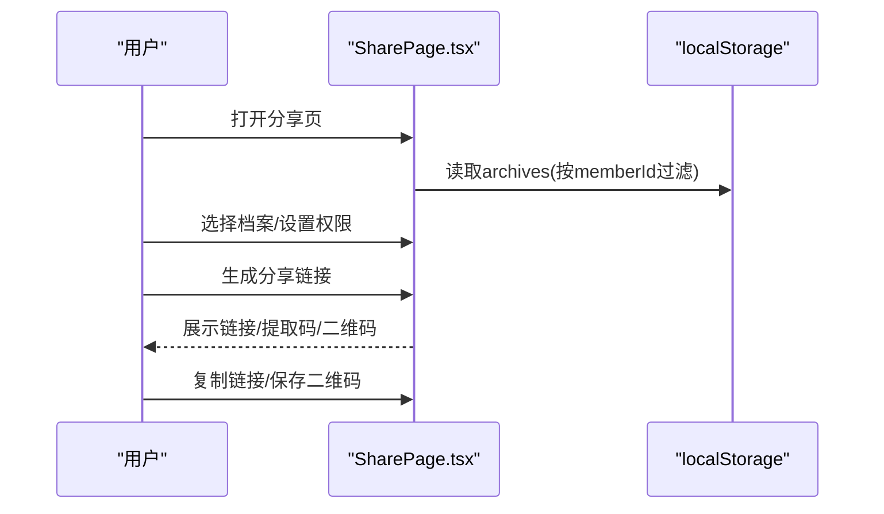
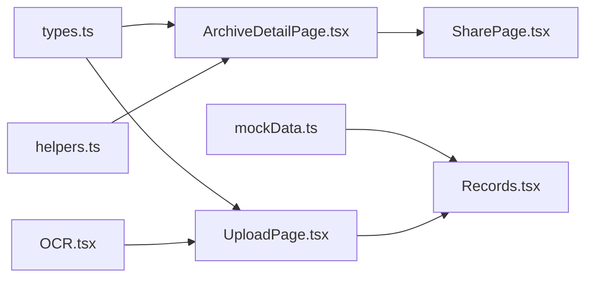

# 结果编辑与确认

<cite>
**本文引用的文件**
- [OCR.tsx](file://figma-ui/src/app/pages/OCR.tsx)
- [UploadPage.tsx](file://figma-ui/src/app/pages/UploadPage.tsx)
- [ArchiveDetailPage.tsx](file://figma-ui/src/app/pages/ArchiveDetailPage.tsx)
- [Records.tsx](file://figma-ui/src/app/pages/Records.tsx)
- [SharePage.tsx](file://figma-ui/src/app/pages/SharePage.tsx)
- [types.ts](file://figma-ui/src/app/types.ts)
- [mockData.ts](file://figma-ui/src/app/utils/mockData.ts)
- [helpers.ts](file://figma-ui/src/app/utils/helpers.ts)
</cite>

## 目录
1. [简介](#简介)
2. [项目结构](#项目结构)
3. [核心组件](#核心组件)
4. [架构总览](#架构总览)
5. [详细组件分析](#详细组件分析)
6. [依赖关系分析](#依赖关系分析)
7. [性能考量](#性能考量)
8. [故障排查指南](#故障排查指南)
9. [结论](#结论)
10. [附录](#附录)

## 简介
本章节面向医案通OCR识别模块的“结果编辑与确认”能力，围绕以下目标展开：结构化数据展示界面、字段编辑能力、数据验证机制、确认归档流程；AI智能总结生成、正常值标识显示、异常数据标记；草稿保存、数据持久化、版本管理；用户交互设计、表单验证规则、错误提示机制；数据导出格式、分享功能、历史记录管理。文档以仓库现有前端实现为依据，结合类型定义与页面逻辑进行系统化说明。

## 项目结构
与OCR结果编辑与确认相关的前端代码主要分布在以下页面与类型文件中：
- OCR识别结果预览与操作入口：OCR.tsx
- 上传流程与确认归档：UploadPage.tsx
- 档案详情与结构化展示：ArchiveDetailPage.tsx
- 记录列表与历史追溯：Records.tsx
- 安全分享：SharePage.tsx
- 数据类型定义：types.ts
- 模拟数据与初始化：mockData.ts
- 工具函数（日期、ID等）：helpers.ts

图表来源
- [OCR.tsx:24-269](file://figma-ui/src/app/pages/OCR.tsx#L24-L269)
- [UploadPage.tsx:7-52](file://figma-ui/src/app/pages/UploadPage.tsx#L7-L52)
- [ArchiveDetailPage.tsx:27-356](file://figma-ui/src/app/pages/ArchiveDetailPage.tsx#L27-L356)
- [Records.tsx:101-421](file://figma-ui/src/app/pages/Records.tsx#L101-L421)
- [SharePage.tsx:6-264](file://figma-ui/src/app/pages/SharePage.tsx#L6-L264)
- [types.ts:11-95](file://figma-ui/src/app/types.ts#L11-L95)
- [mockData.ts:1-98](file://figma-ui/src/app/utils/mockData.ts#L1-L98)
- [helpers.ts:1-52](file://figma-ui/src/app/utils/helpers.ts#L1-L52)

章节来源
- [OCR.tsx:24-269](file://figma-ui/src/app/pages/OCR.tsx#L24-L269)
- [UploadPage.tsx:7-52](file://figma-ui/src/app/pages/UploadPage.tsx#L7-L52)
- [ArchiveDetailPage.tsx:27-356](file://figma-ui/src/app/pages/ArchiveDetailPage.tsx#L27-L356)
- [Records.tsx:101-421](file://figma-ui/src/app/pages/Records.tsx#L101-L421)
- [SharePage.tsx:6-264](file://figma-ui/src/app/pages/SharePage.tsx#L6-L264)
- [types.ts:11-95](file://figma-ui/src/app/types.ts#L11-L95)
- [mockData.ts:1-98](file://figma-ui/src/app/utils/mockData.ts#L1-L98)
- [helpers.ts:1-52](file://figma-ui/src/app/utils/helpers.ts#L1-L52)

## 核心组件
- OCR识别结果页：提供图片预览、扫描进度、结构化结果展示、AI总结、正常/异常标识、草稿保存与确认归档按钮。
- 上传确认页：完成上传与OCR处理后的确认界面，展示AI提取指标、参考范围、异常高亮，支持保存至本地存储并跳转记录列表。
- 档案详情页：按档案类型渲染不同视图（检验报告、处方、门诊病历、影像报告），对异常项进行高亮与提醒，支持查看原件、下载、AI问答入口。
- 记录列表页：展示AI摘要、标签、分类筛选、搜索、历史追溯模式（指标趋势）。
- 分享页：选择档案、设置有效期/密码/下载权限、生成链接与二维码、复制链接。

章节来源
- [OCR.tsx:24-269](file://figma-ui/src/app/pages/OCR.tsx#L24-L269)
- [UploadPage.tsx:7-52](file://figma-ui/src/app/pages/UploadPage.tsx#L7-L52)
- [ArchiveDetailPage.tsx:27-356](file://figma-ui/src/app/pages/ArchiveDetailPage.tsx#L27-L356)
- [Records.tsx:101-421](file://figma-ui/src/app/pages/Records.tsx#L101-L421)
- [SharePage.tsx:6-264](file://figma-ui/src/app/pages/SharePage.tsx#L6-L264)

## 架构总览
OCR结果编辑与确认的整体流程如下：
- 用户上传或拍照后进入上传流程，系统模拟上传与OCR解析，进入确认页。
- 在OCR页或确认页中，展示结构化数据、AI总结、正常/异常标识。
- 用户可存入草稿或直接确认归档；确认后写入本地存储并跳转到记录列表。
- 记录列表支持搜索、分类、历史追溯；详情页按类型渲染结构化内容并提供分享、下载等操作。

图表来源
- [OCR.tsx:42-75](file://figma-ui/src/app/pages/OCR.tsx#L42-L75)
- [OCR.tsx:231-238](file://figma-ui/src/app/pages/OCR.tsx#L231-L238)
- [UploadPage.tsx:12-52](file://figma-ui/src/app/pages/UploadPage.tsx#L12-L52)
- [ArchiveDetailPage.tsx:27-356](file://figma-ui/src/app/pages/ArchiveDetailPage.tsx#L27-L356)
- [Records.tsx:101-421](file://figma-ui/src/app/pages/Records.tsx#L101-L421)
- [SharePage.tsx:6-264](file://figma-ui/src/app/pages/SharePage.tsx#L6-L264)

## 详细组件分析

### OCR识别结果页（OCR.tsx）
- 结构化数据展示：以键值对形式展示识别出的关键指标，支持正常/异常图标提示。
- AI智能总结：在结果卡片底部展示AI生成的总结文本。
- 正常值标识：当字段包含normal为true时显示绿色勾；false时显示黄色警示。
- 草稿保存与确认归档：提供两个按钮，分别用于暂存与最终归档。
- 交互与反馈：扫描过程有进度条与遮罩提示；完成后通过toast提示成功。

图表来源
- [OCR.tsx:42-75](file://figma-ui/src/app/pages/OCR.tsx#L42-L75)
- [OCR.tsx:205-238](file://figma-ui/src/app/pages/OCR.tsx#L205-L238)

章节来源
- [OCR.tsx:24-269](file://figma-ui/src/app/pages/OCR.tsx#L24-L269)

### 上传与确认归档（UploadPage.tsx）
- 步骤流转：选择类型→上传→OCR处理→确认页。
- 确认页展示：档案类型、医院、科室、日期、AI提取指标（含参考范围）、异常高亮。
- 数据持久化：确认后构造档案对象并写入localStorage的archives数组。
- 导航：保存成功后跳转到记录列表。

图表来源
- [UploadPage.tsx:12-52](file://figma-ui/src/app/pages/UploadPage.tsx#L12-L52)
- [UploadPage.tsx:111-185](file://figma-ui/src/app/pages/UploadPage.tsx#L111-L185)

章节来源
- [UploadPage.tsx:7-52](file://figma-ui/src/app/pages/UploadPage.tsx#L7-L52)
- [UploadPage.tsx:111-185](file://figma-ui/src/app/pages/UploadPage.tsx#L111-L185)

### 档案详情页（ArchiveDetailPage.tsx）
- 类型化渲染：根据档案类型渲染不同视图（检验报告、处方、门诊病历、影像报告）。
- 异常数据标记：当items中存在isAbnormal为true时，行背景与文字高亮，并附加“偏高”标签。
- AI指标提醒：若存在异常项，显示统一提醒卡片。
- 元信息展示：标题、医院、科室、日期、医生、标签等。
- 辅助操作：查看原件、下载、AI助手入口。

图表来源
- [types.ts:11-95](file://figma-ui/src/app/types.ts#L11-L95)
- [ArchiveDetailPage.tsx:54-112](file://figma-ui/src/app/pages/ArchiveDetailPage.tsx#L54-L112)
- [ArchiveDetailPage.tsx:114-174](file://figma-ui/src/app/pages/ArchiveDetailPage.tsx#L114-L174)
- [ArchiveDetailPage.tsx:176-249](file://figma-ui/src/app/pages/ArchiveDetailPage.tsx#L176-L249)

章节来源
- [ArchiveDetailPage.tsx:27-356](file://figma-ui/src/app/pages/ArchiveDetailPage.tsx#L27-L356)
- [types.ts:11-95](file://figma-ui/src/app/types.ts#L11-L95)

### 记录列表与历史追溯（Records.tsx）
- 常规模式：展示AI摘要、标签、分类筛选、搜索。
- 历史追溯模式：聚合指标历史，展示趋势与异动提醒。
- 交互：切换视图、筛选类别、搜索关键词匹配标题/医院/摘要/标签。

图表来源
- [Records.tsx:101-421](file://figma-ui/src/app/pages/Records.tsx#L101-L421)

章节来源
- [Records.tsx:101-421](file://figma-ui/src/app/pages/Records.tsx#L101-L421)

### 安全分享（SharePage.tsx）
- 选择档案：从当前成员未删除的档案中选择多份。
- 权限设置：有效期、密码保护、允许下载。
- 生成链接：展示链接与提取码，支持复制与保存二维码。
- 状态管理：已选档案集合、是否已生成链接、复制反馈。

图表来源
- [SharePage.tsx:6-264](file://figma-ui/src/app/pages/SharePage.tsx#L6-L264)

章节来源
- [SharePage.tsx:6-264](file://figma-ui/src/app/pages/SharePage.tsx#L6-L264)

## 依赖关系分析
- 类型依赖：所有页面均基于types.ts中的Archive、OCRData、LabItem、PrescriptionItem等类型进行数据绑定与渲染。
- 数据源：
  - 本地存储：UploadPage与ArchiveDetailPage读写localStorage的archives。
  - 模拟数据：mockData.ts提供初始数据并在为空时初始化。
  - 工具函数：helpers.ts提供日期格式化、过期判断、ID生成等。
- 组件耦合：
  - OCR.tsx与UploadPage.tsx共同构成上传到确认的流程。
  - ArchiveDetailPage.tsx依赖types.ts的结构化数据渲染不同类型视图。
  - Records.tsx负责列表与历史追溯，作为详情页的入口。
  - SharePage.tsx依赖archives数据进行分享配置。

图表来源
- [types.ts:11-95](file://figma-ui/src/app/types.ts#L11-L95)
- [mockData.ts:1-98](file://figma-ui/src/app/utils/mockData.ts#L1-L98)
- [helpers.ts:1-52](file://figma-ui/src/app/utils/helpers.ts#L1-L52)
- [OCR.tsx:24-269](file://figma-ui/src/app/pages/OCR.tsx#L24-L269)
- [UploadPage.tsx:7-52](file://figma-ui/src/app/pages/UploadPage.tsx#L7-L52)
- [ArchiveDetailPage.tsx:27-356](file://figma-ui/src/app/pages/ArchiveDetailPage.tsx#L27-L356)
- [Records.tsx:101-421](file://figma-ui/src/app/pages/Records.tsx#L101-L421)
- [SharePage.tsx:6-264](file://figma-ui/src/app/pages/SharePage.tsx#L6-L264)

章节来源
- [types.ts:11-95](file://figma-ui/src/app/types.ts#L11-L95)
- [mockData.ts:1-98](file://figma-ui/src/app/utils/mockData.ts#L1-L98)
- [helpers.ts:1-52](file://figma-ui/src/app/utils/helpers.ts#L1-L52)

## 性能考量
- 渲染优化：使用条件渲染与动画库减少不必要的重绘；列表项采用布局动画提升体验。
- 本地存储：localStorage读写为同步操作，建议在批量写入时合并数据以减少多次I/O。
- 图片预览：使用URL.createObjectURL避免重复解码；注意及时释放内存。
- 长列表：记录列表可根据搜索与分类进行过滤，避免全量渲染。

[本节为通用指导，不直接分析具体文件]

## 故障排查指南
- 本地存储为空：首次进入记录页时，mockData会初始化archives；如仍为空，检查initializeMockData调用时机。
- 详情页找不到档案：ArchiveDetailPage优先读取localStorage，其次回退到mock数据；确认id是否正确传递。
- 分享页无数据：SharePage按currentMemberId过滤archives；确认localStorage中memberId与archives是否存在。
- OCR结果未显示：确认startScan流程是否被触发，以及scanResult状态是否更新。

章节来源
- [mockData.ts:91-98](file://figma-ui/src/app/utils/mockData.ts#L91-L98)
- [ArchiveDetailPage.tsx:32-40](file://figma-ui/src/app/pages/ArchiveDetailPage.tsx#L32-L40)
- [SharePage.tsx:17-24](file://figma-ui/src/app/pages/SharePage.tsx#L17-L24)
- [OCR.tsx:42-75](file://figma-ui/src/app/pages/OCR.tsx#L42-L75)

## 结论
本模块实现了从OCR识别到结果编辑与确认的完整闭环：
- 结构化展示：按类型渲染检验、处方、病历、影像等内容，清晰呈现元信息与AI提取结果。
- 异常与正常标识：通过isAbnormal与normal字段直观区分指标状态，并提供统一提醒。
- 草稿与归档：支持暂存与确认归档，归档数据写入本地存储并可回溯查看。
- 分享与导出：提供安全分享与下载入口，便于跨设备协作与离线查阅。
- 历史追溯：记录列表支持指标趋势与异动提醒，辅助长期健康管理。

[本节为总结性内容，不直接分析具体文件]

## 附录

### 数据结构与字段说明
- 档案类型：medical_record、lab_report、imaging_report、prescription、physical_exam、discharge_summary、invoice、other。
- OCR数据：
  - 通用字段：hospital、department、date、doctorName、diagnosis。
  - 检验项：name、value、unit、referenceRange、isAbnormal。
  - 处方项：name、dosage、frequency、duration。
- 分享链接：archiveIds、url、password、expiresAt、createdAt、isRevoked、viewCount。

章节来源
- [types.ts:11-95](file://figma-ui/src/app/types.ts#L11-L95)

### 用户交互与验证要点
- 输入校验：当前实现以模拟为主，建议在实际后端接入时增加必填校验、格式校验、范围校验。
- 错误提示：使用toast进行成功提示；异常场景可增加错误弹窗与重试机制。
- 表单规则：建议为ocrData.items增加单位与数值合法性校验，referenceRange用于范围判定。

[本节为通用指导，不直接分析具体文件]

### 数据导出与分享格式
- 导出：详情页提供下载按钮，可将档案原件或结构化数据导出（具体格式由后端决定）。
- 分享：支持链接与二维码，可设置有效期、密码保护与下载权限。

章节来源
- [ArchiveDetailPage.tsx:342-353](file://figma-ui/src/app/pages/ArchiveDetailPage.tsx#L342-L353)
- [SharePage.tsx:111-195](file://figma-ui/src/app/pages/SharePage.tsx#L111-L195)