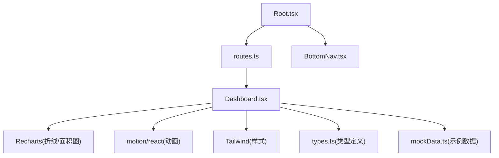
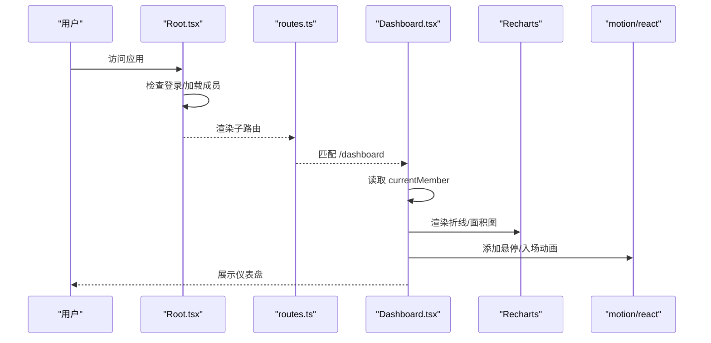
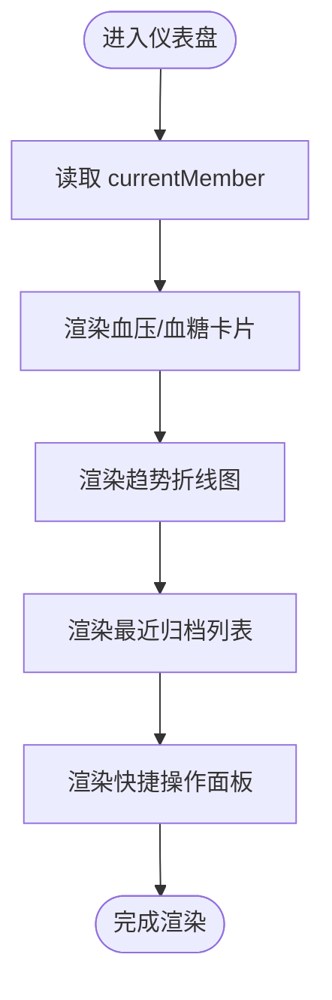
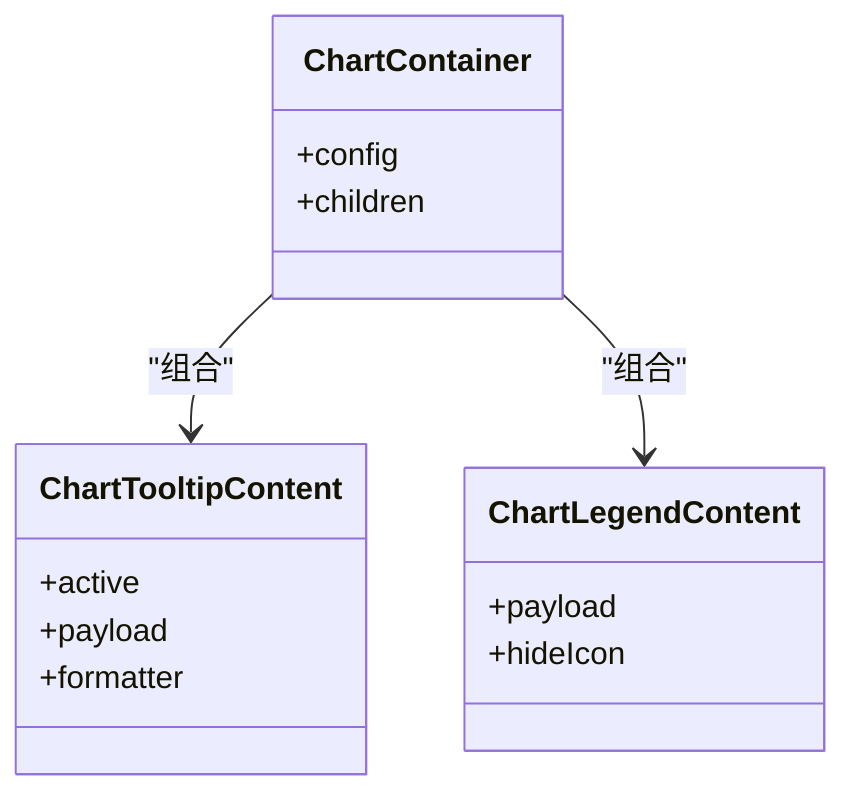
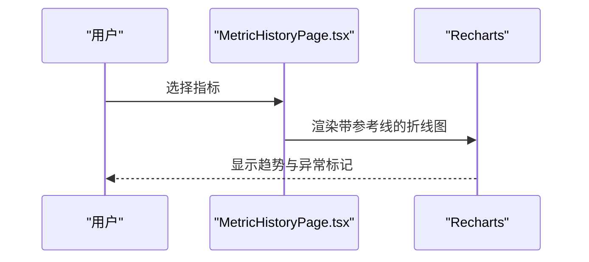
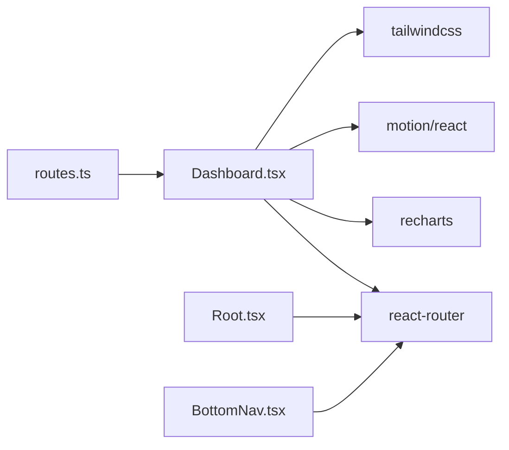
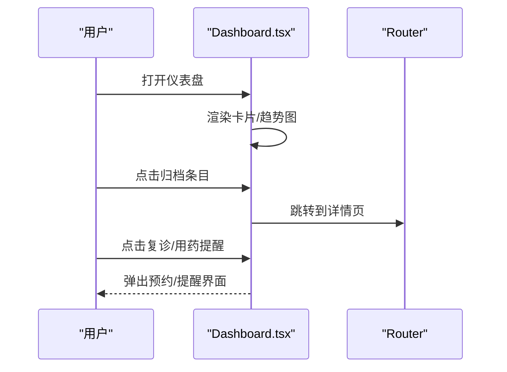

# 仪表盘模块

<cite>
**本文引用的文件**
- [Dashboard.tsx](file://figma-ui/src/app/pages/Dashboard.tsx)
- [types.ts](file://figma-ui/src/app/types.ts)
- [mockData.ts](file://figma-ui/src/app/utils/mockData.ts)
- [chart.tsx](file://figma-ui/src/app/components/ui/chart.tsx)
- [Root.tsx](file://figma-ui/src/app/Root.tsx)
- [routes.ts](file://figma-ui/src/app/routes.ts)
- [BottomNav.tsx](file://figma-ui/src/app/components/BottomNav.tsx)
- [MetricHistoryPage.tsx](file://figma-ui/src/app/pages/MetricHistoryPage.tsx)
- [package.json](file://figma-ui/package.json)
</cite>

## 目录
1. [简介](#简介)
2. [项目结构](#项目结构)
3. [核心组件](#核心组件)
4. [架构总览](#架构总览)
5. [详细组件分析](#详细组件分析)
6. [依赖关系分析](#依赖关系分析)
7. [性能考量](#性能考量)
8. [故障排查指南](#故障排查指南)
9. [结论](#结论)
10. [附录](#附录)

## 简介
本模块为医案通医疗档案网站的“仪表盘”页面，聚焦健康指标展示与趋势分析。当前实现包含：
- 关键健康指标卡片（血压、血糖）及迷你面积图
- 健康指标趋势折线图（基于 Recharts）
- 最近归档记录列表
- 快捷操作面板（复诊预约、用药提醒）
- 响应式布局与动画效果（motion/react）
- 数据绑定方式（本地成员上下文 + 模拟数据）

该文档从系统架构、组件关系、数据流、交互流程、状态管理、性能优化等维度进行系统化说明，帮助开发者快速理解并扩展仪表盘功能。

## 项目结构
仪表盘模块位于 pages 层，通过路由挂载到 Root 容器下，使用 React Router 的 Outlet 注入当前成员信息；图表能力由 Recharts 提供，UI 组件库采用 Tailwind CSS，动效使用 motion/react。

图表来源
- [Root.tsx:1-59](file://figma-ui/src/app/Root.tsx#L1-L59)
- [routes.ts:25-76](file://figma-ui/src/app/routes.ts#L25-L76)
- [Dashboard.tsx:1-204](file://figma-ui/src/app/pages/Dashboard.tsx#L1-L204)

章节来源
- [Root.tsx:1-59](file://figma-ui/src/app/Root.tsx#L1-L59)
- [routes.ts:25-76](file://figma-ui/src/app/routes.ts#L25-L76)

## 核心组件
- 仪表盘主组件 Dashboard：负责欢迎区、搜索框、统计卡片网格、趋势图、最近归档、快捷操作面板。
- 图表封装 chart.tsx：提供 ChartContainer、ChartTooltipContent、ChartLegend 等可复用能力（当前仪表盘未直接使用，但可作为后续统一图表基座）。
- 类型与数据：types.ts 定义成员、档案、OCR 等数据结构；mockData.ts 提供示例档案数据。
- 路由与上下文：routes.ts 将 Dashboard 挂载至 /dashboard；Root.tsx 通过 Outlet 注入 currentMember 上下文。
- 底部导航：BottomNav.tsx 提供应用级导航入口。

章节来源
- [Dashboard.tsx:1-204](file://figma-ui/src/app/pages/Dashboard.tsx#L1-L204)
- [chart.tsx:1-354](file://figma-ui/src/app/components/ui/chart.tsx#L1-L354)
- [types.ts:1-95](file://figma-ui/src/app/types.ts#L1-L95)
- [mockData.ts:1-98](file://figma-ui/src/app/utils/mockData.ts#L1-L98)
- [Root.tsx:1-59](file://figma-ui/src/app/Root.tsx#L1-L59)
- [routes.ts:25-76](file://figma-ui/src/app/routes.ts#L25-L76)
- [BottomNav.tsx:1-85](file://figma-ui/src/app/components/BottomNav.tsx#L1-L85)

## 架构总览
仪表盘采用“页面组件 + 图表库 + 上下文数据”的轻量架构：
- Root 作为应用壳，校验登录态并加载当前成员，通过 Outlet 向子路由注入 currentMember。
- Dashboard 读取 currentMember 渲染个性化内容，并使用 Recharts 绘制指标趋势。
- 数据源以本地模拟为主，便于前端演示与开发；后续可替换为 API 或持久化存储。
- 图表能力可扩展至 chart.tsx 提供的通用容器与工具，保证风格一致性与主题切换能力。

图表来源
- [Root.tsx:1-59](file://figma-ui/src/app/Root.tsx#L1-L59)
- [routes.ts:25-76](file://figma-ui/src/app/routes.ts#L25-L76)
- [Dashboard.tsx:1-204](file://figma-ui/src/app/pages/Dashboard.tsx#L1-L204)

## 详细组件分析

### 仪表盘主组件（Dashboard）
- 欢迎与搜索区：显示当前成员姓名与健康分提示，提供全局搜索输入。
- 统计卡片网格：
  - 血压卡片：展示当前值与单位，附带迷你面积图。
  - 血糖卡片：展示当前值与单位，附带迷你面积图。
- 健康指标趋势：折线图展示时间序列，支持时间范围选择（最近7天/最近30天）。
- 最近归档：列表展示最近上传的档案，含医院、日期、类型与识别状态。
- 快捷操作面板：复诊预约（日期/科室/医院）、待服药物（名称/时间/服用方式）。

技术要点
- 图表：使用 Recharts 的 LineChart/AreaChart + ResponsiveContainer，确保移动端自适应。
- 动画：使用 motion/react 的 whileHover 提升交互反馈。
- 数据绑定：currentMember 来自 Root 的 Outlet 上下文；图表数据使用内联模拟数组。
- 响应式：Tailwind 栅格与 min-w/min-h 控制卡片尺寸，图表容器自适应宽高。

图表来源
- [Dashboard.tsx:30-204](file://figma-ui/src/app/pages/Dashboard.tsx#L30-L204)

章节来源
- [Dashboard.tsx:30-204](file://figma-ui/src/app/pages/Dashboard.tsx#L30-L204)

### 图表能力封装（chart.tsx）
- 提供 ChartContainer：统一包裹 Recharts 图表，注入主题与样式变量。
- 提供 ChartTooltipContent：可配置的 Tooltip，支持图标、格式化、隐藏标签/指示器。
- 提供 ChartLegendContent：可配置的图例，支持图标与自定义标签。
- 适用场景：当仪表盘需要统一图表主题、多系列对比、复杂 Tooltip 时，可迁移至该封装。

图表来源
- [chart.tsx:37-70](file://figma-ui/src/app/components/ui/chart.tsx#L37-L70)
- [chart.tsx:107-249](file://figma-ui/src/app/components/ui/chart.tsx#L107-L249)
- [chart.tsx:253-305](file://figma-ui/src/app/components/ui/chart.tsx#L253-L305)

章节来源
- [chart.tsx:1-354](file://figma-ui/src/app/components/ui/chart.tsx#L1-L354)

### 历史指标页（MetricHistoryPage）
- 用于单指标的历史趋势追溯，展示参考区间、异常高亮、最近医院等信息。
- 与仪表盘形成互补：仪表盘侧重概览与趋势，历史页侧重深度分析与溯源。

图表来源
- [MetricHistoryPage.tsx:1-141](file://figma-ui/src/app/pages/MetricHistoryPage.tsx#L1-L141)

章节来源
- [MetricHistoryPage.tsx:1-141](file://figma-ui/src/app/pages/MetricHistoryPage.tsx#L1-L141)

### 数据模型与类型（types.ts）
- Member：成员基本信息（id、name、relation、gender、birthday、bloodType、allergies）。
- Archive：档案元数据（id、memberId、type、title、hospital、department、date、uploadDate、imageUrl、ocrData、tags、isFavorite、isDeleted）。
- OCRData/LabItem/PrescriptionItem：OCR 解析后的结构化数据，便于指标提取与可视化。
- 常量映射：ARCHIVE_TYPE_LABELS、ARCHIVE_TYPE_COLORS 用于展示与样式。

章节来源
- [types.ts:1-95](file://figma-ui/src/app/types.ts#L1-L95)

### 模拟数据（mockData.ts）
- MOCK_ARCHIVES：示例档案集合，包含血常规、病历、处方、影像、体检等类型。
- initializeMockData：在 localStorage 为空时初始化示例数据，便于离线演示。

章节来源
- [mockData.ts:1-98](file://figma-ui/src/app/utils/mockData.ts#L1-L98)

## 依赖关系分析
- 运行时依赖
  - recharts：图表渲染（折线/面积图、坐标轴、网格、提示框、响应式容器）。
  - motion/react：交互动画（悬停、点击缩放、入场过渡）。
  - lucide-react：图标资源。
  - react-router：路由与上下文传递。
  - tailwindcss：原子化样式与响应式布局。
- 构建与脚本
  - vite：开发与构建工具。
  - @tailwindcss/vite：Tailwind 集成插件。

图表来源
- [Dashboard.tsx:1-204](file://figma-ui/src/app/pages/Dashboard.tsx#L1-L204)
- [Root.tsx:1-59](file://figma-ui/src/app/Root.tsx#L1-L59)
- [routes.ts:25-76](file://figma-ui/src/app/routes.ts#L25-L76)
- [BottomNav.tsx:1-85](file://figma-ui/src/app/components/BottomNav.tsx#L1-L85)
- [package.json:14-76](file://figma-ui/package.json#L14-L76)

章节来源
- [package.json:14-76](file://figma-ui/package.json#L14-L76)

## 性能考量
- 图表渲染
  - 使用 ResponsiveContainer 避免重复计算与溢出。
  - 对小型迷你图（卡片内）限制高度与透明度，减少重绘压力。
  - 大数据量时考虑分页/采样或使用 memo/useMemo 缓存数据。
- 动画性能
  - motion 的 whileHover/whileTap 仅作用于必要元素，避免全量重排。
  - 大列表滚动时谨慎使用复杂动画，必要时降级为静态样式。
- 状态与数据
  - 当前使用内联模拟数据，建议后续接入 API 时增加请求去抖与缓存策略。
  - 使用 localStorage 存储成员与档案时注意序列化开销与容量限制。
- 样式与布局
  - 利用 Tailwind 的 grid/flex 与 min-w/min-h 控制卡片尺寸，避免过度嵌套。
  - 图表容器统一设置 overflow-hidden，防止溢出导致的布局抖动。

[本节为通用性能指导，不直接分析具体代码文件]

## 故障排查指南
- 图表不显示或尺寸异常
  - 检查父容器是否设置了明确宽高；确认 ResponsiveContainer 包裹正确。
  - 确认数据格式与 dataKey 对应，避免空数据导致无渲染。
- 动画卡顿
  - 减少同时触发的动画数量；避免在高频滚动中执行复杂动画。
- 路由跳转无效
  - 确认 routes.ts 已注册对应路径；检查 Root 的 Outlet 是否正确渲染子路由。
- 成员信息为空
  - 检查 Root.tsx 的登录态与成员数据加载逻辑；确认 localStorage 中存在 members 与 currentMemberId。
- 图表主题/样式不一致
  - 如需统一主题，可迁移至 chart.tsx 的 ChartContainer 与配置项。

章节来源
- [Root.tsx:10-46](file://figma-ui/src/app/Root.tsx#L10-L46)
- [routes.ts:25-76](file://figma-ui/src/app/routes.ts#L25-L76)
- [Dashboard.tsx:107-141](file://figma-ui/src/app/pages/Dashboard.tsx#L107-L141)

## 结论
仪表盘模块以简洁的页面组件为核心，结合 Recharts 与 motion/react 实现了健康指标的可视化与交互体验。当前实现满足基础展示与趋势分析需求，具备良好扩展性：
- 可逐步引入真实数据源与状态管理方案（如 Context/Store）。
- 可复用 chart.tsx 的图表封装，统一主题与交互。
- 可增强交互（如筛选、导出、告警通知）以提升用户体验。

[本节为总结性内容，不直接分析具体代码文件]

## 附录

### 用户交互流程
- 进入仪表盘：Root 校验登录态并加载成员，Dashboard 渲染欢迎区与统计卡片。
- 查看趋势：用户可选择时间范围，折线图更新展示。
- 查看归档：点击最近归档条目跳转到详情页。
- 快捷操作：复诊预约与用药提醒卡片提供下一步操作入口（可扩展为弹窗/表单）。

图表来源
- [Dashboard.tsx:144-200](file://figma-ui/src/app/pages/Dashboard.tsx#L144-L200)
- [routes.ts:77-88](file://figma-ui/src/app/routes.ts#L77-L88)

### 数据绑定方式
- 成员信息：通过 Root 的 Outlet 注入 currentMember，Dashboard 使用 useOutletContext 获取。
- 图表数据：当前使用内联模拟数组，后续可替换为 API 返回或本地存储的数据。
- 类型约束：使用 types.ts 中的 Member、Archive、OCRData 等类型保证数据结构一致性。

章节来源
- [Root.tsx:18-46](file://figma-ui/src/app/Root.tsx#L18-L46)
- [Dashboard.tsx:30-32](file://figma-ui/src/app/pages/Dashboard.tsx#L30-L32)
- [types.ts:1-95](file://figma-ui/src/app/types.ts#L1-L95)

### 响应式布局适配
- 使用 Tailwind 的 grid-cols-2 与 min-w/min-h 控制卡片在不同屏幕下的表现。
- 图表使用 ResponsiveContainer 自适应容器尺寸，避免溢出与错位。
- 底部导航固定定位，适配安全区域（safe-area-inset-bottom）。

章节来源
- [Dashboard.tsx:58-105](file://figma-ui/src/app/pages/Dashboard.tsx#L58-L105)
- [BottomNav.tsx:17-19](file://figma-ui/src/app/components/BottomNav.tsx#L17-L19)

### 动画效果实现
- 卡片悬停：motion 的 whileHover 提供轻微上移反馈。
- 导航激活：BottomNav 使用 animate 与 layoutId 实现平滑切换与指示器动画。
- 建议：在长列表或复杂页面中谨慎使用动画，避免影响滚动性能。

章节来源
- [Dashboard.tsx:60-85](file://figma-ui/src/app/pages/Dashboard.tsx#L60-L85)
- [BottomNav.tsx:51-76](file://figma-ui/src/app/components/BottomNav.tsx#L51-L76)

### 状态管理方案
- 当前方案：Root 通过 useState 维护 currentMember，并通过 Outlet 向下传递。
- 扩展建议：
  - 使用 React Context 或轻量状态库（如 Zustand）集中管理成员、档案、指标数据。
  - 对异步数据引入请求缓存与错误重试机制。
  - 对本地存储读写增加容错与版本兼容处理。

章节来源
- [Root.tsx:6-46](file://figma-ui/src/app/Root.tsx#L6-L46)

### 性能优化策略
- 图表优化：
  - 对大数据集进行采样或分页。
  - 使用 memo/useMemo 缓存计算结果。
- 动画优化：
  - 仅在必要元素启用动画。
  - 避免在滚动容器中触发复杂动画。
- 样式优化：
  - 使用 Tailwind 原子类减少 CSS 体积。
  - 避免过度嵌套与重复样式。

[本节为通用优化指导，不直接分析具体代码文件]