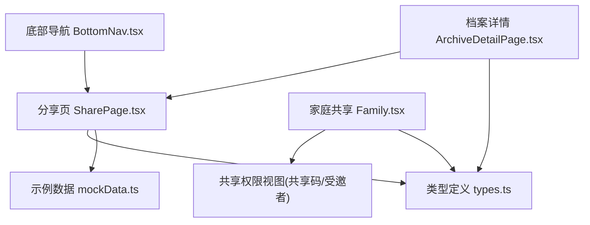
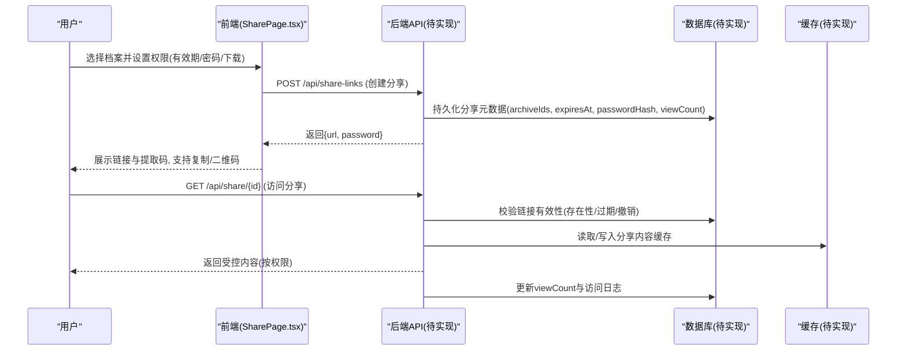
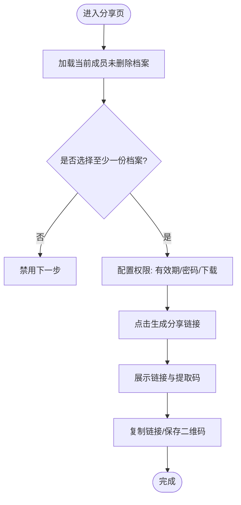
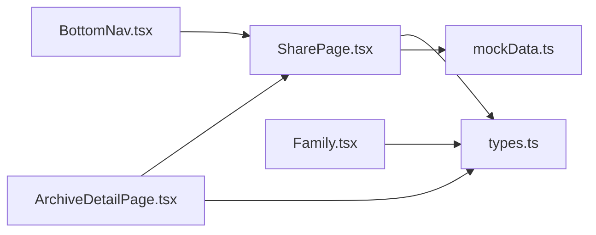
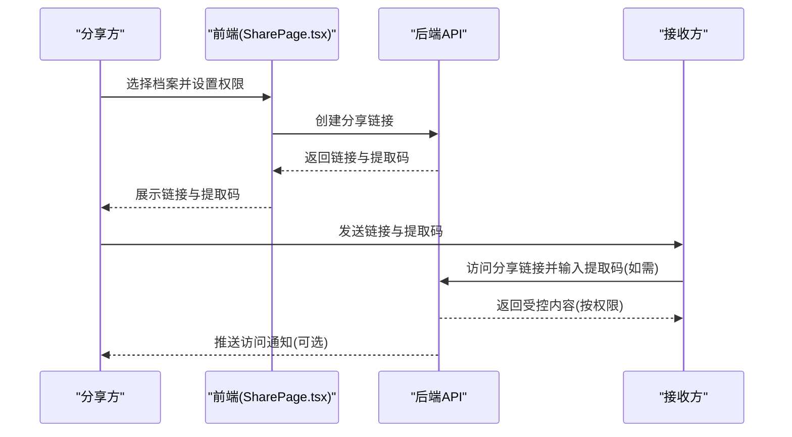

# 共享档案功能

<cite>
**本文引用的文件**
- [SharePage.tsx](file://figma-ui/src/app/pages/SharePage.tsx)
- [ArchiveDetailPage.tsx](file://figma-ui/src/app/pages/ArchiveDetailPage.tsx)
- [types.ts](file://figma-ui/src/app/types.ts)
- [mockData.ts](file://figma-ui/src/app/utils/mockData.ts)
- [Family.tsx](file://figma-ui/src/app/pages/Family.tsx)
- [BottomNav.tsx](file://figma-ui/src/app/components/BottomNav.tsx)
</cite>

## 目录
1. [简介](#简介)
2. [项目结构](#项目结构)
3. [核心组件](#核心组件)
4. [架构总览](#架构总览)
5. [详细组件分析](#详细组件分析)
6. [依赖关系分析](#依赖关系分析)
7. [性能考虑](#性能考虑)
8. [故障排查指南](#故障排查指南)
9. [结论](#结论)
10. [附录](#附录)

## 简介
本文件面向医案通医疗档案网站的“共享档案”功能，基于前端代码与类型定义，梳理并说明共享机制、界面设计、权限配置、有效期管理、数据模型、以及可落地的技术实现建议（同步、冲突解决、版本控制、通知、记录追踪、统计报表等）。文档同时给出安全隔离、隐私保护与性能优化策略，帮助产品与研发团队在现有前端基础上扩展后端能力，形成完整的共享闭环。

## 项目结构
共享相关的前端入口与页面主要位于以下位置：
- 分享主流程：分享页 SharePage.tsx
- 档案详情入口：ArchiveDetailPage.tsx（提供从详情页进入分享的快捷入口）
- 家庭共享与权限：Family.tsx（成员列表与共享权限视图）
- 导航集成：BottomNav.tsx（底部导航包含“分享”入口）
- 数据模型：types.ts（档案、OCR、分享链接等类型）
- 示例数据：mockData.ts（本地初始化与演示数据）

图表来源
- [BottomNav.tsx:8-14](file://figma-ui/src/app/components/BottomNav.tsx#L8-L14)
- [SharePage.tsx:1-15](file://figma-ui/src/app/pages/SharePage.tsx#L1-L15)
- [ArchiveDetailPage.tsx:27-40](file://figma-ui/src/app/pages/ArchiveDetailPage.tsx#L27-L40)
- [Family.tsx:57-106](file://figma-ui/src/app/pages/Family.tsx#L57-L106)
- [types.ts:11-72](file://figma-ui/src/app/types.ts#L11-L72)
- [mockData.ts:91-98](file://figma-ui/src/app/utils/mockData.ts#L91-L98)

章节来源
- [BottomNav.tsx:8-14](file://figma-ui/src/app/components/BottomNav.tsx#L8-L14)
- [SharePage.tsx:1-15](file://figma-ui/src/app/pages/SharePage.tsx#L1-L15)
- [ArchiveDetailPage.tsx:27-40](file://figma-ui/src/pages/ArchiveDetailPage.tsx#L27-L40)
- [Family.tsx:57-106](file://figma-ui/src/app/pages/Family.tsx#L57-L106)
- [types.ts:11-72](file://figma-ui/src/app/types.ts#L11-L72)
- [mockData.ts:91-98](file://figma-ui/src/app/utils/mockData.ts#L91-L98)

## 核心组件
- 分享页（SharePage.tsx）
  - 支持选择多份档案进行分享
  - 提供有效期、密码保护、允许下载三项权限配置
  - 生成分享链接与提取码，支持复制与二维码保存
- 档案详情页（ArchiveDetailPage.tsx）
  - 展示档案详情，并提供“分享”按钮入口
- 家庭共享（Family.tsx）
  - 成员列表与共享权限视图
  - 提供家庭共享码与受邀者管理
- 类型定义（types.ts）
  - 定义档案、OCR、分享链接等数据结构
- 示例数据（mockData.ts）
  - 初始化本地存储的示例档案数据

章节来源
- [SharePage.tsx:6-45](file://figma-ui/src/app/pages/SharePage.tsx#L6-L45)
- [ArchiveDetailPage.tsx:27-52](file://figma-ui/src/app/pages/ArchiveDetailPage.tsx#L27-L52)
- [Family.tsx:57-106](file://figma-ui/src/app/pages/Family.tsx#L57-L106)
- [types.ts:11-72](file://figma-ui/src/app/types.ts#L11-L72)
- [mockData.ts:91-98](file://figma-ui/src/app/utils/mockData.ts#L91-L98)

## 架构总览
当前前端实现了“分享”的核心交互与权限配置，并通过类型定义明确了分享链接的数据结构。后端尚未在本仓库中实现，因此以下同步、冲突解决、版本控制、通知、记录追踪、统计报表等为“落地建议”，用于指导后续服务端开发。

图表来源
- [SharePage.tsx:32-45](file://figma-ui/src/app/pages/SharePage.tsx#L32-L45)
- [types.ts:63-72](file://figma-ui/src/app/types.ts#L63-L72)

## 详细组件分析

### 分享页（SharePage.tsx）
- 功能要点
  - 第一步：选择档案（多选），仅显示当前成员且未删除的档案
  - 第二步：权限设置
    - 有效期：1天/7天/30天/永久
    - 密码保护：开启后生成提取码
    - 允许下载：控制是否允许查看者下载原件
  - 结果：生成加密分享链接与提取码，支持复制链接与保存二维码
- 关键状态
  - selectedArchives：已选档案ID数组
  - shareConfig：expireIn、needPassword、allowDownload
  - isGenerated：是否已生成链接
  - copied：复制反馈状态

图表来源
- [SharePage.tsx:17-45](file://figma-ui/src/app/pages/SharePage.tsx#L17-L45)
- [SharePage.tsx:111-179](file://figma-ui/src/app/pages/SharePage.tsx#L111-L179)
- [SharePage.tsx:181-259](file://figma-ui/src/app/pages/SharePage.tsx#L181-L259)

章节来源
- [SharePage.tsx:17-45](file://figma-ui/src/app/pages/SharePage.tsx#L17-L45)
- [SharePage.tsx:111-179](file://figma-ui/src/app/pages/SharePage.tsx#L111-L179)
- [SharePage.tsx:181-259](file://figma-ui/src/app/pages/SharePage.tsx#L181-L259)

### 档案详情页（ArchiveDetailPage.tsx）
- 功能要点
  - 根据路由参数获取档案ID，优先从本地存储读取，否则回退到示例数据
  - 顶部工具栏提供“分享”按钮，便于快速发起分享
- 与分享的关系
  - 作为分享入口之一，跳转至分享页或弹出分享面板（由路由与业务逻辑决定）

章节来源
- [ArchiveDetailPage.tsx:27-52](file://figma-ui/src/app/pages/ArchiveDetailPage.tsx#L27-L52)
- [ArchiveDetailPage.tsx:267-274](file://figma-ui/src/app/pages/ArchiveDetailPage.tsx#L267-L274)

### 家庭共享（Family.tsx）
- 功能要点
  - 成员列表与共享权限两个Tab
  - 共享权限视图提供“家庭共享码”与“受邀者”列表，支持更新二维码、复制共享密码、查看有效期
- 与分享的关系
  - 家庭共享码用于邀请家庭成员加入共享空间；分享链接用于单次或短期对外共享

章节来源
- [Family.tsx:57-106](file://figma-ui/src/app/pages/Family.tsx#L57-L106)
- [Family.tsx:169-218](file://figma-ui/src/app/pages/Family.tsx#L169-L218)

### 类型与数据模型（types.ts）
- 关键类型
  - Archive：档案基本信息（含成员归属、类型、标签、删除标记等）
  - OCRData：OCR/AI提取的结构化数据（检验项、处方、诊断等）
  - ShareLink：分享链接元数据（关联档案ID、URL、密码、过期时间、创建时间、撤销状态、浏览次数）
- 颜色与标签映射
  - ARCHIVE_TYPE_LABELS、ARCHIVE_TYPE_COLORS 用于UI展示

章节来源
- [types.ts:11-72](file://figma-ui/src/app/types.ts#L11-L72)
- [types.ts:74-94](file://figma-ui/src/app/types.ts#L74-L94)

### 示例数据（mockData.ts）
- 作用
  - 初始化本地存储中的示例档案数据，便于演示与测试
- 使用场景
  - 首次打开应用时若无本地数据则注入示例数据

章节来源
- [mockData.ts:91-98](file://figma-ui/src/app/utils/mockData.ts#L91-L98)

## 依赖关系分析
- 页面间依赖
  - BottomNav.tsx 提供“分享”入口，指向 /share
  - SharePage.tsx 依赖 types.ts 的 Archive 类型
  - ArchiveDetailPage.tsx 依赖 types.ts 与 mockData.ts
  - Family.tsx 依赖 types.ts 的 Member 类型（局部定义）
- 数据流依赖
  - 分享流程依赖 ShareLink 类型定义的字段（archiveIds、expiresAt、password、isRevoked、viewCount）

图表来源
- [BottomNav.tsx:8-14](file://figma-ui/src/app/components/BottomNav.tsx#L8-L14)
- [SharePage.tsx:1-15](file://figma-ui/src/app/pages/SharePage.tsx#L1-L15)
- [ArchiveDetailPage.tsx:27-40](file://figma-ui/src/app/pages/ArchiveDetailPage.tsx#L27-L40)
- [Family.tsx:57-106](file://figma-ui/src/app/pages/Family.tsx#L57-L106)
- [types.ts:11-72](file://figma-ui/src/app/types.ts#L11-L72)
- [mockData.ts:91-98](file://figma-ui/src/app/utils/mockData.ts#L91-L98)

章节来源
- [BottomNav.tsx:8-14](file://figma-ui/src/app/components/BottomNav.tsx#L8-L14)
- [SharePage.tsx:1-15](file://figma-ui/src/app/pages/SharePage.tsx#L1-L15)
- [ArchiveDetailPage.tsx:27-40](file://figma-ui/src/app/pages/ArchiveDetailPage.tsx#L27-L40)
- [Family.tsx:57-106](file://figma-ui/src/app/pages/Family.tsx#L57-L106)
- [types.ts:11-72](file://figma-ui/src/app/types.ts#L11-L72)
- [mockData.ts:91-98](file://figma-ui/src/app/utils/mockData.ts#L91-L98)

## 性能考虑
- 前端层面
  - 列表渲染：对档案列表采用虚拟滚动或分页加载，避免一次性渲染过多DOM
  - 图片与OCR数据：懒加载与按需展开，减少首屏体积
  - 本地缓存：利用 localStorage 缓存常用数据，减少重复请求
- 后端建议（待实现）
  - 分享链接访问：使用缓存层（如Redis）缓存热门分享内容的只读副本，降低数据库压力
  - 限流与防刷：对分享链接访问接口实施速率限制，防止滥用
  - 异步任务：生成二维码、压缩图片、OCR解析等耗时操作走消息队列异步处理
  - 分片与CDN：大文件（影像、PDF）分片上传与CDN分发，提升加载速度

[本节为通用性能建议，不直接分析具体文件]

## 故障排查指南
- 常见问题定位
  - 无法选择档案：检查当前成员ID与档案的 memberId 匹配，以及 isDeleted 标记
  - 链接无效：确认 expiresAt 是否过期、isRevoked 是否被撤销
  - 访问无权限：校验是否需要密码、下载权限是否开启
- 调试建议
  - 前端：打印 selectedArchives、shareConfig 状态变化
  - 后端：记录分享链接创建与访问日志，包括IP、User-Agent、访问时间、访问结果
  - 数据一致性：核对 ShareLink.archiveIds 与实际档案是否存在、是否被删除

章节来源
- [SharePage.tsx:17-45](file://figma-ui/src/app/pages/SharePage.tsx#L17-L45)
- [types.ts:63-72](file://figma-ui/src/app/types.ts#L63-L72)

## 结论
当前前端已实现分享的核心交互与权限配置，具备清晰的类型定义与示例数据支撑。为实现完整的共享能力，建议在服务端补充分享链接生命周期管理、访问鉴权、同步与冲突解决、版本控制、通知与审计、统计报表等功能，并结合缓存与CDN优化性能与可用性。

[本节为总结性内容，不直接分析具体文件]

## 附录

### 共享模式说明（基于现有能力与可扩展点）
- 分类共享：通过 Archive.type 区分门诊病历、检验报告、影像报告、处方、体检报告等，可在后端按类别设置默认共享策略
- 选择性共享：SharePage 支持多选档案，后端以 archiveIds 数组精确控制共享范围
- 完全共享：可通过家庭共享码将全部档案开放给特定成员（需后端实现成员级权限聚合）

章节来源
- [types.ts:11-35](file://figma-ui/src/app/types.ts#L11-L35)
- [SharePage.tsx:63-109](file://figma-ui/src/app/pages/SharePage.tsx#L63-L109)
- [Family.tsx:169-218](file://figma-ui/src/app/pages/Family.tsx#L169-L218)

### 共享设置界面设计（基于 SharePage.tsx）
- 共享范围选择：多选档案，实时计数
- 权限级别配置：密码保护开关、允许下载开关
- 共享有效期管理：1天/7天/30天/永久
- 结果展示：链接与提取码、复制链接、保存二维码

章节来源
- [SharePage.tsx:63-109](file://figma-ui/src/app/pages/SharePage.tsx#L63-L109)
- [SharePage.tsx:111-179](file://figma-ui/src/app/pages/SharePage.tsx#L111-L179)
- [SharePage.tsx:181-259](file://figma-ui/src/app/pages/SharePage.tsx#L181-L259)

### 档案同步机制、冲突解决与版本控制（建议）
- 同步机制
  - 增量同步：基于 lastModified 或版本号拉取变更
  - 双向同步：支持多端编辑合并，冲突时提示用户选择保留版本
- 冲突解决策略
  - 字段级合并：非重叠字段自动合并，重叠字段触发人工确认
  - 时间戳优先：以最近修改为准，或按角色优先级决定
- 版本控制
  - 每次重大修改生成新版本快照，支持回溯与对比
  - 分享链接绑定特定版本，确保访问一致性

[本节为通用技术建议，不直接分析具体文件]

### 共享通知系统、记录追踪与统计报表（建议）
- 通知系统
  - 分享创建成功通知、链接过期提醒、访问异常告警
  - 家庭成员加入/移除通知
- 记录追踪
  - 审计日志：谁在何时创建/撤销了分享、访问次数与来源
  - 访问日志：IP、设备、浏览器、访问时间、访问结果
- 统计报表
  - 分享数量、活跃分享数、平均有效期、下载率、访问峰值时段
  - 按档案类型、科室、医生维度的共享统计

[本节为通用功能建议，不直接分析具体文件]

### 工作流程（从发起分享到接受分享）

图表来源
- [SharePage.tsx:32-45](file://figma-ui/src/app/pages/SharePage.tsx#L32-L45)
- [types.ts:63-72](file://figma-ui/src/app/types.ts#L63-L72)

### 数据隔离策略、隐私保护与安全机制（建议）
- 数据隔离
  - 成员级隔离：基于 memberId 过滤可访问档案
  - 租户级隔离：不同机构/医院数据物理或逻辑隔离
- 隐私保护
  - 最小化披露：仅暴露必要字段，敏感信息脱敏
  - 水印与防截图：动态水印、禁止截屏（移动端）
- 安全机制
  - 传输加密：全站HTTPS
  - 存储加密：敏感字段（如密码）哈希存储
  - 访问控制：基于角色的细粒度权限（查看/下载/编辑）
  - 审计与合规：完整操作日志，满足医疗数据合规要求

[本节为通用安全建议，不直接分析具体文件]

### 性能优化、缓存策略与离线支持（建议）
- 缓存策略
  - 分享内容只读缓存（短TTL），热点内容长TTL
  - 本地缓存：IndexedDB 缓存历史分享与常用档案
- 离线支持
  - Service Worker 缓存静态资源与关键页面
  - 离线状态下可查看已缓存的分享内容（受限）
- 其他优化
  - 图片懒加载、视频分片播放、PDF预览优化
  - 接口合并与批量查询，减少网络往返

[本节为通用性能建议，不直接分析具体文件]