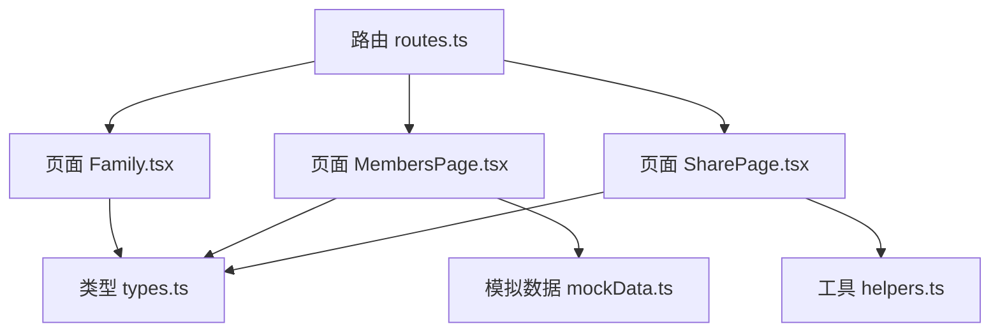
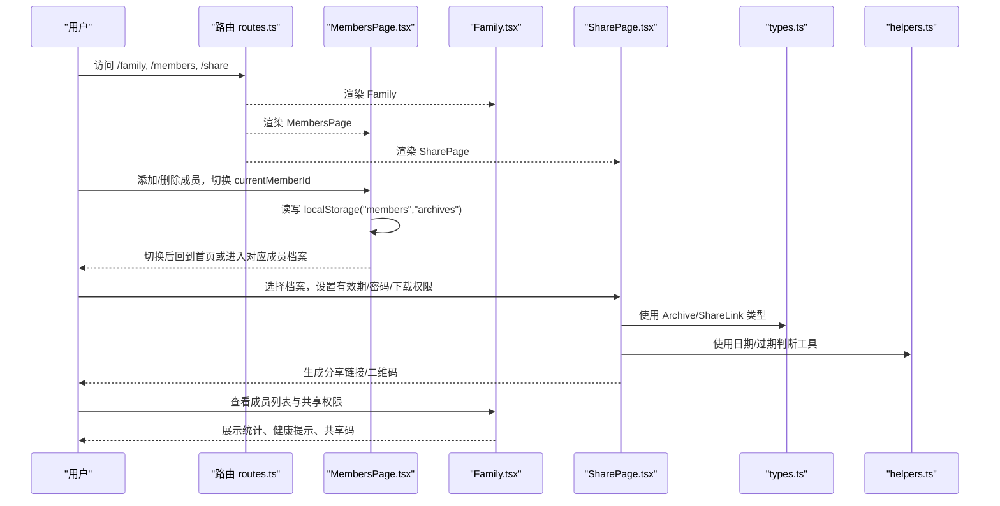
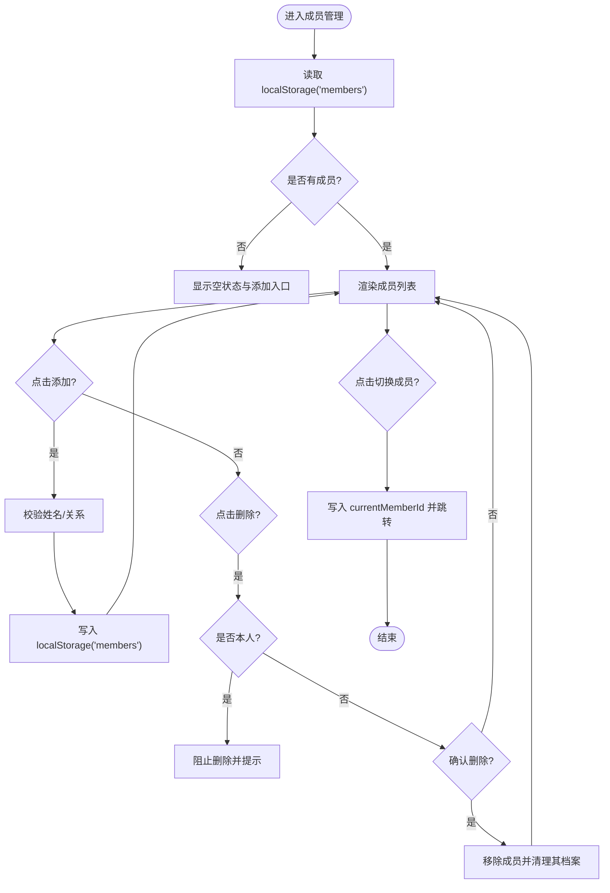
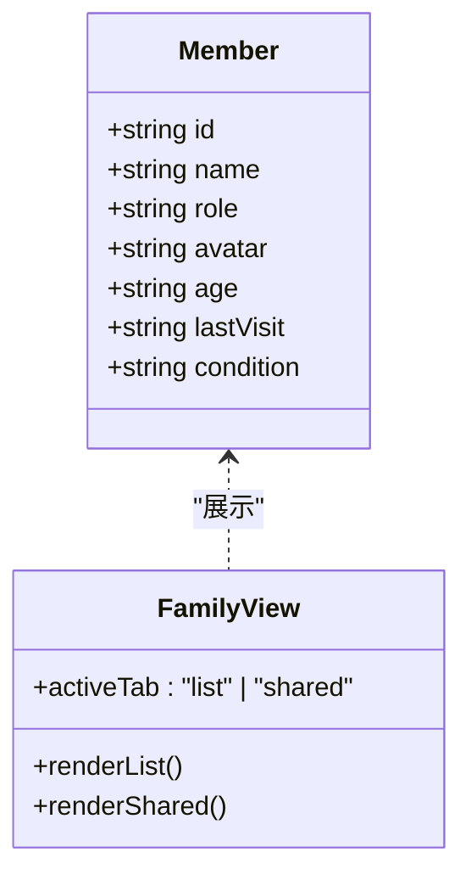
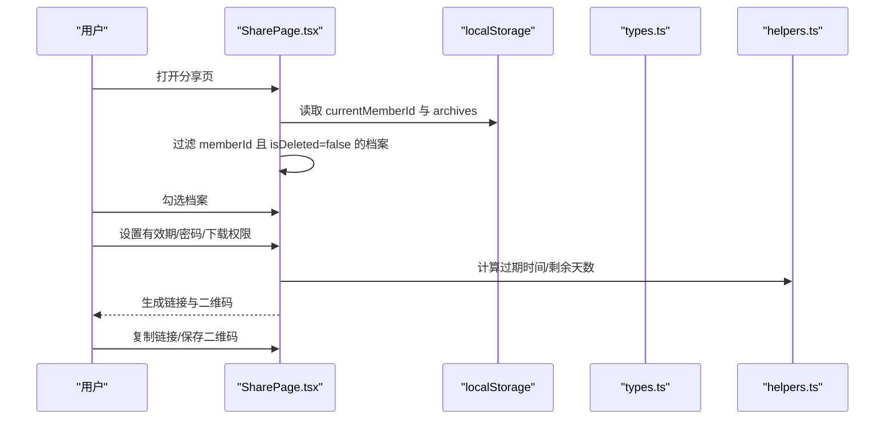
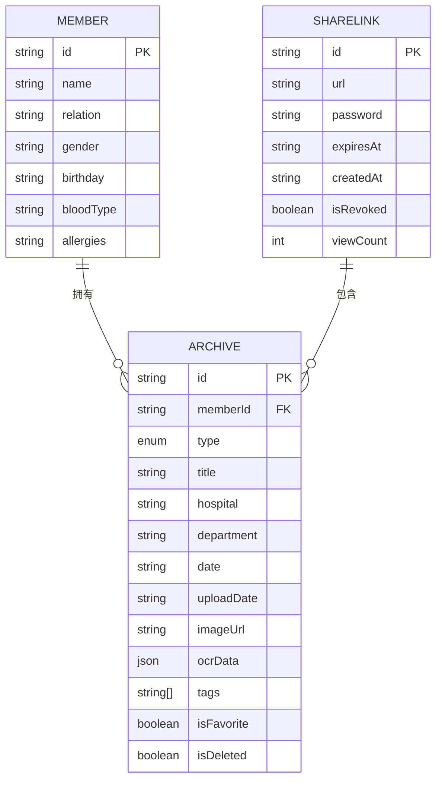
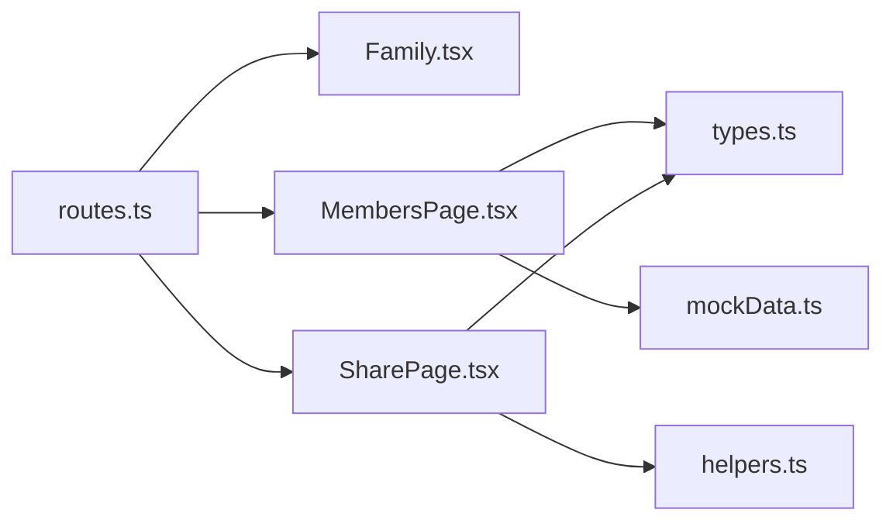

# 家庭管理模块

<cite>
**本文引用的文件**
- [Family.tsx](file://figma-ui/src/app/pages/Family.tsx)
- [MembersPage.tsx](file://figma-ui/src/app/pages/MembersPage.tsx)
- [SharePage.tsx](file://figma-ui/src/app/pages/SharePage.tsx)
- [types.ts](file://figma-ui/src/app/types.ts)
- [routes.ts](file://figma-ui/src/app/routes.ts)
- [helpers.ts](file://figma-ui/src/app/utils/helpers.ts)
- [mockData.ts](file://figma-ui/src/app/utils/mockData.ts)
</cite>

## 目录
1. [简介](#简介)
2. [项目结构](#项目结构)
3. [核心组件](#核心组件)
4. [架构总览](#架构总览)
5. [详细组件分析](#详细组件分析)
6. [依赖分析](#依赖分析)
7. [性能考虑](#性能考虑)
8. [故障排查指南](#故障排查指南)
9. [结论](#结论)
10. [附录](#附录)

## 简介
本模块为医案通医疗档案网站的家庭管理子系统，聚焦家庭成员信息管理、权限控制机制、共享档案功能与健康档案同步。文档覆盖成员角色定义、访问权限配置、数据隔离策略、实时同步机制（前端实现层面）、成员添加与删除、权限分配、共享设置的前端界面设计与后端逻辑对接建议，并给出数据安全与隐私保护、协作工作流程的落地方案。

## 项目结构
家庭管理相关页面与类型集中在以下位置：
- 路由层：统一注册 family、members、share 等页面路由
- 页面层：
  - Family：家庭档案库入口，成员列表与共享权限概览
  - MembersPage：成员增删改查、切换当前成员
  - SharePage：按成员维度选择档案、生成安全分享链接
- 类型与工具：
  - types：成员、档案、OCR、分享链接等数据结构
  - helpers：日期格式化、过期判断、ID 生成等通用方法
  - mockData：本地初始化示例数据

图表来源
- [routes.ts:25-76](file://figma-ui/src/app/routes.ts#L25-L76)
- [Family.tsx:57-106](file://figma-ui/src/app/pages/Family.tsx#L57-L106)
- [MembersPage.tsx:6-18](file://figma-ui/src/app/pages/MembersPage.tsx#L6-L18)
- [SharePage.tsx:6-24](file://figma-ui/src/app/pages/SharePage.tsx#L6-L24)
- [types.ts:1-95](file://figma-ui/src/app/types.ts#L1-L95)
- [helpers.ts:1-52](file://figma-ui/src/app/utils/helpers.ts#L1-L52)
- [mockData.ts:1-98](file://figma-ui/src/app/utils/mockData.ts#L1-L98)

章节来源
- [routes.ts:25-76](file://figma-ui/src/app/routes.ts#L25-L76)

## 核心组件
- 家庭成员管理（MembersPage）
  - 功能：新增成员、删除成员、查看/切换当前成员、统计成员档案数量
  - 数据：基于 localStorage 持久化 members 与 archives；通过 currentMemberId 切换上下文
- 家庭档案库（Family）
  - 功能：成员列表展示、健康提示、共享码与受邀用户概览
  - 交互：Tab 切换“成员列表/共享权限”，支持扫码绑定与邀请
- 安全分享（SharePage）
  - 功能：按当前成员筛选可分享档案、勾选、设置有效期/密码/下载权限、生成分享链接与二维码
  - 数据：从 localStorage 读取 archives，过滤当前成员未删除档案

章节来源
- [MembersPage.tsx:6-48](file://figma-ui/src/app/pages/MembersPage.tsx#L6-L48)
- [Family.tsx:57-224](file://figma-ui/src/app/pages/Family.tsx#L57-L224)
- [SharePage.tsx:6-45](file://figma-ui/src/app/pages/SharePage.tsx#L6-L45)

## 架构总览
家庭管理模块采用“页面 + 类型 + 工具”的分层组织，数据在浏览器端以 localStorage 作为临时存储，配合 React Router 进行页面导航。分享流程由 SharePage 驱动，成员切换由 MembersPage 完成，Family 提供聚合视图。

图表来源
- [routes.ts:25-76](file://figma-ui/src/app/routes.ts#L25-L76)
- [MembersPage.tsx:6-48](file://figma-ui/src/app/pages/MembersPage.tsx#L6-L48)
- [Family.tsx:57-224](file://figma-ui/src/app/pages/Family.tsx#L57-L224)
- [SharePage.tsx:6-45](file://figma-ui/src/app/pages/SharePage.tsx#L6-L45)
- [types.ts:1-95](file://figma-ui/src/app/types.ts#L1-L95)
- [helpers.ts:1-52](file://figma-ui/src/app/utils/helpers.ts#L1-L52)

## 详细组件分析

### 成员管理（MembersPage）
- 数据流
  - 初始化时从 localStorage 加载 members，若为空则显示空状态引导添加
  - 新增成员：校验必填字段后写入 localStorage，刷新列表
  - 删除成员：禁止删除本人；确认后移除成员并从 archives 中清理其档案
  - 切换成员：更新 currentMemberId 并跳转回首页，使后续操作基于新成员上下文
- 权限与安全
  - 本地存储限制：仅当前设备可用，跨设备不同步
  - 敏感信息脱敏：建议在展示手机号等时使用 maskPhone 工具
- 扩展点
  - 可接入后端 API 替换 localStorage，实现多端同步与权限校验
  - 可增加成员关系图谱、角色权限矩阵

图表来源
- [MembersPage.tsx:11-48](file://figma-ui/src/app/pages/MembersPage.tsx#L11-L48)
- [helpers.ts:36-41](file://figma-ui/src/app/utils/helpers.ts#L36-L41)

章节来源
- [MembersPage.tsx:6-153](file://figma-ui/src/app/pages/MembersPage.tsx#L6-L153)
- [helpers.ts:36-41](file://figma-ui/src/app/utils/helpers.ts#L36-L41)

### 家庭档案库（Family）
- 功能要点
  - 成员列表：头像、角色标签、年龄、最近就诊时间、健康提示
  - 统计面板：总成员、总档案、待识别数量
  - 共享权限：展示家庭共享码、受邀用户及有效期
- 交互设计
  - Tab 切换“成员列表/共享权限”，带入场动画
  - 当前成员高亮，支持编辑与详情跳转
- 数据与集成
  - 当前为演示数据，可替换为真实成员与共享记录
  - 可结合 OCR 结果展示健康提示

图表来源
- [Family.tsx:17-55](file://figma-ui/src/app/pages/Family.tsx#L17-L55)
- [Family.tsx:57-224](file://figma-ui/src/app/pages/Family.tsx#L57-L224)

章节来源
- [Family.tsx:57-224](file://figma-ui/src/app/pages/Family.tsx#L57-L224)

### 安全分享（SharePage）
- 功能要点
  - 第一步：选择当前成员的未删除档案
  - 第二步：设置有效期、密码保护、是否允许下载
  - 生成分享链接与二维码，支持复制与保存
- 权限控制
  - 基于当前成员过滤可分享档案
  - 可选密码保护与下载权限，降低泄露风险
- 数据与工具
  - 使用 types 中的 Archive、ARCHIVE_TYPE_LABELS
  - 使用 helpers 的日期与过期判断能力

图表来源
- [SharePage.tsx:6-45](file://figma-ui/src/app/pages/SharePage.tsx#L6-L45)
- [SharePage.tsx:17-24](file://figma-ui/src/app/pages/SharePage.tsx#L17-L24)
- [types.ts:11-72](file://figma-ui/src/app/types.ts#L11-L72)
- [helpers.ts:21-51](file://figma-ui/src/app/utils/helpers.ts#L21-L51)

章节来源
- [SharePage.tsx:6-264](file://figma-ui/src/app/pages/SharePage.tsx#L6-L264)
- [types.ts:11-72](file://figma-ui/src/app/types.ts#L11-L72)
- [helpers.ts:21-51](file://figma-ui/src/app/utils/helpers.ts#L21-L51)

### 类型与数据结构
- Member：成员基本信息（id、name、relation、gender、birthday、bloodType、allergies）
- Archive：档案元数据（关联 memberId、类型、医院、科室、日期、图片、OCR 数据、标签、收藏/删除标记）
- ShareLink：分享链接元数据（包含 archiveIds、url、password、expiresAt、createdAt、isRevoked、viewCount）
- 辅助常量：ARCHIVE_TYPE_LABELS、ARCHIVE_TYPE_COLORS

图表来源
- [types.ts:1-95](file://figma-ui/src/app/types.ts#L1-L95)

章节来源
- [types.ts:1-95](file://figma-ui/src/app/types.ts#L1-L95)

## 依赖分析
- 路由依赖
  - routes.ts 将 /family、/members、/share 映射到对应页面组件
- 页面间依赖
  - MembersPage 与 SharePage 均依赖 localStorage 中的 members、archives、currentMemberId
  - Family 提供聚合视图，不直接读写数据，但可作为入口跳转到其他页面
- 类型与工具依赖
  - SharePage 依赖 types 中的 Archive、ARCHIVE_TYPE_LABELS
  - 所有页面均可复用 helpers 中的日期与 ID 工具

图表来源
- [routes.ts:25-76](file://figma-ui/src/app/routes.ts#L25-L76)
- [MembersPage.tsx:6-18](file://figma-ui/src/app/pages/MembersPage.tsx#L6-L18)
- [SharePage.tsx:6-24](file://figma-ui/src/app/pages/SharePage.tsx#L6-L24)
- [types.ts:1-95](file://figma-ui/src/app/types.ts#L1-L95)
- [helpers.ts:1-52](file://figma-ui/src/app/utils/helpers.ts#L1-L52)
- [mockData.ts:1-98](file://figma-ui/src/app/utils/mockData.ts#L1-L98)

章节来源
- [routes.ts:25-76](file://figma-ui/src/app/routes.ts#L25-L76)

## 性能考虑
- 本地存储读写
  - 频繁读写 localStorage 可能阻塞主线程，建议批量更新与防抖处理
- 列表渲染优化
  - 成员与档案列表较大时，可使用虚拟滚动或分页加载
- 图片与 OCR
  - 大图懒加载，OCR 结果缓存避免重复解析
- 分享链接生成
  - 大文件分享建议分片上传与断点续传（后端实现）

[本节为通用指导，无需具体文件引用]

## 故障排查指南
- 无法加载成员或档案
  - 检查 localStorage 中 members/archives 是否为空或被污染
  - 确认 currentMemberId 是否正确设置
- 删除成员失败
  - 确认非本人成员；确认二次确认弹窗已触发
- 分享链接无效
  - 检查是否选择了至少一份档案
  - 检查有效期是否已过期（使用 helpers.isExpired/daysUntilExpiry）
- 数据不一致
  - 多标签页切换可能导致状态不同步，建议使用事件总线或 StorageEvent 监听变更

章节来源
- [MembersPage.tsx:27-48](file://figma-ui/src/app/pages/MembersPage.tsx#L27-L48)
- [SharePage.tsx:17-35](file://figma-ui/src/app/pages/SharePage.tsx#L17-L35)
- [helpers.ts:21-51](file://figma-ui/src/app/utils/helpers.ts#L21-L51)

## 结论
家庭管理模块在前端实现了成员管理、共享权限概览与安全分享的核心流程，采用 localStorage 进行本地数据持久化，并通过类型系统与工具函数保证数据一致性与可用性。面向生产环境，建议引入后端服务以实现多端同步、细粒度权限控制、审计日志与加密传输，进一步提升数据安全与协作效率。

[本节为总结性内容，无需具体文件引用]

## 附录

### 成员角色与权限模型（建议）
- 角色定义
  - 管理员：可管理成员、修改共享设置、删除档案
  - 协作者：可查看与编辑指定档案，不可删除成员
  - 访客：仅可查看共享范围内的档案
- 权限配置
  - 成员级：对某成员的全部档案授予角色
  - 档案级：对特定档案授予只读/可编辑权限
  - 分享级：链接有效期、密码保护、下载开关
- 数据隔离策略
  - 基于 memberId 的数据隔离，确保各成员档案互不可见
  - 分享链接仅暴露授权档案集合，服务端校验链接有效性与会话权限

[本节为概念性说明，无需具体文件引用]

### 协作工作流程（建议）
- 邀请加入家庭
  - 管理员生成家庭共享码/二维码，被邀请者输入共享密码加入
- 分配权限
  - 根据角色与需求分配成员级/档案级权限
- 共享与审阅
  - 生成带密码与有效期的分享链接，供医生或家属审阅
- 归档与同步
  - 新增档案自动归属当前成员，支持 OCR 结构化提取
  - 多端同步通过后端服务实现，前端监听变更并刷新视图

[本节为概念性说明，无需具体文件引用]

### 数据安全与隐私保护（建议）
- 传输安全
  - 全站 HTTPS，敏感接口启用签名与鉴权
- 存储安全
  - 本地敏感信息加密存储（如分享密码），避免明文
  - 服务端数据库加密与最小权限原则
- 访问控制
  - 基于角色的访问控制（RBAC），细粒度到档案级
  - 分享链接限次、限时、可撤销
- 审计与合规
  - 记录关键操作日志（添加成员、修改权限、分享链接）
  - 遵循医疗数据合规要求，提供数据导出与删除能力

[本节为概念性说明，无需具体文件引用]