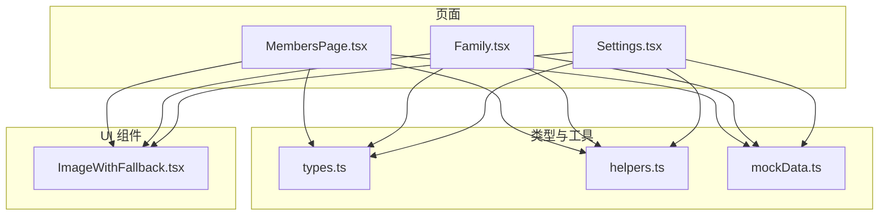
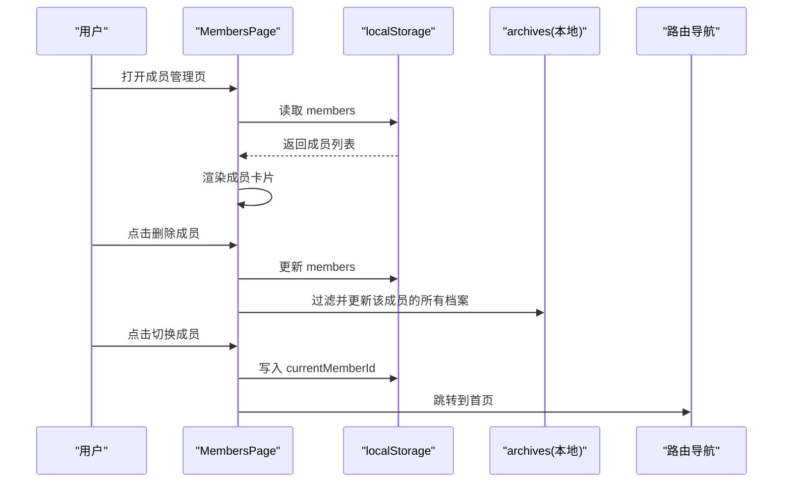
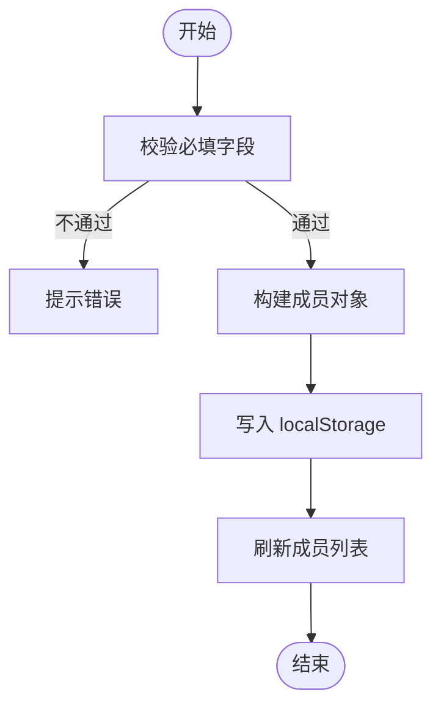
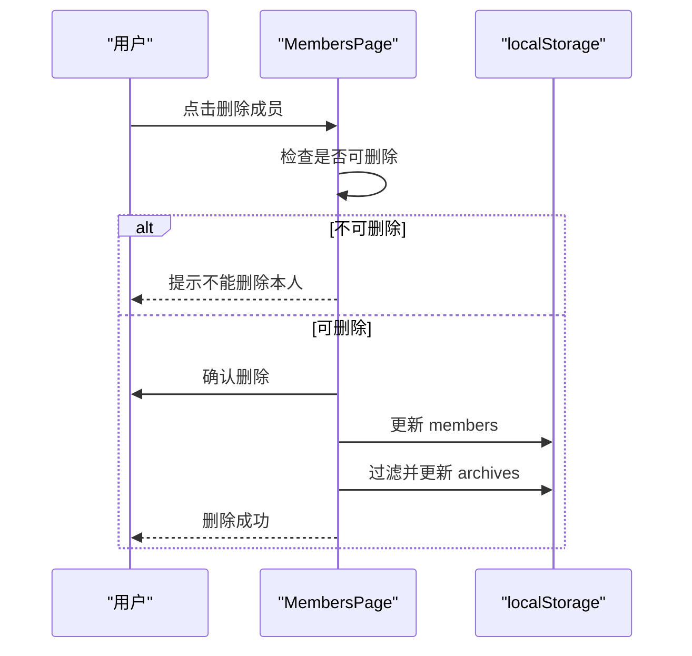
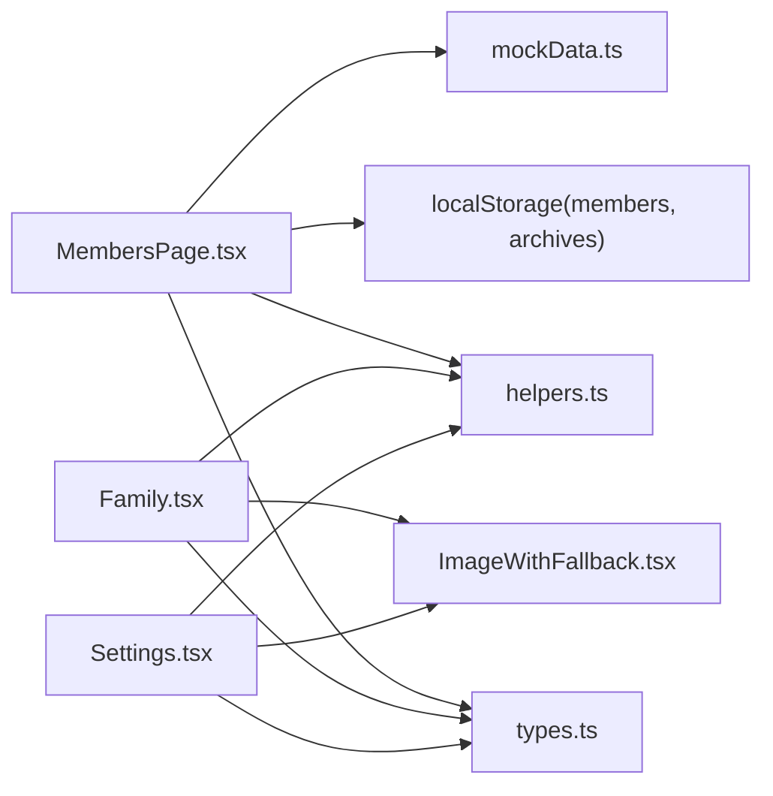

# 成员信息管理

<cite>
**本文引用的文件**
- [MembersPage.tsx](file://figma-ui/src/app/pages/MembersPage.tsx)
- [types.ts](file://figma-ui/src/app/types.ts)
- [Family.tsx](file://figma-ui/src/app/pages/Family.tsx)
- [Settings.tsx](file://figma-ui/src/app/pages/Settings.tsx)
- [helpers.ts](file://figma-ui/src/app/utils/helpers.ts)
- [mockData.ts](file://figma-ui/src/app/utils/mockData.ts)
- [ImageWithFallback.tsx](file://figma-ui/src/app/components/figma/ImageWithFallback.tsx)
</cite>

## 目录
1. [简介](#简介)
2. [项目结构](#项目结构)
3. [核心组件](#核心组件)
4. [架构总览](#架构总览)
5. [详细组件分析](#详细组件分析)
6. [依赖关系分析](#依赖关系分析)
7. [性能考虑](#性能考虑)
8. [故障排查指南](#故障排查指南)
9. [结论](#结论)
10. [附录](#附录)

## 简介
本文件为“医案通医疗档案网站”的成员信息管理功能提供系统化文档，覆盖家庭成员的添加、编辑、删除操作；成员基本信息管理（姓名、年龄、角色关系等）；头像上传与管理；健康状态跟踪；Member 类型定义与字段验证规则；成员列表展示逻辑、搜索筛选与批量操作机制；用户界面设计说明（卡片式布局、动画效果、响应式设计）；数据持久化策略、错误处理机制与用户体验优化方案。

## 项目结构
围绕成员管理的相关代码主要分布在以下位置：
- 页面层：成员管理页、家庭档案页、设置页
- 类型定义：成员与档案相关的数据模型
- 工具函数：日期格式化、ID生成等
- 示例数据：初始化本地存储的模拟数据
- UI 组件：图片回退组件用于头像加载失败时的兜底显示

图表来源
- [MembersPage.tsx:1-294](file://figma-ui/src/app/pages/MembersPage.tsx#L1-L294)
- [Family.tsx:1-224](file://figma-ui/src/app/pages/Family.tsx#L1-L224)
- [Settings.tsx:76-347](file://figma-ui/src/app/pages/Settings.tsx#L76-L347)
- [types.ts:1-95](file://figma-ui/src/app/types.ts#L1-L95)
- [helpers.ts:1-52](file://figma-ui/src/app/utils/helpers.ts#L1-L52)
- [mockData.ts:1-98](file://figma-ui/src/app/utils/mockData.ts#L1-L98)
- [ImageWithFallback.tsx:1-27](file://figma-ui/src/app/components/figma/ImageWithFallback.tsx#L1-L27)

章节来源
- [MembersPage.tsx:1-294](file://figma-ui/src/app/pages/MembersPage.tsx#L1-L294)
- [Family.tsx:1-224](file://figma-ui/src/app/pages/Family.tsx#L1-L224)
- [Settings.tsx:76-347](file://figma-ui/src/app/pages/Settings.tsx#L76-L347)
- [types.ts:1-95](file://figma-ui/src/app/types.ts#L1-L95)
- [helpers.ts:1-52](file://figma-ui/src/app/utils/helpers.ts#L1-L52)
- [mockData.ts:1-98](file://figma-ui/src/app/utils/mockData.ts#L1-L98)
- [ImageWithFallback.tsx:1-27](file://figma-ui/src/app/components/figma/ImageWithFallback.tsx#L1-L27)

## 核心组件
- 成员管理页（MembersPage）：负责成员的增删、切换当前成员、展示成员卡片及关联档案数量。
- 家庭档案页（Family）：以卡片形式展示成员信息，包含头像、角色、年龄、最近就诊与健康提示，并支持进入共享权限视图。
- 设置页（Settings）：提供成员管理的入口与简化表单，实现新增与删除成员，并在删除时处理当前成员切换。
- 类型定义（types）：定义 Member、Archive、OCRData 等数据结构，统一前后端数据契约。
- 工具函数（helpers）：日期格式化、过期判断、ID 生成、手机号脱敏等。
- 图片回退组件（ImageWithFallback）：当头像加载失败时自动替换为默认占位图。

章节来源
- [MembersPage.tsx:1-294](file://figma-ui/src/app/pages/MembersPage.tsx#L1-L294)
- [Family.tsx:1-224](file://figma-ui/src/app/pages/Family.tsx#L1-L224)
- [Settings.tsx:76-347](file://figma-ui/src/app/pages/Settings.tsx#L76-L347)
- [types.ts:1-95](file://figma-ui/src/app/types.ts#L1-L95)
- [helpers.ts:1-52](file://figma-ui/src/app/utils/helpers.ts#L1-L52)
- [ImageWithFallback.tsx:1-27](file://figma-ui/src/app/components/figma/ImageWithFallback.tsx#L1-L27)

## 架构总览
成员管理采用前端本地存储（localStorage）作为数据持久化层，页面通过读取和写入 members 与 archives 键值进行数据交互。成员切换通过 currentMemberId 控制，影响后续档案展示与上传归属。

图表来源
- [MembersPage.tsx:15-48](file://figma-ui/src/app/pages/MembersPage.tsx#L15-L48)
- [mockData.ts:91-98](file://figma-ui/src/app/utils/mockData.ts#L91-L98)

章节来源
- [MembersPage.tsx:15-48](file://figma-ui/src/app/pages/MembersPage.tsx#L15-L48)
- [mockData.ts:91-98](file://figma-ui/src/app/utils/mockData.ts#L91-L98)

## 详细组件分析

### 成员数据类型与字段说明
- Member 接口定义了成员的基本信息，包括 id、name、relation、gender、birthday、bloodType、allergies。这些字段用于标识成员、描述其身份与基本健康相关信息。
- Family 页面中使用了另一种 Member 类型，包含 id、name、role、avatar、age、lastVisit、condition，用于展示更丰富的成员信息与健康提示。

字段作用与验证规则（基于现有实现）：
- id：唯一标识，新增时使用时间戳或工具函数生成。
- name：必填，提交前校验非空。
- relation/role：必填，表示成员与本人的关系或角色。
- gender/birthday/bloodType/allergies：可选，用于补充健康背景信息。
- avatar：在 Family 页面中用于头像展示，建议使用 ImageWithFallback 组件处理加载失败。
- age/lastVisit/condition：在 Family 页面中用于展示年龄、最近就诊时间与当前健康关注点。

章节来源
- [types.ts:1-9](file://figma-ui/src/app/types.ts#L1-L9)
- [Family.tsx:17-25](file://figma-ui/src/app/pages/Family.tsx#L17-L25)
- [MembersPage.tsx:175-183](file://figma-ui/src/app/pages/MembersPage.tsx#L175-L183)

### 成员添加流程
- 用户在 MembersPage 或 Settings 中填写表单并提交。
- 前端对必填字段进行校验（如姓名与关系）。
- 生成新成员对象并追加到 members 数组，同时写回 localStorage。
- 关闭表单并刷新列表。

图表来源
- [MembersPage.tsx:169-186](file://figma-ui/src/app/pages/MembersPage.tsx#L169-L186)
- [Settings.tsx:84-104](file://figma-ui/src/app/pages/Settings.tsx#L84-L104)

章节来源
- [MembersPage.tsx:169-186](file://figma-ui/src/app/pages/MembersPage.tsx#L169-L186)
- [Settings.tsx:84-104](file://figma-ui/src/app/pages/Settings.tsx#L84-L104)

### 成员删除流程
- 删除按钮触发后，若为目标成员（id 为特定值），则阻止删除并提示。
- 二次确认后，从 members 列表中移除该成员，并同步清理其所有档案（archives）。
- 若当前成员被删除，切换到默认成员。

图表来源
- [MembersPage.tsx:27-43](file://figma-ui/src/app/pages/MembersPage.tsx#L27-L43)
- [Settings.tsx:106-118](file://figma-ui/src/app/pages/Settings.tsx#L106-L118)

章节来源
- [MembersPage.tsx:27-43](file://figma-ui/src/app/pages/MembersPage.tsx#L27-L43)
- [Settings.tsx:106-118](file://figma-ui/src/app/pages/Settings.tsx#L106-L118)

### 成员切换与当前成员管理
- 切换成员时将 currentMemberId 写入 localStorage，并导航至首页，使后续档案展示与上传归属到所选成员。
- 删除成员时若删除的是当前成员，则自动切换回默认成员。

章节来源
- [MembersPage.tsx:45-48](file://figma-ui/src/app/pages/MembersPage.tsx#L45-L48)
- [Settings.tsx:115-118](file://figma-ui/src/app/pages/Settings.tsx#L115-L118)

### 成员列表展示与卡片布局
- 成员列表使用卡片式布局，展示头像、姓名、关系、性别、生日、血型与档案数量。
- 空状态提供引导添加成员的入口。
- 卡片内提供查看档案与删除操作按钮。

章节来源
- [MembersPage.tsx:78-147](file://figma-ui/src/app/pages/MembersPage.tsx#L78-L147)

### 头像上传与管理
- Family 页面直接展示成员头像 URL。
- 建议在实际项目中结合 ImageWithFallback 组件处理头像加载失败的回退显示。
- 当前实现未包含文件选择与上传逻辑，可在表单中添加文件输入并使用 FileReader 或后端上传接口获取 URL。

章节来源
- [Family.tsx:127-134](file://figma-ui/src/app/pages/Family.tsx#L127-L134)
- [ImageWithFallback.tsx:1-27](file://figma-ui/src/app/components/figma/ImageWithFallback.tsx#L1-L27)

### 健康状态跟踪
- Family 页面通过 condition 字段展示健康提示（如“高血压关注中”、“季节性过敏”、“糖尿病复诊”）。
- MembersPage 中的 allergies 字段可用于记录过敏史，辅助健康跟踪。
- 建议在后续版本增加健康指标（如血压、血糖）与趋势可视化。

章节来源
- [Family.tsx:146-150](file://figma-ui/src/app/pages/Family.tsx#L146-L150)
- [MembersPage.tsx:167-183](file://figma-ui/src/app/pages/MembersPage.tsx#L167-L183)

### 搜索与筛选、批量操作
- 当前实现未包含搜索与筛选功能。
- 批量操作（如批量删除）尚未实现。
- 建议扩展：
  - 搜索：按姓名、关系、健康关键词模糊匹配。
  - 筛选：按角色、最近就诊时间、是否有健康提示。
  - 批量：勾选多个成员执行批量删除或导出。

章节来源
- [MembersPage.tsx:78-147](file://figma-ui/src/app/pages/MembersPage.tsx#L78-L147)
- [Family.tsx:117-162](file://figma-ui/src/app/pages/Family.tsx#L117-L162)

### 用户界面设计与响应式
- 卡片式布局：成员卡片包含头像、基本信息与操作按钮，视觉层次清晰。
- 动画效果：Family 页面使用 motion/react 实现入场与切换动画，提升交互体验。
- 响应式设计：使用 Tailwind CSS 类名适配不同屏幕尺寸。

章节来源
- [Family.tsx:108-168](file://figma-ui/src/app/pages/Family.tsx#L108-L168)
- [MembersPage.tsx:51-151](file://figma-ui/src/app/pages/MembersPage.tsx#L51-L151)

## 依赖关系分析
- MembersPage 依赖 types 中的 Member 类型，并通过 localStorage 读写 members 与 archives。
- Family 页面使用自定义 Member 类型，展示头像与健康提示。
- Settings 页面提供成员管理入口，复用相同的持久化策略。
- helpers 提供日期格式化与 ID 生成等通用能力。
- mockData 提供初始化的档案数据，便于演示与测试。
- ImageWithFallback 用于头像加载失败的兜底显示。

图表来源
- [MembersPage.tsx:1-294](file://figma-ui/src/app/pages/MembersPage.tsx#L1-L294)
- [Family.tsx:1-224](file://figma-ui/src/app/pages/Family.tsx#L1-L224)
- [Settings.tsx:76-347](file://figma-ui/src/app/pages/Settings.tsx#L76-L347)
- [types.ts:1-95](file://figma-ui/src/app/types.ts#L1-L95)
- [helpers.ts:1-52](file://figma-ui/src/app/utils/helpers.ts#L1-L52)
- [mockData.ts:1-98](file://figma-ui/src/app/utils/mockData.ts#L1-L98)
- [ImageWithFallback.tsx:1-27](file://figma-ui/src/app/components/figma/ImageWithFallback.tsx#L1-L27)

章节来源
- [MembersPage.tsx:1-294](file://figma-ui/src/app/pages/MembersPage.tsx#L1-L294)
- [Family.tsx:1-224](file://figma-ui/src/app/pages/Family.tsx#L1-L224)
- [Settings.tsx:76-347](file://figma-ui/src/app/pages/Settings.tsx#L76-L347)
- [types.ts:1-95](file://figma-ui/src/app/types.ts#L1-L95)
- [helpers.ts:1-52](file://figma-ui/src/app/utils/helpers.ts#L1-L52)
- [mockData.ts:1-98](file://figma-ui/src/app/utils/mockData.ts#L1-L98)
- [ImageWithFallback.tsx:1-27](file://figma-ui/src/app/components/figma/ImageWithFallback.tsx#L1-L27)

## 性能考虑
- 本地存储读写频繁可能导致阻塞，建议合并多次写入或使用防抖/节流。
- 成员列表渲染时避免重复计算，可使用 useMemo 缓存过滤结果。
- 头像加载失败时及时回退，减少无效请求与重绘。
- 大数据量下分页或虚拟滚动可提升渲染性能。

[本节为通用指导，无需具体文件引用]

## 故障排查指南
- 无法删除本人：当尝试删除 id 为特定值的成员时，系统会阻止并提示。请检查目标成员是否为本人。
- 删除后无反馈：确认是否触发了确认对话框与状态更新。
- 头像加载失败：使用 ImageWithFallback 组件确保回退显示。
- 数据不一致：检查 localStorage 中 members 与 archives 的一致性，确保删除成员时同步清理其档案。

章节来源
- [MembersPage.tsx:27-43](file://figma-ui/src/app/pages/MembersPage.tsx#L27-L43)
- [ImageWithFallback.tsx:1-27](file://figma-ui/src/app/components/figma/ImageWithFallback.tsx#L1-L27)

## 结论
成员信息管理模块已具备基础的增删改查与本地持久化能力，界面采用卡片式布局与动画效果，提升了用户体验。当前版本缺少搜索筛选与批量操作，头像上传逻辑需进一步完善。建议在后续迭代中增强数据校验、错误处理与性能优化，并引入更完善的健康状态跟踪与可视化能力。

[本节为总结性内容，无需具体文件引用]

## 附录
- 数据模型参考：
  - Member（基础版）：id、name、relation、gender、birthday、bloodType、allergies
  - Member（展示版）：id、name、role、avatar、age、lastVisit、condition
- 工具函数：
  - 日期格式化、过期判断、ID 生成、手机号脱敏
- 示例数据：
  - 初始化本地存储的档案数据，便于演示与测试

章节来源
- [types.ts:1-95](file://figma-ui/src/app/types.ts#L1-L95)
- [helpers.ts:1-52](file://figma-ui/src/app/utils/helpers.ts#L1-L52)
- [mockData.ts:1-98](file://figma-ui/src/app/utils/mockData.ts#L1-L98)