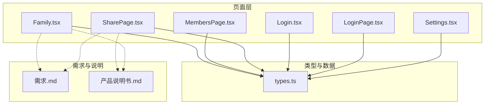
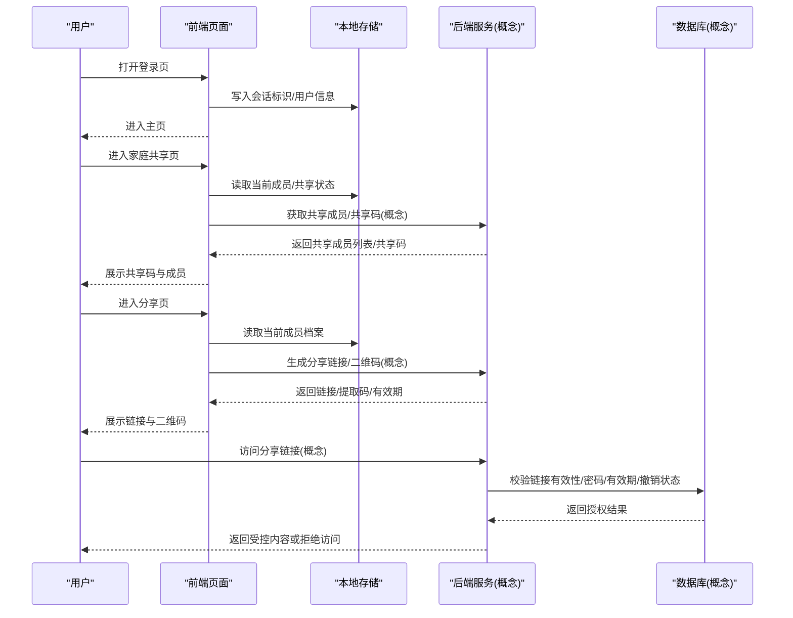
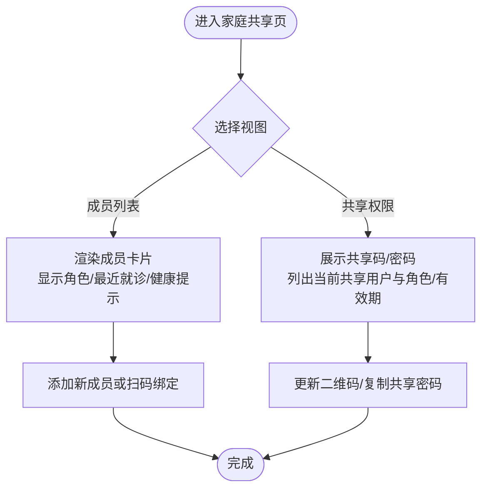
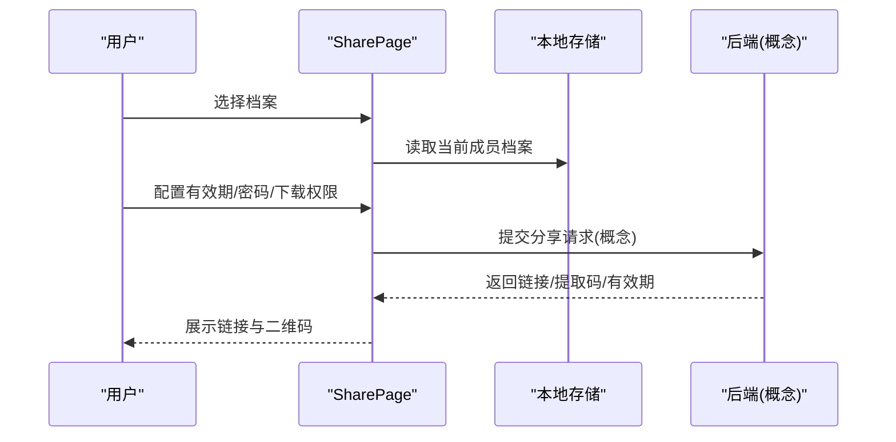
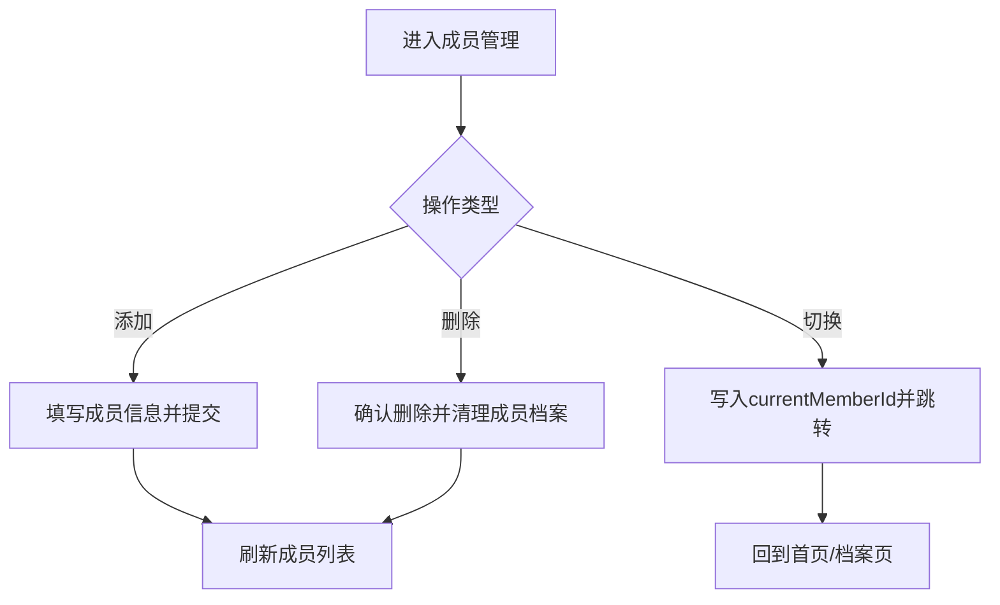
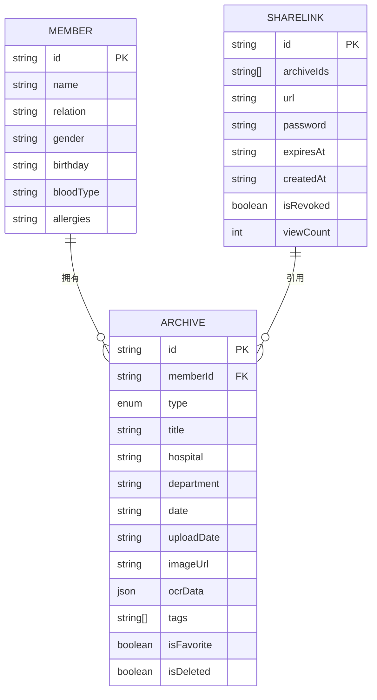
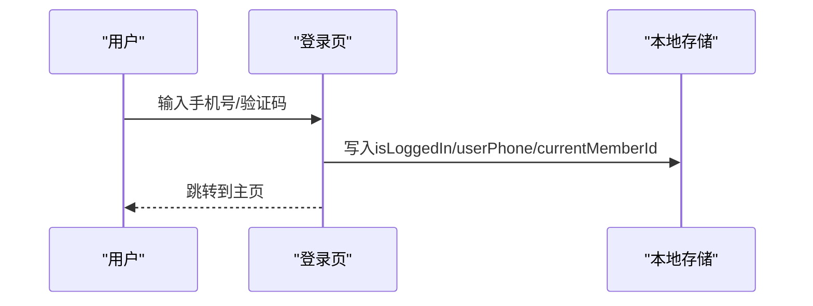
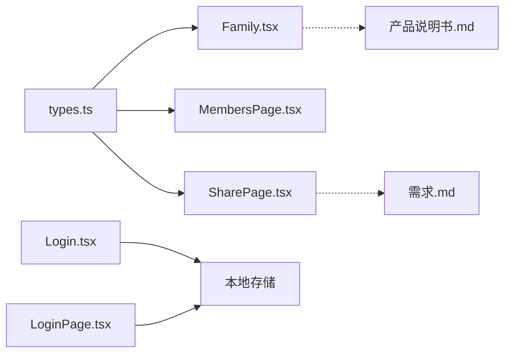

# 权限控制机制

<cite>
**本文引用的文件**
- [Family.tsx](file://figma-ui/src/app/pages/Family.tsx)
- [SharePage.tsx](file://figma-ui/src/app/pages/SharePage.tsx)
- [MembersPage.tsx](file://figma-ui/src/app/pages/MembersPage.tsx)
- [types.ts](file://figma-ui/src/app/types.ts)
- [Login.tsx](file://figma-ui/src/app/pages/Login.tsx)
- [LoginPage.tsx](file://figma-ui/src/app/pages/LoginPage.tsx)
- [Settings.tsx](file://figma-ui/src/app/pages/Settings.tsx)
- [产品说明书.md](file://figma-ui/src/imports/产品说明书.md)
- [需求.md](file://figma-ui/src/imports/需求.md)
</cite>

## 目录
1. [简介](#简介)
2. [项目结构](#项目结构)
3. [核心组件](#核心组件)
4. [架构总览](#架构总览)
5. [详细组件分析](#详细组件分析)
6. [依赖关系分析](#依赖关系分析)
7. [性能与安全考量](#性能与安全考量)
8. [故障排查指南](#故障排查指南)
9. [结论](#结论)
10. [附录](#附录)

## 简介
本文件面向医案通医疗档案网站的前端实现，系统性梳理“家庭共享权限系统”的设计与实现：角色与权限、共享密码与二维码绑定、邀请链接生成、权限验证与会话管理、安全令牌处理、权限继承与动态调整、权限审计日志等。文档同时给出权限配置的用户界面设计要点（分配表单、权限预览、撤销权限），并总结数据安全与隐私保护策略及防越权访问措施。

## 项目结构
本项目为前端原型与页面实现，权限相关能力主要分布在以下页面与类型定义中：
- 家庭共享与成员管理：Family.tsx、MembersPage.tsx
- 分享与授权：SharePage.tsx
- 登录与会话：Login.tsx、LoginPage.tsx
- 类型与数据模型：types.ts
- 设置与隐私入口：Settings.tsx
- 产品说明与需求：产品说明书.md、需求.md

图表来源
- [Family.tsx:1-224](file://figma-ui/src/app/pages/Family.tsx#L1-L224)
- [SharePage.tsx:1-264](file://figma-ui/src/app/pages/SharePage.tsx#L1-L264)
- [MembersPage.tsx:1-294](file://figma-ui/src/app/pages/MembersPage.tsx#L1-L294)
- [types.ts:1-95](file://figma-ui/src/app/types.ts#L1-L95)
- [Login.tsx:1-123](file://figma-ui/src/app/pages/Login.tsx#L1-L123)
- [LoginPage.tsx:1-203](file://figma-ui/src/app/pages/LoginPage.tsx#L1-L203)
- [Settings.tsx:41-77](file://figma-ui/src/app/pages/Settings.tsx#L41-L77)
- [需求.md:333-362](file://figma-ui/src/imports/需求.md#L333-L362)
- [产品说明书.md:158-190](file://figma-ui/src/imports/产品说明书.md#L158-L190)

章节来源
- [Family.tsx:1-224](file://figma-ui/src/app/pages/Family.tsx#L1-L224)
- [SharePage.tsx:1-264](file://figma-ui/src/app/pages/SharePage.tsx#L1-L264)
- [MembersPage.tsx:1-294](file://figma-ui/src/app/pages/MembersPage.tsx#L1-L294)
- [types.ts:1-95](file://figma-ui/src/app/types.ts#L1-L95)
- [Login.tsx:1-123](file://figma-ui/src/app/pages/Login.tsx#L1-L123)
- [LoginPage.tsx:1-203](file://figma-ui/src/app/pages/LoginPage.tsx#L1-L203)
- [Settings.tsx:41-77](file://figma-ui/src/app/pages/Settings.tsx#L41-L77)
- [需求.md:333-362](file://figma-ui/src/imports/需求.md#L333-L362)
- [产品说明书.md:158-190](file://figma-ui/src/imports/产品说明书.md#L158-L190)

## 核心组件
- 家庭共享与成员管理（Family.tsx）
  - 提供“成员列表”和“共享权限”两个视图；支持展示家庭共享码与当前共享用户，支持更新二维码、复制共享密码、查看受邀者角色与有效期。
- 分享与授权（SharePage.tsx）
  - 支持选择单份或多份档案，配置有效期、访问密码、是否允许下载；生成加密分享链接与二维码，支持复制链接与保存二维码。
- 成员管理（MembersPage.tsx）
  - 支持添加、删除成员，切换当前成员视角；删除成员时联动清理其档案。
- 类型与数据模型（types.ts）
  - 定义了成员、档案、OCR数据、分享链接等数据结构，其中分享链接包含有效期、密码、撤销状态、访问次数等字段。
- 登录与会话（Login.tsx、LoginPage.tsx）
  - 手机号+验证码登录流程，登录后在本地存储会话标识与用户信息，初始化默认成员与当前成员ID。
- 设置与隐私（Settings.tsx）
  - 提供“隐私与安全”、“分享保护设置”等入口，便于统一配置安全策略。

章节来源
- [Family.tsx:1-224](file://figma-ui/src/app/pages/Family.tsx#L1-L224)
- [SharePage.tsx:1-264](file://figma-ui/src/app/pages/SharePage.tsx#L1-L264)
- [MembersPage.tsx:1-294](file://figma-ui/src/app/pages/MembersPage.tsx#L1-L294)
- [types.ts:1-95](file://figma-ui/src/app/types.ts#L1-L95)
- [Login.tsx:1-123](file://figma-ui/src/app/pages/Login.tsx#L1-L123)
- [LoginPage.tsx:1-203](file://figma-ui/src/app/pages/LoginPage.tsx#L1-L203)
- [Settings.tsx:41-77](file://figma-ui/src/app/pages/Settings.tsx#L41-L77)

## 架构总览
下图展示了从用户登录到家庭共享、档案分享的核心交互链路，以及前后端可能涉及的权限校验点（以实际前端实现为准）。

图表来源
- [Login.tsx:18-27](file://figma-ui/src/app/pages/Login.tsx#L18-L27)
- [LoginPage.tsx:31-58](file://figma-ui/src/app/pages/LoginPage.tsx#L31-L58)
- [Family.tsx:177-216](file://figma-ui/src/app/pages/Family.tsx#L177-L216)
- [SharePage.tsx:17-35](file://figma-ui/src/app/pages/SharePage.tsx#L17-L35)
- [types.ts:63-72](file://figma-ui/src/app/types.ts#L63-L72)

## 详细组件分析

### 家庭共享与成员管理（Family.tsx）
- 功能要点
  - 成员列表：展示家庭成员、最近就诊时间、健康提示等。
  - 共享权限：展示家庭共享码与当前共享中的用户，支持更新二维码、复制共享密码、查看受邀者角色与有效期。
- 权限角色与访问控制
  - 已实现的角色标签包括“本人”“长子”“父亲”“配偶”“管理员”“受邀查看者”等，用于区分不同成员与外部受邀者的身份与权限范围。
  - 共享码与二维码作为家庭级共享入口，结合共享密码进行二次鉴权。
- 交互流程
  - 切换“成员列表/共享权限”视图；点击“添加新成员或扫码绑定”可触发新增或扫码绑定流程。
  - 共享码区域支持“更新二维码”，便于轮换密钥。

图表来源
- [Family.tsx:88-106](file://figma-ui/src/app/pages/Family.tsx#L88-L106)
- [Family.tsx:164-167](file://figma-ui/src/app/pages/Family.tsx#L164-L167)
- [Family.tsx:177-216](file://figma-ui/src/app/pages/Family.tsx#L177-L216)

章节来源
- [Family.tsx:1-224](file://figma-ui/src/app/pages/Family.tsx#L1-L224)

### 分享与授权（SharePage.tsx）
- 功能要点
  - 第一步：选择要分享的档案（单选/多选）。
  - 第二步：权限设置——有效期（1天/7天/30天/永久）、访问密码开关、是否允许下载。
  - 生成分享链接与二维码，支持复制链接与保存二维码。
- 权限控制策略
  - 通过“有效期”控制链接生命周期；通过“访问密码”限制未授权访问；通过“允许下载”控制原始文件下载能力。
- 数据流
  - 从本地存储读取当前成员的档案集合；根据用户选择与配置生成分享结果。

图表来源
- [SharePage.tsx:17-35](file://figma-ui/src/app/pages/SharePage.tsx#L17-L35)
- [SharePage.tsx:117-178](file://figma-ui/src/app/pages/SharePage.tsx#L117-L178)
- [SharePage.tsx:181-249](file://figma-ui/src/app/pages/SharePage.tsx#L181-L249)

章节来源
- [SharePage.tsx:1-264](file://figma-ui/src/app/pages/SharePage.tsx#L1-L264)

### 成员管理（MembersPage.tsx）
- 功能要点
  - 添加成员：填写姓名、关系、性别、生日、血型、过敏史等。
  - 删除成员：非本人可删除，删除时同步清理该成员的档案。
  - 切换成员：将当前成员ID写入本地存储，以便后续操作基于该成员上下文。
- 权限影响
  - 删除成员会级联删除其档案，体现“资源归属”的权限边界。

图表来源
- [MembersPage.tsx:20-48](file://figma-ui/src/app/pages/MembersPage.tsx#L20-L48)
- [MembersPage.tsx:155-294](file://figma-ui/src/app/pages/MembersPage.tsx#L155-L294)

章节来源
- [MembersPage.tsx:1-294](file://figma-ui/src/app/pages/MembersPage.tsx#L1-L294)

### 类型与数据模型（types.ts）
- 关键模型
  - Member：成员基本信息。
  - Archive：档案元数据，含所属成员、类型、医院、日期、标签、收藏与删除标记等。
  - ShareLink：分享链接模型，包含链接ID、关联档案ID数组、URL、可选密码、过期时间、创建时间、撤销状态、访问次数等。
- 权限相关字段
  - ShareLink.expiresAt：控制链接有效期。
  - ShareLink.password：访问密码。
  - ShareLink.isRevoked：是否已撤销。
  - ShareLink.viewCount：访问统计，可用于审计。

图表来源
- [types.ts:1-95](file://figma-ui/src/app/types.ts#L1-L95)

章节来源
- [types.ts:1-95](file://figma-ui/src/app/types.ts#L1-L95)

### 登录与会话（Login.tsx、LoginPage.tsx）
- 登录流程
  - 输入手机号与验证码，通过后在本地存储写入会话标识与用户信息，并初始化默认成员与当前成员ID。
- 会话管理
  - 使用本地存储维护登录态与当前成员上下文，便于跨页面共享权限判断。
- 退出登录
  - 在设置页提供退出登录入口，清除本地会话标识。

图表来源
- [Login.tsx:18-27](file://figma-ui/src/app/pages/Login.tsx#L18-L27)
- [LoginPage.tsx:31-58](file://figma-ui/src/app/pages/LoginPage.tsx#L31-L58)
- [Settings.tsx:44-48](file://figma-ui/src/app/pages/Settings.tsx#L44-L48)

章节来源
- [Login.tsx:1-123](file://figma-ui/src/app/pages/Login.tsx#L1-L123)
- [LoginPage.tsx:1-203](file://figma-ui/src/app/pages/LoginPage.tsx#L1-L203)
- [Settings.tsx:41-77](file://figma-ui/src/app/pages/Settings.tsx#L41-L77)

## 依赖关系分析
- 页面间依赖
  - Family.tsx 与 MembersPage.tsx 均依赖 types.ts 的类型定义，保证数据一致性。
  - SharePage.tsx 依赖 types.ts 的 Archive 与 ShareLink 类型，确保分享配置与结果符合预期。
  - Login.tsx / LoginPage.tsx 通过本地存储维护会话，供其他页面读取当前成员上下文。
- 数据依赖
  - 成员与档案通过 memberId 关联；分享链接通过 archiveIds 引用多份档案。
- 需求与说明对齐
  - 产品说明书与需求文档明确了分享与授权的规则（有效期、密码、下载控制、撤销、医生端优化等），前端实现与之对应。

图表来源
- [types.ts:1-95](file://figma-ui/src/app/types.ts#L1-L95)
- [Family.tsx:1-224](file://figma-ui/src/app/pages/Family.tsx#L1-L224)
- [MembersPage.tsx:1-294](file://figma-ui/src/app/pages/MembersPage.tsx#L1-L294)
- [SharePage.tsx:1-264](file://figma-ui/src/app/pages/SharePage.tsx#L1-L264)
- [Login.tsx:1-123](file://figma-ui/src/app/pages/Login.tsx#L1-L123)
- [LoginPage.tsx:1-203](file://figma-ui/src/app/pages/LoginPage.tsx#L1-L203)
- [需求.md:333-362](file://figma-ui/src/imports/需求.md#L333-L362)
- [产品说明书.md:158-190](file://figma-ui/src/imports/产品说明书.md#L158-L190)

章节来源
- [types.ts:1-95](file://figma-ui/src/app/types.ts#L1-L95)
- [Family.tsx:1-224](file://figma-ui/src/app/pages/Family.tsx#L1-L224)
- [MembersPage.tsx:1-294](file://figma-ui/src/app/pages/MembersPage.tsx#L1-L294)
- [SharePage.tsx:1-264](file://figma-ui/src/app/pages/SharePage.tsx#L1-L264)
- [Login.tsx:1-123](file://figma-ui/src/app/pages/Login.tsx#L1-L123)
- [LoginPage.tsx:1-203](file://figma-ui/src/app/pages/LoginPage.tsx#L1-L203)
- [需求.md:333-362](file://figma-ui/src/imports/需求.md#L333-L362)
- [产品说明书.md:158-190](file://figma-ui/src/imports/产品说明书.md#L158-L190)

## 性能与安全考量
- 性能
  - 本地存储读写轻量，适合原型阶段快速迭代；生产环境建议引入服务端缓存与分页加载，减少首屏数据量。
  - 分享链接生成与二维码渲染应在客户端尽量无阻塞，避免长耗时计算。
- 安全与隐私
  - 数据传输与存储采用端到端加密（产品说明要求）。
  - 分享链接支持有效期与访问密码，默认优先保护隐私（需求文档要求）。
  - 本地敏感数据应加密存储，密钥与账户绑定（需求文档要求）。
  - 应用锁与二次确认增强账户安全（需求文档要求）。
  - 权限透明：用户可查看分享记录与授权历史，并可主动关闭云端备份或删除云端数据（产品说明与需求文档要求）。
- 防越权访问
  - 前端需校验当前成员上下文与资源归属（如仅能分享当前成员档案）。
  - 后端需对分享链接进行严格校验（有效期、密码、撤销状态、资源归属），并记录访问审计日志。

章节来源
- [产品说明书.md:158-190](file://figma-ui/src/imports/产品说明书.md#L158-L190)
- [需求.md:333-362](file://figma-ui/src/imports/需求.md#L333-L362)

## 故障排查指南
- 无法登录或会话丢失
  - 检查本地存储是否成功写入 isLoggedIn、userPhone、currentMemberId。
  - 确认设置页退出登录逻辑是否正确清除会话。
- 分享链接无效
  - 检查 ShareLink 的 expiresAt 是否已过期、isRevoked 是否被撤销、password 是否匹配。
  - 核对所选档案是否属于当前成员。
- 成员删除后数据异常
  - 确认删除成员时是否同步清理了该成员的档案数据。
- 二维码无法扫描或绑定失败
  - 检查共享码是否已更新、二维码是否最新；确认绑定流程中密码校验逻辑正确。

章节来源
- [Login.tsx:18-27](file://figma-ui/src/app/pages/Login.tsx#L18-L27)
- [LoginPage.tsx:31-58](file://figma-ui/src/app/pages/LoginPage.tsx#L31-L58)
- [MembersPage.tsx:27-43](file://figma-ui/src/app/pages/MembersPage.tsx#L27-L43)
- [SharePage.tsx:17-35](file://figma-ui/src/app/pages/SharePage.tsx#L17-L35)
- [types.ts:63-72](file://figma-ui/src/app/types.ts#L63-L72)

## 结论
本实现围绕“家庭共享权限系统”提供了完整的用户界面与基础流程：成员管理、家庭共享码与二维码绑定、档案分享与授权、登录与会话管理。通过类型定义明确数据模型，结合需求与产品说明，形成了可演进的安全与隐私保护体系。后续可在后端补充严格的权限校验、审计日志与更细粒度的角色权限控制，进一步提升安全性与可观测性。

## 附录

### 角色与权限定义（基于现有实现与需求）
- 角色
  - 本人/家庭成员：拥有自身档案的完整管理权限。
  - 管理员：可管理家庭共享与成员权限（如配偶角色示例）。
  - 受邀查看者：仅具备查看权限，且可受有效期与密码限制。
- 访问控制策略
  - 家庭共享码+共享密码：用于家庭级共享入口。
  - 分享链接+访问密码+有效期+下载控制：用于单份或多份档案的精细化授权。
  - 撤销权限：支持随时撤销分享链接，使其立即失效。

章节来源
- [Family.tsx:177-216](file://figma-ui/src/app/pages/Family.tsx#L177-L216)
- [SharePage.tsx:117-178](file://figma-ui/src/app/pages/SharePage.tsx#L117-L178)
- [需求.md:333-362](file://figma-ui/src/imports/需求.md#L333-L362)
- [产品说明书.md:158-190](file://figma-ui/src/imports/产品说明书.md#L158-L190)

### 权限配置界面要点
- 权限分配表单
  - 选择档案、设置有效期、开启/关闭访问密码、允许/禁止下载。
- 权限预览
  - 生成链接后展示链接与提取码，支持复制链接与保存二维码。
- 撤销权限
  - 在“我的分享”中查看并撤销链接，撤销后不可继续访问。

章节来源
- [SharePage.tsx:117-249](file://figma-ui/src/app/pages/SharePage.tsx#L117-L249)
- [需求.md:333-362](file://figma-ui/src/imports/需求.md#L333-L362)

### 权限继承与动态调整
- 继承规则（概念）
  - 家庭共享码授予的家庭成员可继承部分权限（如查看），具体权限由管理员在共享设置中决定。
- 动态调整（概念）
  - 管理员可随时调整共享密码、更新二维码、修改分享链接有效期或撤销链接，以实现动态权限控制。

章节来源
- [Family.tsx:177-216](file://figma-ui/src/app/pages/Family.tsx#L177-L216)
- [SharePage.tsx:117-249](file://figma-ui/src/app/pages/SharePage.tsx#L117-L249)
- [需求.md:333-362](file://figma-ui/src/imports/需求.md#L333-L362)

### 权限审计日志（概念）
- 记录项
  - 分享链接创建、访问、撤销事件；访问次数、IP（若可用）、时间戳。
- 用途
  - 安全审计、异常检测、合规报告。

章节来源
- [types.ts:63-72](file://figma-ui/src/app/types.ts#L63-L72)
- [需求.md:344-362](file://figma-ui/src/imports/需求.md#L344-L362)