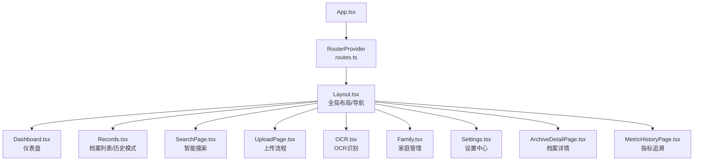
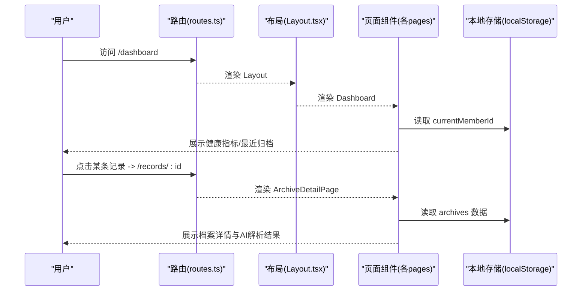
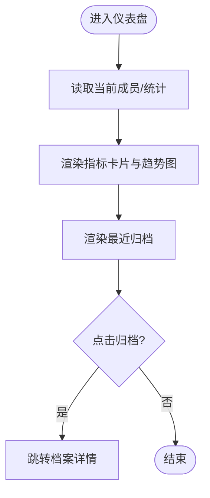
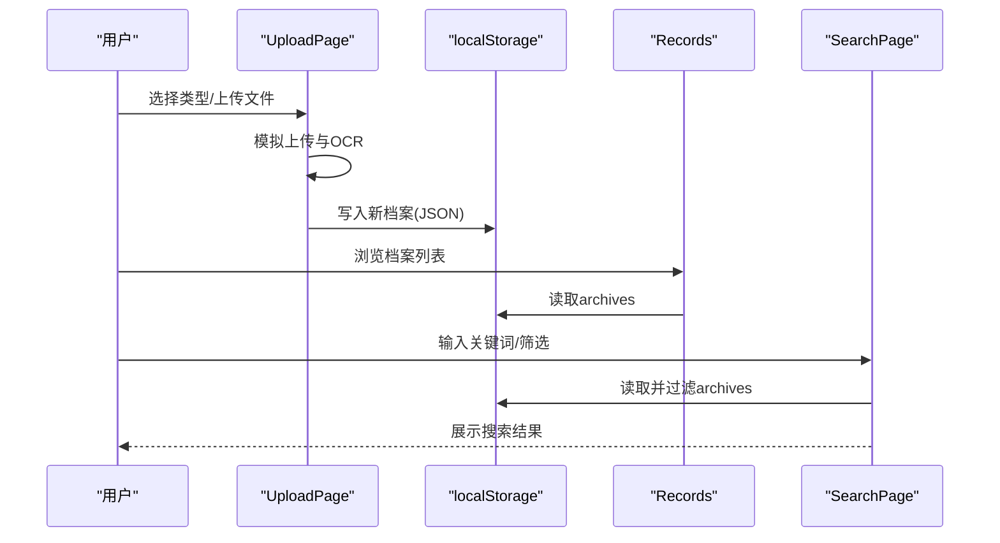
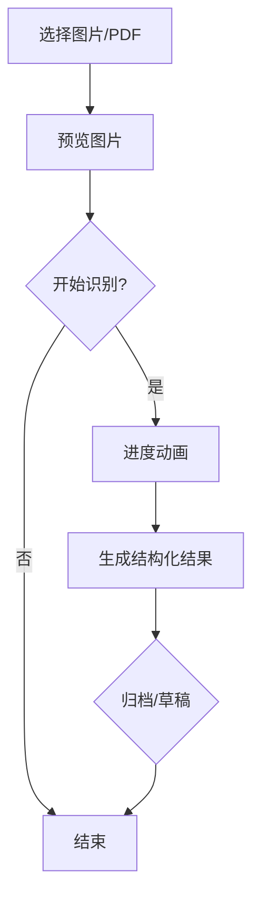
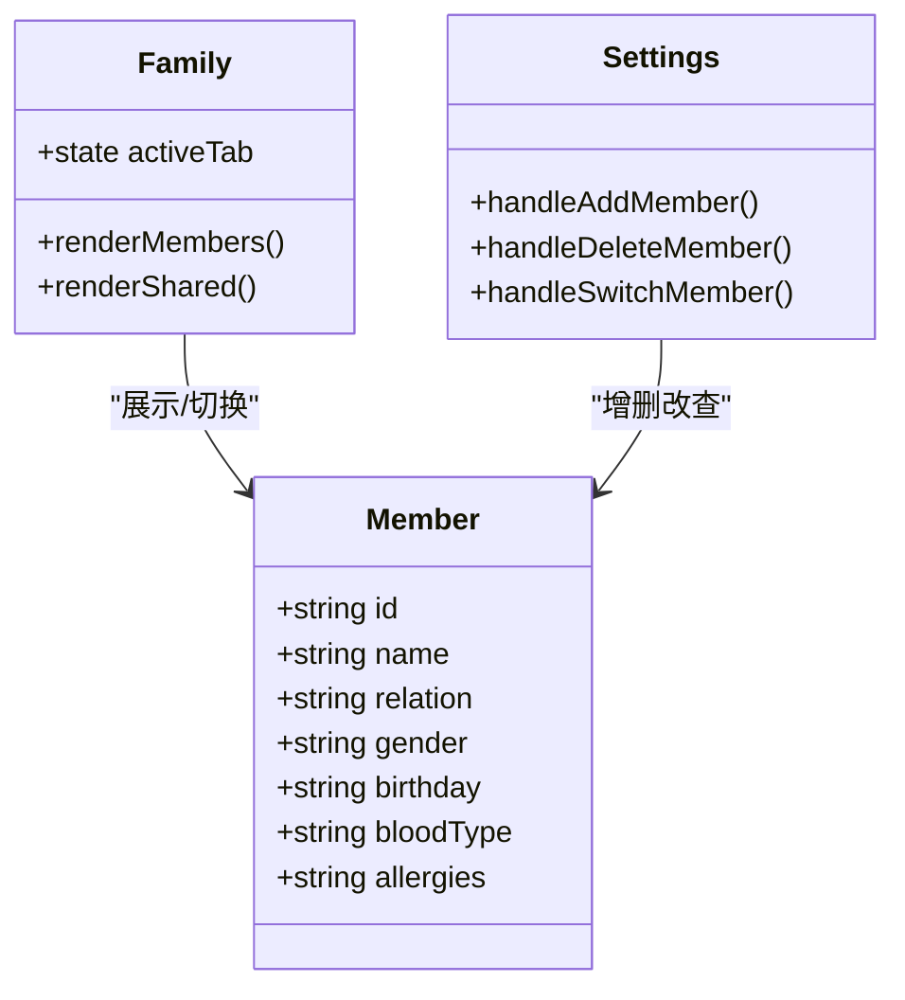
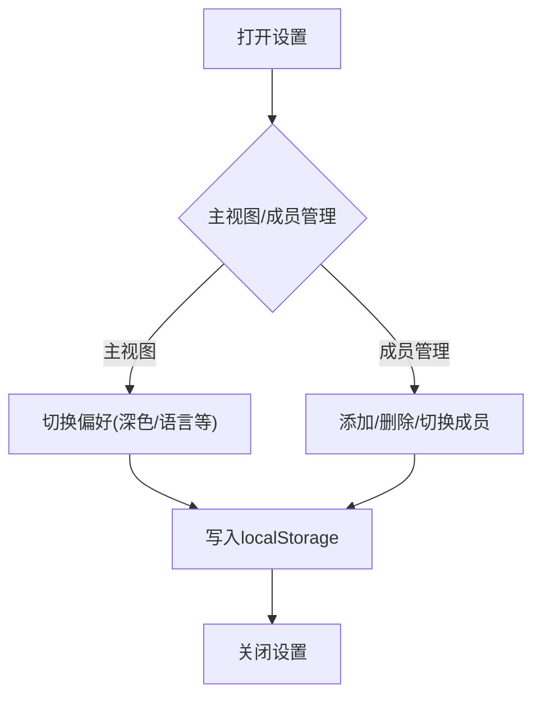
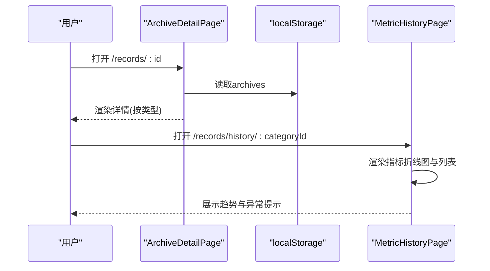
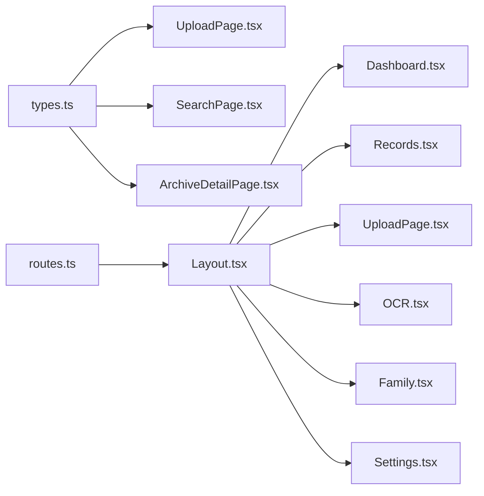

# 核心功能模块

<cite>
**本文引用的文件**
- [routes.ts](file://figma-ui/src/app/routes.ts)
- [App.tsx](file://figma-ui/src/app/App.tsx)
- [Layout.tsx](file://figma-ui/src/app/components/Layout.tsx)
- [Dashboard.tsx](file://figma-ui/src/app/pages/Dashboard.tsx)
- [Records.tsx](file://figma-ui/src/app/pages/Records.tsx)
- [SearchPage.tsx](file://figma-ui/src/app/pages/SearchPage.tsx)
- [UploadPage.tsx](file://figma-ui/src/app/pages/UploadPage.tsx)
- [OCR.tsx](file://figma-ui/src/app/pages/OCR.tsx)
- [Family.tsx](file://figma-ui/src/app/pages/Family.tsx)
- [Settings.tsx](file://figma-ui/src/app/pages/Settings.tsx)
- [ArchiveDetailPage.tsx](file://figma-ui/src/app/pages/ArchiveDetailPage.tsx)
- [MetricHistoryPage.tsx](file://figma-ui/src/app/pages/MetricHistoryPage.tsx)
- [types.ts](file://figma-ui/src/app/types.ts)
</cite>

## 目录
1. [简介](#简介)
2. [项目结构](#项目结构)
3. [核心组件](#核心组件)
4. [架构总览](#架构总览)
5. [详细组件分析](#详细组件分析)
6. [依赖关系分析](#依赖关系分析)
7. [性能考量](#性能考量)
8. [故障排查指南](#故障排查指南)
9. [结论](#结论)
10. [附录：扩展点与自定义配置](#附录：扩展点与自定义配置)

## 简介
本文件面向医案通医疗档案网站的核心功能模块，围绕五大能力进行系统化说明：仪表盘（健康指标展示、趋势分析）、档案管理（文档上传、分类、搜索）、OCR识别（图像识别、信息提取）、家庭管理（成员协作、权限控制）、设置中心（用户偏好、系统配置）。每个模块包含功能概述、界面设计要点、业务流程、技术实现细节、使用示例，以及模块间交互和数据流转说明。文末提供扩展点与自定义配置建议，便于二次开发与集成。

## 项目结构
前端采用 React + React Router 的 SPA 架构，页面按功能拆分到 pages 目录，公共 UI 组件位于 components/ui，类型定义集中在 types.ts，路由统一在 routes.ts 中注册。应用入口 App.tsx 通过 RouterProvider 挂载路由，Layout.tsx 提供全局布局与导航。

图表来源
- [App.tsx:1-12](file://figma-ui/src/app/App.tsx#L1-L12)
- [routes.ts:25-106](file://figma-ui/src/app/routes.ts#L25-L106)
- [Layout.tsx:31-144](file://figma-ui/src/app/components/Layout.tsx#L31-L144)

章节来源
- [App.tsx:1-12](file://figma-ui/src/app/App.tsx#L1-L12)
- [routes.ts:25-106](file://figma-ui/src/app/routes.ts#L25-L106)
- [Layout.tsx:31-144](file://figma-ui/src/app/components/Layout.tsx#L31-L144)

## 核心组件
- 路由与导航：routes.ts 集中声明所有页面路由；Layout.tsx 提供顶部导航、移动端菜单与页脚；App.tsx 作为根组件注入路由。
- 数据模型：types.ts 定义了 Member、Archive、OCRData、LabItem、PrescriptionItem 等核心数据结构，贯穿上传、归档、详情、搜索等模块。
- 共享状态：当前成员切换与本地存储（localStorage）用于跨页面持久化成员与档案数据。

章节来源
- [routes.ts:25-106](file://figma-ui/src/app/routes.ts#L25-L106)
- [Layout.tsx:31-144](file://figma-ui/src/app/components/Layout.tsx#L31-L144)
- [types.ts:1-95](file://figma-ui/src/app/types.ts#L1-L95)

## 架构总览
整体采用“页面组件 + 路由 + 本地存储”的前端架构。页面之间通过路由跳转与上下文传递（如 useOutletContext）共享当前成员信息；数据以 JSON 形式存储在 localStorage，供各页面读取与更新。

图表来源
- [routes.ts:25-106](file://figma-ui/src/app/routes.ts#L25-L106)
- [Layout.tsx:31-144](file://figma-ui/src/app/components/Layout.tsx#L31-L144)
- [Dashboard.tsx:30-204](file://figma-ui/src/app/pages/Dashboard.tsx#L30-L204)
- [ArchiveDetailPage.tsx:27-40](file://figma-ui/src/app/pages/ArchiveDetailPage.tsx#L27-L40)

## 详细组件分析

### 仪表盘（健康指标展示、趋势分析）
- 功能概述：展示用户健康指标卡片（血压、血糖等），并提供趋势折线/面积图；显示最近归档条目、复诊提醒与待服药物提示。
- 界面设计：顶部欢迎语与健康分；搜索框；双列指标卡片含迷你趋势图；主趋势图支持时间范围选择；最近归档卡片带状态标签；底部行动卡片。
- 业务流程：从路由进入后，读取当前成员信息，加载模拟统计数据，渲染图表与列表；点击归档项跳转到详情页。
- 技术实现：使用 recharts 绘制折线/面积图；motion/react 提供微动效；useOutletContext 获取当前成员；Link 跳转至 /records/:id。
- 使用示例：打开仪表盘，查看血压/血糖趋势；点击“全部报告”或最近归档条目进入档案详情。

图表来源
- [Dashboard.tsx:30-204](file://figma-ui/src/app/pages/Dashboard.tsx#L30-L204)

章节来源
- [Dashboard.tsx:30-204](file://figma-ui/src/app/pages/Dashboard.tsx#L30-L204)

### 档案管理（文档上传、分类、搜索）
- 功能概述：提供上传入口（拍照/相册/微信导入）、分类筛选、智能搜索、历史记录模式（指标追溯入口）。
- 界面设计：上传页分步骤引导（选择类型→上传→OCR→确认）；档案列表支持分类标签与搜索；历史模式展示指标类别卡片。
- 业务流程：选择类型后模拟上传与OCR处理，生成结构化数据并写入本地存储；列表页根据关键词、医院、时间范围过滤；历史模式聚合指标并跳转详情。
- 技术实现：UploadPage 使用 useState 管理步骤；SearchPage 基于关键字、医院、日期范围过滤；Records 提供常规/历史两种视图；类型与标签映射来自 types.ts。
- 使用示例：上传一份门诊病历，等待AI解析完成后保存；在搜索页输入关键词快速定位相关档案。

图表来源
- [UploadPage.tsx:7-52](file://figma-ui/src/app/pages/UploadPage.tsx#L7-L52)
- [SearchPage.tsx:7-70](file://figma-ui/src/app/pages/SearchPage.tsx#L7-L70)
- [Records.tsx:101-123](file://figma-ui/src/app/pages/Records.tsx#L101-L123)
- [types.ts:11-46](file://figma-ui/src/app/types.ts#L11-L46)

章节来源
- [UploadPage.tsx:7-278](file://figma-ui/src/app/pages/UploadPage.tsx#L7-L278)
- [SearchPage.tsx:7-286](file://figma-ui/src/app/pages/SearchPage.tsx#L7-L286)
- [Records.tsx:101-421](file://figma-ui/src/app/pages/Records.tsx#L101-L421)
- [types.ts:11-46](file://figma-ui/src/app/types.ts#L11-L46)

### OCR识别（图像识别、信息提取）
- 功能概述：支持图片/PDF上传，模拟扫描进度，输出结构化字段（标题、日期、医院、医生、检验项、总结），并提供草稿/归档操作。
- 界面设计：大尺寸预览区、扫描动画、结果卡片展示关键指标与AI总结，支持放大查看。
- 业务流程：选择文件→预览→开始识别→进度动画→返回结构化结果→用户确认归档或存草稿。
- 技术实现：useState 管理文件、预览、进度与结果；setTimeout 模拟后端OCR耗时；toast 反馈成功；结果对象遵循 types.ts 中的 OCRData/LabItem 结构。
- 使用示例：拍摄一张化验单，点击“开启AI智能分析”，等待识别完成后确认归档。

图表来源
- [OCR.tsx:24-83](file://figma-ui/src/app/pages/OCR.tsx#L24-L83)
- [OCR.tsx:150-244](file://figma-ui/src/app/pages/OCR.tsx#L150-L244)
- [types.ts:37-54](file://figma-ui/src/app/types.ts#L37-L54)

章节来源
- [OCR.tsx:24-270](file://figma-ui/src/app/pages/OCR.tsx#L24-L270)
- [types.ts:37-54](file://figma-ui/src/app/types.ts#L37-L54)

### 家庭管理（成员协作、权限控制）
- 功能概述：家庭成员列表与共享权限管理；支持添加成员、扫码绑定、共享码与有效期控制。
- 界面设计：统计摘要（成员数/档案数/待识别）、成员卡片（头像、角色、最近就诊、健康提示）、共享二维码与受邀者列表。
- 业务流程：切换成员时更新当前成员ID；共享页展示共享码与有效期；可邀请他人查看或管理。
- 技术实现：Family 使用 useOutletContext 获取当前成员；LocalStorage 存储 members 与 currentMemberId；Settings 中提供成员增删改查与切换逻辑。
- 使用示例：添加新成员并设置为当前成员，随后在档案上传时自动归属该成员。

图表来源
- [Family.tsx:17-55](file://figma-ui/src/app/pages/Family.tsx#L17-L55)
- [Settings.tsx:84-126](file://figma-ui/src/app/pages/Settings.tsx#L84-L126)
- [types.ts:1-9](file://figma-ui/src/app/types.ts#L1-L9)

章节来源
- [Family.tsx:57-224](file://figma-ui/src/app/pages/Family.tsx#L57-L224)
- [Settings.tsx:27-126](file://figma-ui/src/app/pages/Settings.tsx#L27-L126)
- [types.ts:1-9](file://figma-ui/src/app/types.ts#L1-L9)

### 设置中心（用户偏好、系统配置）
- 功能概述：个人中心、消息提醒、隐私与安全、数据存储管理、分享保护、深色模式、语言选择、帮助与反馈、退出登录。
- 界面设计：用户卡片、分组设置项、开关控件、成员管理子视图。
- 业务流程：进入设置→修改偏好→保存到本地存储→切换成员影响其他页面数据展示。
- 技术实现：useState 管理深色模式与视图切换；localStorage 持久化 members 与 currentMemberId；navigate 跳转登录页。
- 使用示例：开启深色模式；添加或删除家庭成员；切换当前成员后刷新其他页面数据。

图表来源
- [Settings.tsx:27-82](file://figma-ui/src/app/pages/Settings.tsx#L27-L82)
- [Settings.tsx:84-126](file://figma-ui/src/app/pages/Settings.tsx#L84-L126)
- [Settings.tsx:128-219](file://figma-ui/src/app/pages/Settings.tsx#L128-L219)

章节来源
- [Settings.tsx:27-347](file://figma-ui/src/app/pages/Settings.tsx#L27-L347)

### 档案详情与指标追溯（支撑模块）
- 档案详情：根据档案类型动态渲染不同内容（检验报告、处方、门诊病历、影像检查），展示AI提取的诊断、用药提醒与原件查看入口。
- 指标追溯：以折线图展示历史指标变化，标注参考区间与异常状态，支持查看原件。

图表来源
- [ArchiveDetailPage.tsx:27-40](file://figma-ui/src/app/pages/ArchiveDetailPage.tsx#L27-L40)
- [ArchiveDetailPage.tsx:54-249](file://figma-ui/src/app/pages/ArchiveDetailPage.tsx#L54-L249)
- [MetricHistoryPage.tsx:59-153](file://figma-ui/src/app/pages/MetricHistoryPage.tsx#L59-L153)

章节来源
- [ArchiveDetailPage.tsx:27-356](file://figma-ui/src/app/pages/ArchiveDetailPage.tsx#L27-L356)
- [MetricHistoryPage.tsx:59-216](file://figma-ui/src/app/pages/MetricHistoryPage.tsx#L59-L216)

## 依赖关系分析
- 路由依赖：App.tsx 引入 RouterProvider 与 routes.ts；Layout.tsx 提供 Outlet 渲染子页面。
- 页面依赖：Dashboard、Records、SearchPage、UploadPage、OCR、Family、Settings 均依赖 types.ts 的数据结构；部分页面依赖 recharts、motion/react、lucide-react 图标库。
- 数据流：UploadPage 写入 localStorage；SearchPage/Records/ArchiveDetailPage 读取；Settings 维护 members 与 currentMemberId；Family 与 Settings 共同维护成员状态。

图表来源
- [routes.ts:25-106](file://figma-ui/src/app/routes.ts#L25-L106)
- [Layout.tsx:31-144](file://figma-ui/src/app/components/Layout.tsx#L31-L144)
- [types.ts:11-95](file://figma-ui/src/app/types.ts#L11-L95)

章节来源
- [routes.ts:25-106](file://figma-ui/src/app/routes.ts#L25-L106)
- [Layout.tsx:31-144](file://figma-ui/src/app/components/Layout.tsx#L31-L144)
- [types.ts:11-95](file://figma-ui/src/app/types.ts#L11-L95)

## 性能考量
- 渲染优化：使用 motion/react 的 AnimatePresence 与 layout 动画提升交互体验；列表项按需渲染，避免重排。
- 图表性能：recharts 的 ResponsiveContainer 自适应容器大小；大数据量时可考虑分页或虚拟滚动。
- 本地存储：localStorage 读写频繁时注意序列化成本；建议在批量更新时合并写入。
- 网络与OCR：当前为模拟流程，实际接入OCR服务时应增加错误重试、超时与进度上报机制。

## 故障排查指南
- 数据为空：检查 localStorage 是否已写入 archives/members；确认 currentMemberId 是否正确。
- 搜索无结果：核对关键词、医院、时间范围筛选条件；确认数据字段是否包含目标值。
- OCR失败：检查文件类型与格式；确认模拟流程是否被拦截；实际接入时需捕获服务端错误并提示用户。
- 成员切换无效：确认 Settings 中 handleSwitchMember 是否更新了 currentMemberId；其他页面需重新读取。

章节来源
- [SearchPage.tsx:15-23](file://figma-ui/src/app/pages/SearchPage.tsx#L15-L23)
- [Settings.tsx:122-126](file://figma-ui/src/app/pages/Settings.tsx#L122-L126)
- [OCR.tsx:42-75](file://figma-ui/src/app/pages/OCR.tsx#L42-L75)

## 结论
医案通网站以清晰的模块化设计与前后端解耦的前端架构，实现了健康指标可视化、档案全生命周期管理、OCR智能识别、家庭协作与个性化设置等核心能力。通过统一的类型定义与本地存储策略，各模块间数据流转顺畅，用户体验友好。后续可通过接入真实OCR服务、增强权限控制与数据同步机制，进一步提升系统的可用性与安全性。

## 附录：扩展点与自定义配置
- 扩展OCR能力：在 OCR.tsx 中替换模拟流程为真实OCR API调用，增加错误处理与重试逻辑；扩展 OCRData 结构以支持更多字段。
- 扩展档案类型：在 types.ts 的 ArchiveType 中添加新类型，并在 UploadPage、ArchiveDetailPage 中补充对应渲染逻辑。
- 扩展搜索维度：在 SearchPage 中增加新的筛选条件（如科室、诊断、药品名），并完善过滤函数。
- 扩展家庭权限：在 Family.tsx 与 Settings.tsx 中实现更细粒度的权限控制（查看/编辑/分享），结合共享码与有效期管理。
- 主题与国际化：在 Settings.tsx 中扩展语言切换逻辑；结合主题变量实现多主题支持。
- 数据持久化：将 localStorage 替换为后端API，确保数据安全与多端同步；增加版本迁移策略。