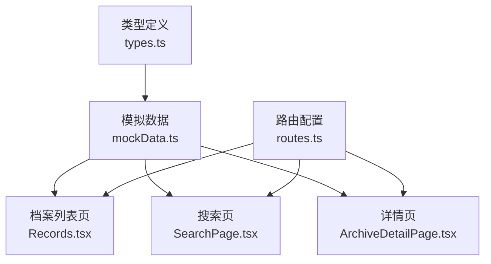
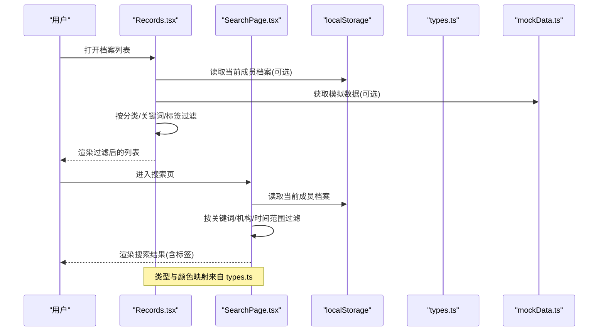
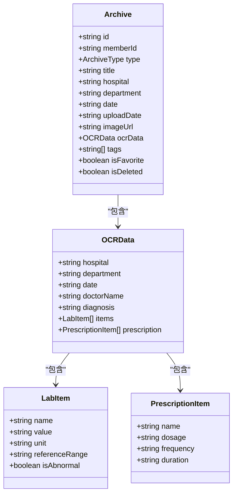
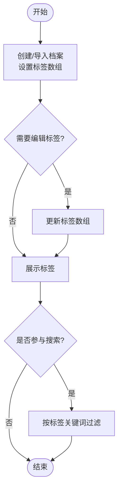
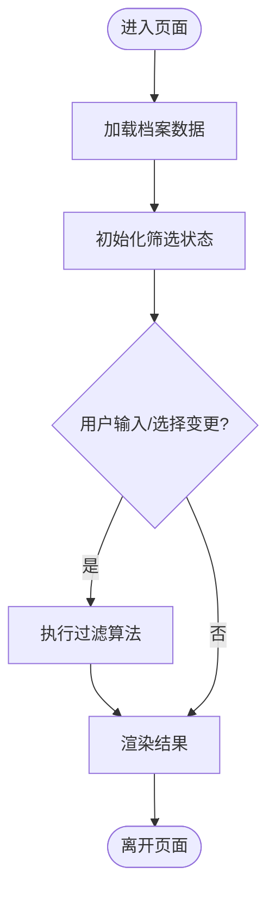
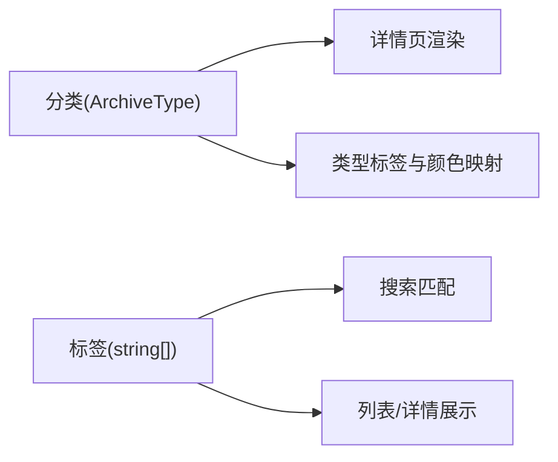
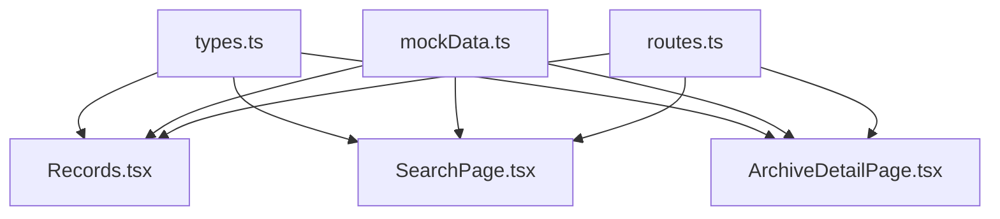

# 分类与标签管理

<cite>
**本文引用的文件**
- [types.ts](file://figma-ui/src/app/types.ts)
- [mockData.ts](file://figma-ui/src/app/utils/mockData.ts)
- [helpers.ts](file://figma-ui/src/app/utils/helpers.ts)
- [Records.tsx](file://figma-ui/src/app/pages/Records.tsx)
- [SearchPage.tsx](file://figma-ui/src/app/pages/SearchPage.tsx)
- [ArchiveDetailPage.tsx](file://figma-ui/src/app/pages/ArchiveDetailPage.tsx)
- [routes.ts](file://figma-ui/src/app/routes.ts)
</cite>

## 目录
1. [简介](#简介)
2. [项目结构](#项目结构)
3. [核心组件](#核心组件)
4. [架构总览](#架构总览)
5. [详细组件分析](#详细组件分析)
6. [依赖关系分析](#依赖关系分析)
7. [性能考量](#性能考量)
8. [故障排查指南](#故障排查指南)
9. [结论](#结论)
10. [附录：API 与交互规范](#附录api-与交互规范)

## 简介
本文件面向医案通医疗档案网站的“分类与标签管理系统”，聚焦以下目标：
- 说明内置分类体系的设计与使用场景（门诊病历、化验报告、处方记录、影像检查等）
- 介绍自定义标签系统的实现（创建、编辑、删除、批量操作）
- 解释分类筛选逻辑（前端过滤算法、性能优化、用户体验）
- 阐述标签与分类的关系模型，及其在搜索与展示中的作用
- 提供分类管理的 API 接口文档与用户界面交互规范
- 给出实际使用示例与常见问题解决方案

## 项目结构
本项目采用基于功能页面的组织方式，分类与标签相关能力主要分布在类型定义、数据源、页面组件与路由中：
- 类型与常量：集中定义档案类型、标签字段、颜色映射等
- 数据层：本地存储与模拟数据初始化
- 页面层：档案列表、搜索、详情等页面承载分类筛选与标签展示
- 路由层：页面入口与跳转路径

图表来源
- [types.ts:11-35](file://figma-ui/src/app/types.ts#L11-L35)
- [mockData.ts:1-98](file://figma-ui/src/app/utils/mockData.ts#L1-L98)
- [Records.tsx:1-122](file://figma-ui/src/app/pages/Records.tsx#L1-L122)
- [SearchPage.tsx:1-70](file://figma-ui/src/app/pages/SearchPage.tsx#L1-L70)
- [ArchiveDetailPage.tsx:1-40](file://figma-ui/src/app/pages/ArchiveDetailPage.tsx#L1-L40)
- [routes.ts:25-88](file://figma-ui/src/app/routes.ts#L25-L88)

章节来源
- [types.ts:11-35](file://figma-ui/src/app/types.ts#L11-L35)
- [mockData.ts:1-98](file://figma-ui/src/app/utils/mockData.ts#L1-L98)
- [Routes.ts:25-88](file://figma-ui/src/app/routes.ts#L25-L88)

## 核心组件
- 档案类型与标签
  - 档案类型：通过联合类型定义，包含门诊病历、检验报告、影像报告、处方、体检报告、出院记录、发票、其他等
  - 标签：每个档案对象包含字符串数组形式的标签字段，用于多维度检索与展示
  - 类型标签与颜色：为每种档案类型提供中文标签与样式类名，便于统一展示
- 数据与工具
  - 模拟数据：提供初始档案集合，包含不同类型、标签、OCR 解析结果等
  - 工具函数：日期格式化、过期判断、ID 生成等辅助方法
- 页面与交互
  - 档案列表页：支持按内置分类筛选、关键词搜索、标签匹配
  - 搜索页：支持关键词、机构、时间范围等多维筛选，并展示标签
  - 详情页：根据档案类型渲染不同内容区块，同时展示标签

章节来源
- [types.ts:11-35](file://figma-ui/src/app/types.ts#L11-L35)
- [types.ts:74-94](file://figma-ui/src/app/types.ts#L74-L94)
- [mockData.ts:1-98](file://figma-ui/src/app/utils/mockData.ts#L1-L98)
- [helpers.ts:1-52](file://figma-ui/src/app/utils/helpers.ts#L1-L52)
- [Records.tsx:101-122](file://figma-ui/src/app/pages/Records.tsx#L101-L122)
- [SearchPage.tsx:15-70](file://figma-ui/src/app/pages/SearchPage.tsx#L15-L70)
- [ArchiveDetailPage.tsx:27-40](file://figma-ui/src/app/pages/ArchiveDetailPage.tsx#L27-L40)

## 架构总览
系统以“类型定义 + 本地数据 + 页面组件”的轻量架构运行，分类与标签贯穿数据到展示的完整链路：
- 数据层：从 localStorage 或模拟数据加载档案集合
- 业务层：页面内维护筛选状态，执行过滤与排序
- 表现层：根据档案类型与标签渲染卡片、标签云、统计面板等

图表来源
- [Records.tsx:101-122](file://figma-ui/src/app/pages/Records.tsx#L101-L122)
- [SearchPage.tsx:15-70](file://figma-ui/src/app/pages/SearchPage.tsx#L15-L70)
- [types.ts:74-94](file://figma-ui/src/app/types.ts#L74-L94)
- [mockData.ts:1-98](file://figma-ui/src/app/utils/mockData.ts#L1-L98)

## 详细组件分析

### 内置分类体系设计
- 分类定义
  - 使用联合类型明确限定档案类型，避免非法值
  - 提供中文标签映射与颜色映射，保证 UI 一致性
- 使用场景
  - 门诊病历：医生诊断、主诉与建议
  - 化验报告：检验项目、参考区间、异常标记
  - 处方记录：药品名称、用量、频次、疗程
  - 影像检查：影像所见与诊断结论
  - 体检报告、出院记录、发票、其他：扩展场景

图表来源
- [types.ts:11-61](file://figma-ui/src/app/types.ts#L11-L61)

章节来源
- [types.ts:11-35](file://figma-ui/src/app/types.ts#L11-L35)
- [types.ts:74-94](file://figma-ui/src/app/types.ts#L74-L94)

### 自定义标签系统实现
- 数据结构
  - 每个档案对象包含字符串数组标签字段，支持多标签并存
- 创建
  - 新增档案时附带标签；或通过上传/OCR 解析后自动打标
- 编辑
  - 在详情页或编辑表单中修改标签数组
- 删除
  - 移除指定标签项；或整批清空
- 批量操作
  - 在列表页选中多条记录，统一添加/移除标签
- 展示
  - 列表与详情页均渲染标签；搜索时可按标签匹配

图表来源
- [mockData.ts:1-98](file://figma-ui/src/app/utils/mockData.ts#L1-L98)
- [SearchPage.tsx:29-40](file://figma-ui/src/app/pages/SearchPage.tsx#L29-L40)
- [Records.tsx:113-122](file://figma-ui/src/app/pages/Records.tsx#L113-L122)
- [ArchiveDetailPage.tsx:304-312](file://figma-ui/src/app/pages/ArchiveDetailPage.tsx#L304-L312)

章节来源
- [mockData.ts:1-98](file://figma-ui/src/app/utils/mockData.ts#L1-L98)
- [SearchPage.tsx:29-40](file://figma-ui/src/app/pages/SearchPage.tsx#L29-L40)
- [Records.tsx:113-122](file://figma-ui/src/app/pages/Records.tsx#L113-L122)
- [ArchiveDetailPage.tsx:304-312](file://figma-ui/src/app/pages/ArchiveDetailPage.tsx#L304-L312)

### 分类筛选逻辑与体验
- 前端过滤算法
  - 列表页：按分类、关键词（标题/医院/摘要/标签）进行过滤
  - 搜索页：按关键词、就诊机构、时间范围进行过滤
- 性能优化
  - 使用不可变数组拷贝后再过滤，避免副作用
  - 将计算结果缓存到状态变量，减少重复计算
  - 对大数据集可考虑分页或虚拟滚动（建议）
- 用户体验
  - 即时反馈：输入变化即触发过滤
  - 清晰提示：显示匹配数量、空结果引导
  - 视觉区分：分类按钮高亮、标签样式统一

图表来源
- [Records.tsx:101-122](file://figma-ui/src/app/pages/Records.tsx#L101-L122)
- [SearchPage.tsx:15-70](file://figma-ui/src/app/pages/SearchPage.tsx#L15-L70)

章节来源
- [Records.tsx:101-122](file://figma-ui/src/app/pages/Records.tsx#L101-L122)
- [SearchPage.tsx:15-70](file://figma-ui/src/app/pages/SearchPage.tsx#L15-L70)

### 标签与分类的关系模型及作用
- 关系模型
  - 分类：决定档案的类型与展示模板
  - 标签：跨分类的多维度属性，用于细粒度检索与聚合
- 在搜索中的作用
  - 关键词可匹配标题、医院、科室、标签
  - 机构与时间范围作为二级筛选条件
- 在展示中的作用
  - 列表与详情页展示标签，增强可读性与导航性
  - 详情页根据分类渲染不同内容区块

图表来源
- [types.ts:11-35](file://figma-ui/src/app/types.ts#L11-L35)
- [types.ts:74-94](file://figma-ui/src/app/types.ts#L74-L94)
- [SearchPage.tsx:29-40](file://figma-ui/src/app/pages/SearchPage.tsx#L29-L40)
- [ArchiveDetailPage.tsx:335-339](file://figma-ui/src/app/pages/ArchiveDetailPage.tsx#L335-L339)

章节来源
- [types.ts:11-35](file://figma-ui/src/app/types.ts#L11-L35)
- [types.ts:74-94](file://figma-ui/src/app/types.ts#L74-L94)
- [SearchPage.tsx:29-40](file://figma-ui/src/app/pages/SearchPage.tsx#L29-L40)
- [ArchiveDetailPage.tsx:335-339](file://figma-ui/src/app/pages/ArchiveDetailPage.tsx#L335-L339)

## 依赖关系分析
- 模块耦合
  - 页面组件依赖类型定义与模拟数据
  - 路由配置串联各页面入口
- 外部依赖
  - 图标库、动画库、图表库用于提升交互体验
- 潜在循环依赖
  - 当前结构无直接循环依赖；保持页面与数据解耦

图表来源
- [types.ts:11-35](file://figma-ui/src/app/types.ts#L11-L35)
- [mockData.ts:1-98](file://figma-ui/src/app/utils/mockData.ts#L1-L98)
- [Records.tsx:1-122](file://figma-ui/src/app/pages/Records.tsx#L1-L122)
- [SearchPage.tsx:1-70](file://figma-ui/src/app/pages/SearchPage.tsx#L1-L70)
- [ArchiveDetailPage.tsx:1-40](file://figma-ui/src/app/pages/ArchiveDetailPage.tsx#L1-L40)
- [routes.ts:25-88](file://figma-ui/src/app/routes.ts#L25-L88)

章节来源
- [routes.ts:25-88](file://figma-ui/src/app/routes.ts#L25-L88)

## 性能考量
- 过滤复杂度
  - 单次过滤为 O(n)，n 为档案数量；可通过分页或索引优化
- 状态更新
  - 使用 React 状态管理，避免不必要的重渲染
- 数据源
  - 优先从 localStorage 读取，必要时回退到模拟数据
- 建议优化
  - 对大列表使用虚拟滚动
  - 对搜索词进行防抖处理
  - 对常用筛选结果进行缓存

[本节为通用指导，不直接分析具体文件]

## 故障排查指南
- 未找到档案
  - 检查路由参数是否正确传递
  - 确认 localStorage 中是否存在对应 ID 的数据
- 筛选结果为空
  - 检查关键词大小写与空格
  - 确认机构与时间范围筛选条件是否过于严格
- 标签未显示
  - 确认档案对象是否包含标签数组
  - 检查详情页渲染逻辑是否覆盖该类型

章节来源
- [ArchiveDetailPage.tsx:32-52](file://figma-ui/src/app/pages/ArchiveDetailPage.tsx#L32-L52)
- [SearchPage.tsx:15-27](file://figma-ui/src/app/pages/SearchPage.tsx#L15-L27)

## 结论
本系统通过明确的类型定义、灵活的标签机制与直观的前端筛选，实现了医疗档案的分类管理与高效检索。未来可在后端集成、搜索算法与性能优化方面进一步增强，以提升大规模数据下的体验与稳定性。

[本节为总结性内容，不直接分析具体文件]

## 附录：API 与交互规范

### 数据模型与字段说明
- 档案对象
  - 标识：唯一 ID
  - 成员：所属家庭成员 ID
  - 类型：内置分类之一
  - 标题、医院、科室、日期、上传日期
  - 图片链接（可选）
  - OCR 数据（可选）
  - 标签：字符串数组
  - 收藏与删除标记
- OCR 数据
  - 医院、科室、日期、医生姓名、诊断
  - 检验项目列表（名称、数值、单位、参考区间、异常标记）
  - 处方项目列表（名称、用量、频次、疗程）

章节来源
- [types.ts:11-61](file://figma-ui/src/app/types.ts#L11-L61)

### 分类与标签的交互规范
- 分类筛选
  - 列表页顶部提供分类按钮组，点击切换当前分类
  - 支持“全部”选项以取消分类限制
- 标签管理
  - 新建档案时允许输入多个标签
  - 编辑档案时可增删标签
  - 批量操作：多选档案后统一添加/移除标签
- 搜索与展示
  - 搜索框支持关键词匹配标题、医院、科室、标签
  - 搜索结果与列表项展示标签，点击可快速定位
  - 详情页展示标签区域，便于归档与回顾

章节来源
- [Records.tsx:101-122](file://figma-ui/src/app/pages/Records.tsx#L101-L122)
- [SearchPage.tsx:15-70](file://figma-ui/src/app/pages/SearchPage.tsx#L15-L70)
- [ArchiveDetailPage.tsx:304-312](file://figma-ui/src/app/pages/ArchiveDetailPage.tsx#L304-L312)

### 路由与页面入口
- 路由配置
  - 首页、仪表盘、搜索、上传、分享、设置、档案列表、OCR、家庭、成员等
  - 档案详情与历史记录、原文查看等子路由
- 页面职责
  - 列表页：分类筛选与标签展示
  - 搜索页：多维筛选与结果呈现
  - 详情页：按类型渲染内容与标签

章节来源
- [routes.ts:25-88](file://figma-ui/src/app/routes.ts#L25-L88)

### 使用示例
- 示例一：按分类与关键词查找
  - 在列表页选择“门诊病历”，输入“高血压”关键词，系统将返回匹配的档案
- 示例二：按机构与时间范围搜索
  - 在搜索页选择“北京协和医院”与“近一月”，得到相应结果
- 示例三：标签批量操作
  - 在列表页勾选多条档案，统一添加“长期用药”标签

章节来源
- [Records.tsx:101-122](file://figma-ui/src/app/pages/Records.tsx#L101-L122)
- [SearchPage.tsx:15-70](file://figma-ui/src/app/pages/SearchPage.tsx#L15-L70)

### 常见问题与解决
- 问题：筛选后无结果
  - 解决：放宽关键词或时间范围；检查标签拼写
- 问题：标签未生效
  - 解决：确认已保存标签；刷新页面或重新进入
- 问题：详情页内容不显示
  - 解决：检查档案类型与 OCR 数据完整性

章节来源
- [SearchPage.tsx:15-70](file://figma-ui/src/app/pages/SearchPage.tsx#L15-L70)
- [ArchiveDetailPage.tsx:32-52](file://figma-ui/src/app/pages/ArchiveDetailPage.tsx#L32-L52)