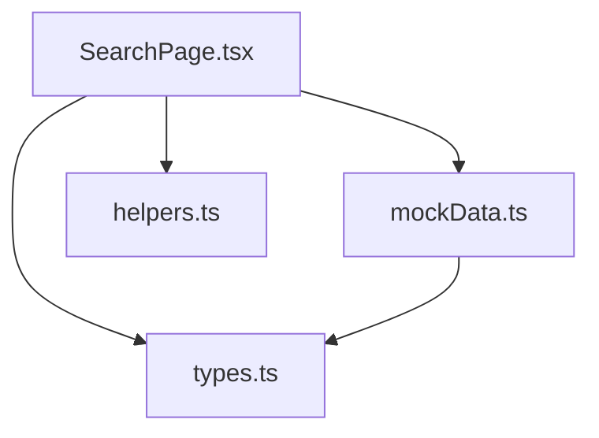
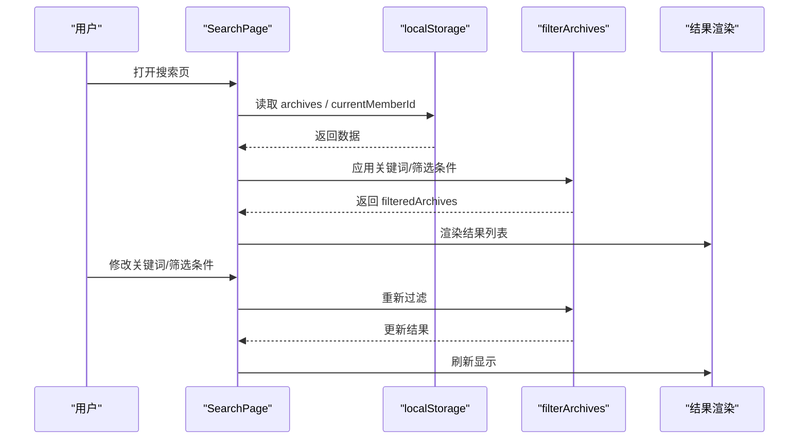
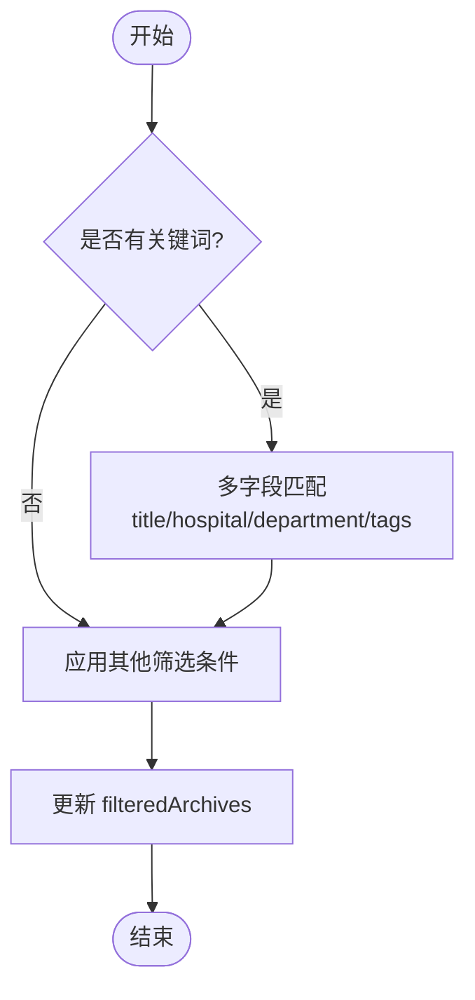
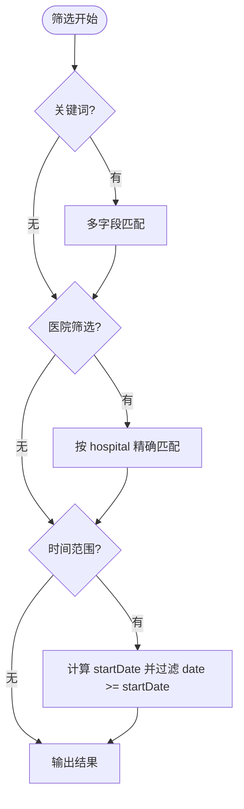
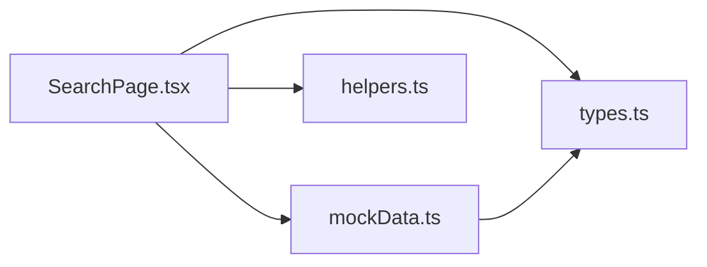

# 搜索与筛选功能

<cite>
**本文引用的文件**
- [SearchPage.tsx](file://figma-ui/src/app/pages/SearchPage.tsx)
- [types.ts](file://figma-ui/src/app/types.ts)
- [mockData.ts](file://figma-ui/src/app/utils/mockData.ts)
- [helpers.ts](file://figma-ui/src/app/utils/helpers.ts)
</cite>

## 目录
1. [简介](#简介)
2. [项目结构](#项目结构)
3. [核心组件](#核心组件)
4. [架构总览](#架构总览)
5. [详细组件分析](#详细组件分析)
6. [依赖关系分析](#依赖关系分析)
7. [性能考量](#性能考量)
8. [故障排除指南](#故障排除指南)
9. [结论](#结论)
10. [附录：接口规范与前端集成示例](#附录接口规范与前端集成示例)

## 简介
本技术文档聚焦医案通医疗档案网站的“搜索与筛选”能力，围绕当前实现的前端搜索与筛选逻辑进行系统化说明。内容涵盖：
- 全文搜索算法（关键词匹配、多字段检索）
- 高级筛选器（时间范围、医院名称等维度组合）
- 排序机制现状与建议
- 性能优化策略（索引、缓存、分页加载）
- 搜索API接口规范建议与前端集成示例
- 搜索体验优化建议与故障排除

说明：当前仓库为前端原型/设计稿工程，搜索与筛选逻辑以本地数据为主，未包含后端服务代码。因此，本文对“后端API”部分提供基于现有前端的接口契约建议与集成示例，便于后续扩展至真实后端。

## 项目结构
搜索与筛选功能主要由以下文件构成：
- 页面组件：SearchPage.tsx（搜索入口、筛选面板、结果列表）
- 类型定义：types.ts（Archive、OCRData 等数据结构）
- 模拟数据：mockData.ts（初始数据与初始化逻辑）
- 工具函数：helpers.ts（日期格式化等通用方法）

图表来源
- [SearchPage.tsx:1-286](file://figma-ui/src/app/pages/SearchPage.tsx#L1-L286)
- [types.ts:11-46](file://figma-ui/src/app/types.ts#L11-L46)
- [mockData.ts:1-98](file://figma-ui/src/app/utils/mockData.ts#L1-L98)
- [helpers.ts:1-52](file://figma-ui/src/app/utils/helpers.ts#L1-L52)

章节来源
- [SearchPage.tsx:1-286](file://figma-ui/src/app/pages/SearchPage.tsx#L1-L286)
- [types.ts:11-46](file://figma-ui/src/app/types.ts#L11-L46)
- [mockData.ts:1-98](file://figma-ui/src/app/utils/mockData.ts#L1-L98)
- [helpers.ts:1-52](file://figma-ui/src/app/utils/helpers.ts#L1-L52)

## 核心组件
- SearchPage：负责用户输入（关键词）、筛选条件（医院、时间范围）、过滤计算与结果渲染。
- Archive 类型：描述单条医疗档案的完整字段，包括标题、医院、科室、日期、标签、OCR解析数据等。
- mockData：提供初始数据与本地存储初始化，使搜索功能在离线环境下可运行。
- helpers：提供日期格式化等工具函数，用于结果展示。

章节来源
- [SearchPage.tsx:7-28](file://figma-ui/src/app/pages/SearchPage.tsx#L7-L28)
- [types.ts:11-46](file://figma-ui/src/app/types.ts#L11-L46)
- [mockData.ts:3-98](file://figma-ui/src/app/utils/mockData.ts#L3-L98)
- [helpers.ts:4-19](file://figma-ui/src/app/utils/helpers.ts#L4-L19)

## 架构总览
搜索与筛选的整体流程如下：
- 页面初始化时从本地存储读取当前成员的有效档案集合。
- 用户输入关键词或选择筛选条件后，触发过滤函数，按规则生成结果集。
- 结果集渲染为卡片列表，支持点击跳转至详情页。

图表来源
- [SearchPage.tsx:15-27](file://figma-ui/src/app/pages/SearchPage.tsx#L15-L27)
- [SearchPage.tsx:29-69](file://figma-ui/src/app/pages/SearchPage.tsx#L29-L69)

章节来源
- [SearchPage.tsx:15-69](file://figma-ui/src/app/pages/SearchPage.tsx#L15-L69)

## 详细组件分析

### 搜索算法与多字段检索
- 关键词匹配：对标题、医院、科室、标签进行大小写不敏感的子串匹配。
- 多字段检索：同时覆盖 title、hospital、department、tags 四个字段，提升召回率。
- 模糊搜索：当前为子串匹配，非编辑距离或拼音匹配；如需更智能的容错匹配，可在后续版本引入拼音库或模糊匹配算法。
- 拼音搜索：当前未实现；建议在关键词预处理阶段将中文转拼音后再进行匹配。

图表来源
- [SearchPage.tsx:29-69](file://figma-ui/src/app/pages/SearchPage.tsx#L29-L69)

章节来源
- [SearchPage.tsx:29-69](file://figma-ui/src/app/pages/SearchPage.tsx#L29-L69)

### 高级筛选器设计
- 时间范围：支持近一周、近一月、近三月、近一年，通过比较档案日期与计算出的起始日期进行过滤。
- 医院名称：动态提取所有医院的去重列表，支持单选过滤。
- 诊断结果/医生姓名：当前未直接暴露筛选入口；但可通过 OCRData 中的 diagnosis 与 doctorName 字段扩展筛选能力。
- 组合筛选：关键词与时间范围、医院可叠加使用，最终取交集。

图表来源
- [SearchPage.tsx:42-66](file://figma-ui/src/app/pages/SearchPage.tsx#L42-L66)

章节来源
- [SearchPage.tsx:42-66](file://figma-ui/src/app/pages/SearchPage.tsx#L42-L66)

### 搜索结果排序算法
- 当前实现：未显式排序，仅按原始顺序返回过滤后的结果。
- 建议方案：
  - 相关性评分：根据关键词命中字段权重（如标题>标签>医院>科室）计算得分，再结合时间衰减因子。
  - 时间权重：近期档案优先，采用指数衰减或线性衰减。
  - 用户偏好：收藏档案置顶、最近访问优先等。
- 复杂度：若采用加权评分+排序，时间复杂度约为 O(n log n)，n 为候选结果数。

章节来源
- [SearchPage.tsx:29-69](file://figma-ui/src/app/pages/SearchPage.tsx#L29-L69)

### 数据模型与字段映射
- Archive：包含 id、memberId、type、title、hospital、department、date、uploadDate、imageUrl、ocrData、tags、isFavorite、isDeleted。
- OCRData：包含 hospital、department、date、doctorName、diagnosis、items、prescription 等扩展字段，可用于增强搜索与筛选。
- 类型常量：ARCHIVE_TYPE_LABELS、ARCHIVE_TYPE_COLORS 用于展示标签与颜色。

章节来源
- [types.ts:11-46](file://figma-ui/src/app/types.ts#L11-L46)
- [types.ts:74-94](file://figma-ui/src/app/types.ts#L74-L94)

### 模拟数据与本地存储
- 初始数据：MOCK_ARCHIVES 提供多条样例档案，覆盖不同类别与字段。
- 初始化逻辑：当本地存储不存在 archives 时，写入 MOCK_ARCHIVES，确保搜索功能可用。
- 成员隔离：通过 currentMemberId 过滤出当前成员的档案，避免跨成员数据污染。

章节来源
- [mockData.ts:3-98](file://figma-ui/src/app/utils/mockData.ts#L3-L98)
- [SearchPage.tsx:15-23](file://figma-ui/src/app/pages/SearchPage.tsx#L15-L23)

## 依赖关系分析
- SearchPage 依赖 types 中的 Archive 与常量，保证类型安全与展示一致性。
- SearchPage 依赖 mockData 提供的初始数据与初始化逻辑。
- SearchPage 依赖 helpers 中的日期格式化函数用于结果展示。
- 数据源：当前为 localStorage，未来可扩展为后端 API。

图表来源
- [SearchPage.tsx:1-6](file://figma-ui/src/app/pages/SearchPage.tsx#L1-L6)
- [types.ts:11-46](file://figma-ui/src/app/types.ts#L11-L46)
- [mockData.ts:1-98](file://figma-ui/src/app/utils/mockData.ts#L1-L98)
- [helpers.ts:1-52](file://figma-ui/src/app/utils/helpers.ts#L1-L52)

章节来源
- [SearchPage.tsx:1-6](file://figma-ui/src/app/pages/SearchPage.tsx#L1-L6)
- [types.ts:11-46](file://figma-ui/src/app/types.ts#L11-L46)
- [mockData.ts:1-98](file://figma-ui/src/app/utils/mockData.ts#L1-L98)
- [helpers.ts:1-52](file://figma-ui/src/app/utils/helpers.ts#L1-L52)

## 性能考量
- 当前实现特点：
  - 全量内存过滤：每次输入变化都会遍历全部档案数组，时间复杂度 O(n)。
  - 无分页：结果一次性渲染，大数据量可能导致卡顿。
- 优化建议：
  - 索引建立：为常用字段（title、hospital、department、tags）建立倒排索引或哈希表，加速匹配。
  - 缓存机制：对高频查询结果进行短期缓存（如防抖后缓存），减少重复计算。
  - 分页加载：采用虚拟滚动或分页加载，降低首屏渲染压力。
  - 增量更新：仅对变更字段对应的索引进行更新，避免全量重建。
  - 前端节流/防抖：对输入事件进行节流或防抖，降低频繁过滤带来的性能开销。

[本节为通用性能指导，不直接分析具体文件]

## 故障排除指南
- 无结果返回：
  - 检查关键词是否为空或拼写错误。
  - 确认筛选条件（医院、时间范围）是否过于严格。
  - 验证本地存储中是否存在有效数据（archives）。
- 数据不一致：
  - 检查 currentMemberId 是否正确设置。
  - 确认 isDeleted 标记是否影响过滤。
- 性能问题：
  - 数据量较大时，考虑引入分页或虚拟滚动。
  - 对输入事件添加防抖，避免频繁触发过滤。
- 展示异常：
  - 检查日期格式与 locale 设置。
  - 确认 OCRData 字段是否存在，避免空引用导致的渲染问题。

章节来源
- [SearchPage.tsx:15-27](file://figma-ui/src/app/pages/SearchPage.tsx#L15-L27)
- [SearchPage.tsx:29-69](file://figma-ui/src/app/pages/SearchPage.tsx#L29-L69)
- [helpers.ts:4-19](file://figma-ui/src/app/utils/helpers.ts#L4-L19)

## 结论
当前搜索与筛选功能实现了基础的关键词多字段匹配与高级筛选（时间范围、医院名称），并通过本地存储提供离线可用性。为进一步满足医疗场景的复杂需求，建议：
- 引入拼音搜索与模糊匹配，提升召回率与容错性。
- 扩展高级筛选维度（诊断结果、医生姓名、档案类型等）。
- 实现相关性评分与排序，提高结果质量。
- 完善性能优化（索引、缓存、分页），保障大数据量下的流畅体验。
- 对接后端 API，实现持久化与协作能力。

[本节为总结性内容，不直接分析具体文件]

## 附录：接口规范与前端集成示例

### 搜索API接口规范（建议）
- 基础信息
  - 方法：POST
  - 路径：/api/search
  - 请求体示例字段：keyword、filters（hospital、dateRange、doctorName、diagnosis、archiveType）、page、pageSize、sortBy、sortOrder
  - 响应体示例字段：results（数组）、total、hasMore
- 参数说明
  - keyword：字符串，支持多词分词与拼音匹配（后端实现）
  - filters：对象，包含多维筛选条件
  - page/pageSize：分页参数
  - sortBy/sortOrder：排序字段与方向（如 relevance、date、favorite）
- 状态码
  - 200：成功
  - 400：参数错误
  - 500：服务器错误

[本节为接口契约建议，不直接分析具体文件]

### 前端集成示例（基于当前实现）
- 数据源切换
  - 当前：从 localStorage 读取 archives 与 currentMemberId
  - 建议：封装统一的 dataProvider，内部根据环境切换本地或远程数据源
- 搜索调用流程
  - 监听输入变化，防抖后发起搜索请求
  - 合并服务端结果与本地缓存，更新 filteredArchives
  - 支持分页加载与无限滚动
- 错误处理
  - 网络异常：提示重试或降级到本地数据
  - 参数校验：前端预校验，减少无效请求

[本节为集成建议，不直接分析具体文件]