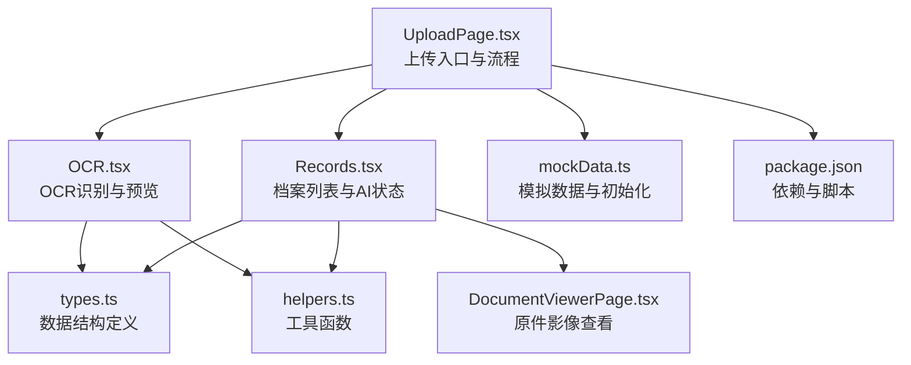
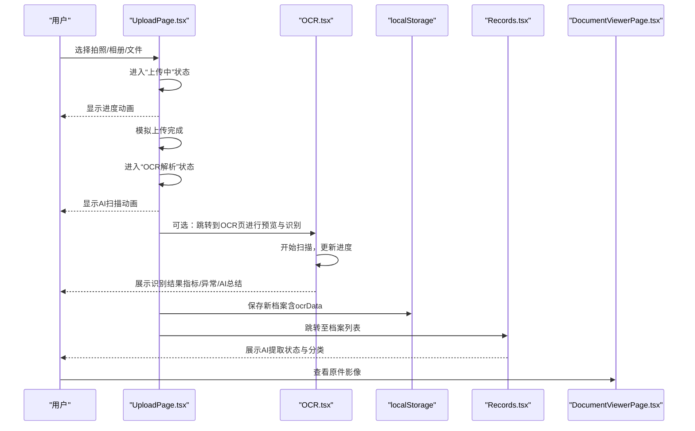
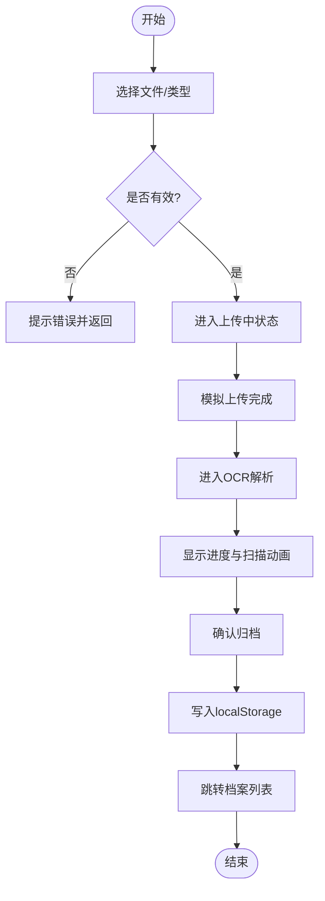
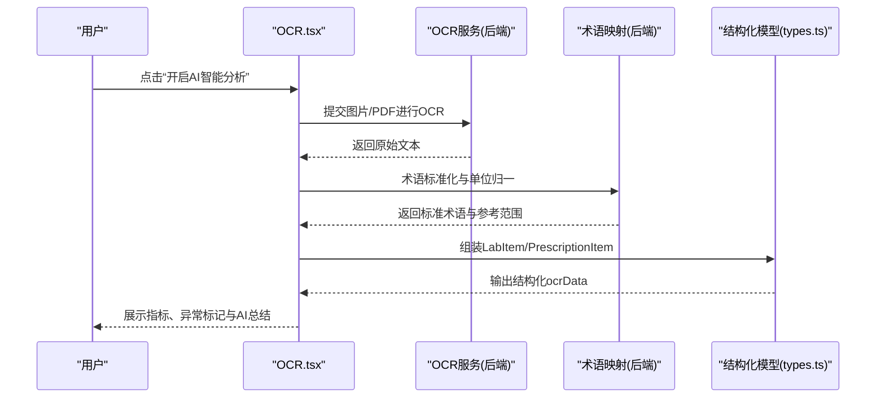
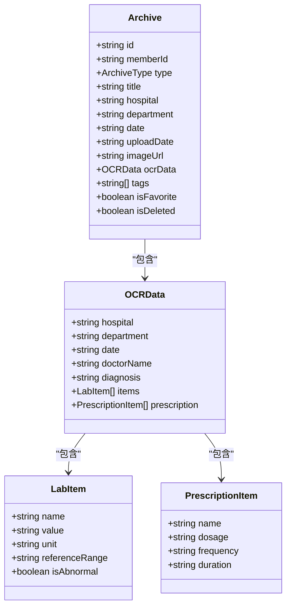
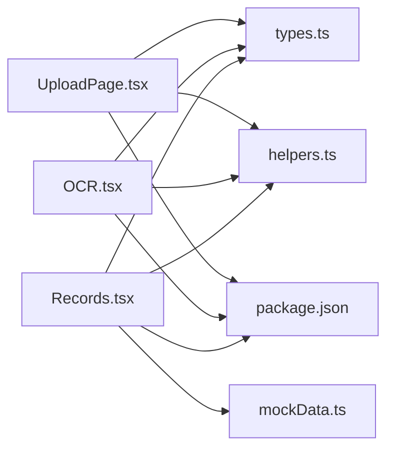

# 文档上传与处理

<cite>
**本文引用的文件**
- [UploadPage.tsx](file://figma-ui/src/app/pages/UploadPage.tsx)
- [OCR.tsx](file://figma-ui/src/app/pages/OCR.tsx)
- [types.ts](file://figma-ui/src/app/types.ts)
- [helpers.ts](file://figma-ui/src/app/utils/helpers.ts)
- [Records.tsx](file://figma-ui/src/app/pages/Records.tsx)
- [DocumentViewerPage.tsx](file://figma-ui/src/app/pages/DocumentViewerPage.tsx)
- [mockData.ts](file://figma-ui/src/app/utils/mockData.ts)
- [package.json](file://figma-ui/package.json)
</cite>

## 目录
1. [简介](#简介)
2. [项目结构](#项目结构)
3. [核心组件](#核心组件)
4. [架构总览](#架构总览)
5. [详细组件分析](#详细组件分析)
6. [依赖关系分析](#依赖关系分析)
7. [性能考量](#性能考量)
8. [故障排查指南](#故障排查指南)
9. [结论](#结论)
10. [附录](#附录)

## 简介
本章节面向医案通医疗档案网站的“文档上传与处理”能力，聚焦前端实现：文件选择与上传流程、OCR识别交互、AI智能摘要展示、结构化数据模型、以及本地存储与演示数据。当前仓库为前端工程，未包含后端API与服务端逻辑；因此本节基于现有代码说明可实现的流程、数据结构与交互设计，并给出落地到后端的建议与最佳实践。

## 项目结构
该功能主要涉及以下页面与模块：
- 上传入口与流程控制：UploadPage.tsx
- OCR识别交互与结果展示：OCR.tsx
- 数据类型定义：types.ts
- 工具函数（日期、ID等）：helpers.ts
- 档案列表与AI状态展示：Records.tsx
- 原件影像查看：DocumentViewerPage.tsx
- 模拟数据与初始化：mockData.ts
- 依赖与构建配置：package.json

图表来源
- [UploadPage.tsx:1-278](file://figma-ui/src/app/pages/UploadPage.tsx#L1-L278)
- [OCR.tsx:1-270](file://figma-ui/src/app/pages/OCR.tsx#L1-L270)
- [types.ts:1-95](file://figma-ui/src/app/types.ts#L1-L95)
- [helpers.ts:1-52](file://figma-ui/src/app/utils/helpers.ts#L1-L52)
- [Records.tsx:1-421](file://figma-ui/src/app/pages/Records.tsx#L1-L421)
- [DocumentViewerPage.tsx:1-131](file://figma-ui/src/app/pages/DocumentViewerPage.tsx#L1-L131)
- [mockData.ts:1-97](file://figma-ui/src/app/utils/mockData.ts#L1-L97)
- [package.json:1-101](file://figma-ui/package.json#L1-L101)

章节来源
- [UploadPage.tsx:1-278](file://figma-ui/src/app/pages/UploadPage.tsx#L1-L278)
- [OCR.tsx:1-270](file://figma-ui/src/app/pages/OCR.tsx#L1-L270)
- [types.ts:1-95](file://figma-ui/src/app/types.ts#L1-L95)
- [helpers.ts:1-52](file://figma-ui/src/app/utils/helpers.ts#L1-L52)
- [Records.tsx:1-421](file://figma-ui/src/app/pages/Records.tsx#L1-L421)
- [DocumentViewerPage.tsx:1-131](file://figma-ui/src/app/pages/DocumentViewerPage.tsx#L1-L131)
- [mockData.ts:1-97](file://figma-ui/src/app/utils/mockData.ts#L1-L97)
- [package.json:1-101](file://figma-ui/package.json#L1-L101)

## 核心组件
- 上传页 UploadPage.tsx：提供拍照/相册/微信文件导入入口，支持多种档案类型选择，进入“上传中→OCR解析→确认归档”的三步流程，并在确认后写入本地存储并跳转至档案列表。
- OCR页 OCR.tsx：提供图片/PDF上传、预览、扫描进度条、识别结果卡片（指标、异常标记、AI总结），支持重置与再次识别。
- 类型定义 types.ts：统一档案类型、OCR数据结构、检验项、处方项等，确保前后端数据结构一致。
- 工具 helpers.ts：日期格式化、过期判断、随机ID生成、脱敏等通用方法。
- 档案列表 Records.tsx：展示AI提取状态、分类筛选、搜索、历史趋势视图，体现“AI已加密守护”的安全感。
- 原件查看 DocumentViewerPage.tsx：以滑动方式查看原件影像，附带下载与分享按钮。
- 模拟数据 mockData.ts：初始化本地存档数据，便于演示与测试。

章节来源
- [UploadPage.tsx:1-278](file://figma-ui/src/app/pages/UploadPage.tsx#L1-L278)
- [OCR.tsx:1-270](file://figma-ui/src/app/pages/OCR.tsx#L1-L270)
- [types.ts:1-95](file://figma-ui/src/app/types.ts#L1-L95)
- [helpers.ts:1-52](file://figma-ui/src/app/utils/helpers.ts#L1-L52)
- [Records.tsx:1-421](file://figma-ui/src/app/pages/Records.tsx#L1-L421)
- [DocumentViewerPage.tsx:1-131](file://figma-ui/src/app/pages/DocumentViewerPage.tsx#L1-L131)
- [mockData.ts:1-97](file://figma-ui/src/app/utils/mockData.ts#L1-L97)

## 架构总览
从用户操作到数据落库的前端流程如下：

图表来源
- [UploadPage.tsx:12-52](file://figma-ui/src/app/pages/UploadPage.tsx#L12-L52)
- [OCR.tsx:42-75](file://figma-ui/src/app/pages/OCR.tsx#L42-L75)
- [Records.tsx:113-122](file://figma-ui/src/app/pages/Records.tsx#L113-L122)
- [DocumentViewerPage.tsx:32-47](file://figma-ui/src/app/pages/DocumentViewerPage.tsx#L32-L47)

## 详细组件分析

### 上传流程与接口实现（前端视角）
- 文件类型支持
  - 拍照/相册：通过系统相机或相册选择图片（接受 image/*）。
  - 微信文件导入：界面提示支持 PDF / Word / Excel（文本类文档）。
  - 特定类型上传：门诊病历、检验报告、处方签、影像报告、其他资料。
- 文件大小限制
  - 当前前端未显式校验大小；建议在上传前对 File.size 进行限制，并结合后端策略做二次校验。
- 上传进度显示
  - 使用动画进度条与状态文案反馈“正在加密上传”“AI智能解析中”。
- 错误处理机制
  - 当前为演示流程，未实现网络请求与错误分支；建议接入后端API时增加超时、重试、错误提示与回滚。
- 数据存储
  - 将新档案对象写入 localStorage 的 archives 数组，包含 id、memberId、type、title、hospital、department、date、uploadDate、tags、isFavorite、isDeleted、ocrData 等字段。

图表来源
- [UploadPage.tsx:12-52](file://figma-ui/src/app/pages/UploadPage.tsx#L12-L52)
- [OCR.tsx:42-75](file://figma-ui/src/app/pages/OCR.tsx#L42-L75)

章节来源
- [UploadPage.tsx:12-52](file://figma-ui/src/app/pages/UploadPage.tsx#L12-L52)
- [OCR.tsx:42-75](file://figma-ui/src/app/pages/OCR.tsx#L42-L75)
- [types.ts:11-61](file://figma-ui/src/app/types.ts#L11-L61)

### OCR识别流程（图像预处理、文本提取、术语转换、结构化数据）
- 图像预处理
  - 前端仅负责预览与扫描动画；实际预处理（去噪、纠偏、增强）应在后端或专用SDK中完成。
- 文本提取
  - 调用OCR服务将图片/PDF转为文本；当前为模拟流程，使用定时器推进进度并返回示例数据。
- 医学术语转换
  - 将原始文本映射为标准术语（如“空腹血糖”“左室射血分数”），并标注单位与参考范围。
- 结构化数据生成
  - 生成 items 数组（name/value/unit/referenceRange/isAbnormal）、summary 摘要、诊断信息等，符合 types.ts 中的 OCRData/LabItem 结构。

图表来源
- [OCR.tsx:42-75](file://figma-ui/src/app/pages/OCR.tsx#L42-L75)
- [types.ts:37-61](file://figma-ui/src/app/types.ts#L37-L61)

章节来源
- [OCR.tsx:42-75](file://figma-ui/src/app/pages/OCR.tsx#L42-L75)
- [types.ts:37-61](file://figma-ui/src/app/types.ts#L37-L61)

### AI智能摘要（关键信息提取、异常指标识别、健康建议）
- 关键信息提取
  - 从OCR结果中提取医院、科室、医生、诊断、检查项目等关键字段。
- 异常指标识别
  - 对比 referenceRange 与 value，设置 isAbnormal 标志，并在UI中以颜色与图标提示。
- 健康建议生成
  - 基于指标与诊断生成简短建议（如“建议定期复查”“低盐饮食”），在OCR结果卡片中展示。

图表来源
- [types.ts:11-61](file://figma-ui/src/app/types.ts#L11-L61)

章节来源
- [types.ts:11-61](file://figma-ui/src/app/types.ts#L11-L61)
- [OCR.tsx:60-74](file://figma-ui/src/app/pages/OCR.tsx#L60-L74)
- [mockData.ts:3-97](file://figma-ui/src/app/utils/mockData.ts#L3-L97)

### 文件存储策略与数据备份方案
- 前端存储
  - 使用 localStorage 持久化 archives 数组，便于离线演示与快速验证。
- 后端存储（建议）
  - 对象存储（如云OSS/S3）存放原图与PDF，数据库记录元数据与ocrData。
  - 分桶按成员/时间维度组织，命名规范包含 member_id/archive_type/date/hash。
- 数据备份（建议）
  - 定时快照+增量备份；跨地域复制；保留版本与恢复演练。
  - 敏感数据加密存储与传输（TLS），访问鉴权与审计日志。

章节来源
- [UploadPage.tsx:26-52](file://figma-ui/src/app/pages/UploadPage.tsx#L26-L52)
- [mockData.ts:91-97](file://figma-ui/src/app/utils/mockData.ts#L91-L97)

### 性能优化建议
- 前端
  - 图片压缩与转码（WebP/AVIF），减少带宽与渲染压力。
  - 懒加载与虚拟滚动，避免长列表卡顿。
  - 防抖/节流搜索与过滤，降低重排重绘。
- 后端
  - 异步任务队列处理OCR与摘要，避免阻塞主线程。
  - CDN缓存静态资源与缩略图；边缘计算加速预览。
  - 数据库索引与分页查询，提升检索性能。

[本节为通用指导，不直接分析具体文件]

## 依赖关系分析
- 页面与类型
  - UploadPage.tsx 依赖 types.ts 的 ArchiveType 与标签映射。
  - OCR.tsx 依赖 types.ts 的结构用于展示与后续存储。
  - Records.tsx 依赖 types.ts 与 mockData.ts 的数据结构。
- 工具与UI
  - helpers.ts 提供日期与ID工具，被多页面复用。
  - package.json 声明了构建与运行时依赖（React、Vite、Tailwind、Motion等）。

图表来源
- [UploadPage.tsx:1-278](file://figma-ui/src/app/pages/UploadPage.tsx#L1-L278)
- [OCR.tsx:1-270](file://figma-ui/src/app/pages/OCR.tsx#L1-L270)
- [Records.tsx:1-421](file://figma-ui/src/app/pages/Records.tsx#L1-L421)
- [types.ts:1-95](file://figma-ui/src/app/types.ts#L1-L95)
- [mockData.ts:1-97](file://figma-ui/src/app/utils/mockData.ts#L1-L97)
- [helpers.ts:1-52](file://figma-ui/src/app/utils/helpers.ts#L1-L52)
- [package.json:1-101](file://figma-ui/package.json#L1-L101)

章节来源
- [UploadPage.tsx:1-278](file://figma-ui/src/app/pages/UploadPage.tsx#L1-L278)
- [OCR.tsx:1-270](file://figma-ui/src/app/pages/OCR.tsx#L1-L270)
- [Records.tsx:1-421](file://figma-ui/src/app/pages/Records.tsx#L1-L421)
- [types.ts:1-95](file://figma-ui/src/app/types.ts#L1-L95)
- [mockData.ts:1-97](file://figma-ui/src/app/utils/mockData.ts#L1-L97)
- [helpers.ts:1-52](file://figma-ui/src/app/utils/helpers.ts#L1-L52)
- [package.json:1-101](file://figma-ui/package.json#L1-L101)

## 性能考量
- 大文件上传
  - 切片上传、断点续传、并发控制，结合后端分片合并。
- OCR与摘要
  - 服务端异步处理，前端轮询或WebSocket推送进度与结果。
- 渲染优化
  - 列表虚拟化、图片懒加载、骨架屏占位。
- 安全与合规
  - 端到端加密、最小权限访问、审计日志与合规留存。

[本节为通用指导，不直接分析具体文件]

## 故障排查指南
- 常见问题
  - 无法选择文件：检查 accept 属性与浏览器权限。
  - 进度卡住：检查模拟定时器或真实网络请求状态。
  - 识别结果为空：确认输入图片质量与格式，必要时提示重新拍摄。
  - 本地存储失败：检查存储空间与浏览器策略。
- 调试建议
  - 打开控制台查看错误堆栈与网络请求。
  - 使用浏览器开发者工具的存储面板检查 localStorage。
  - 逐步打印关键状态变量（step、progress、scanResult）。

章节来源
- [OCR.tsx:42-75](file://figma-ui/src/app/pages/OCR.tsx#L42-L75)
- [UploadPage.tsx:12-52](file://figma-ui/src/app/pages/UploadPage.tsx#L12-L52)

## 结论
当前仓库实现了完整的“上传→OCR→结构化→展示”前端流程与交互，具备清晰的类型定义与良好的用户体验。生产环境需补充后端API、OCR服务、存储与备份方案，并完善错误处理、性能优化与安全合规措施。

[本节为总结性内容，不直接分析具体文件]

## 附录
- 代码片段路径（不含具体代码内容）
  - 上传流程与状态切换：[UploadPage.tsx:12-52](file://figma-ui/src/app/pages/UploadPage.tsx#L12-L52)
  - OCR识别与进度：[OCR.tsx:42-75](file://figma-ui/src/app/pages/OCR.tsx#L42-L75)
  - 数据结构定义：[types.ts:11-61](file://figma-ui/src/app/types.ts#L11-L61)
  - 工具函数示例：[helpers.ts:1-52](file://figma-ui/src/app/utils/helpers.ts#L1-L52)
  - 档案列表与AI状态：[Records.tsx:113-122](file://figma-ui/src/app/pages/Records.tsx#L113-L122)
  - 原件影像查看：[DocumentViewerPage.tsx:32-47](file://figma-ui/src/app/pages/DocumentViewerPage.tsx#L32-L47)
  - 模拟数据与初始化：[mockData.ts:1-97](file://figma-ui/src/app/utils/mockData.ts#L1-L97)
  - 依赖与脚本：[package.json:1-101](file://figma-ui/package.json#L1-L101)