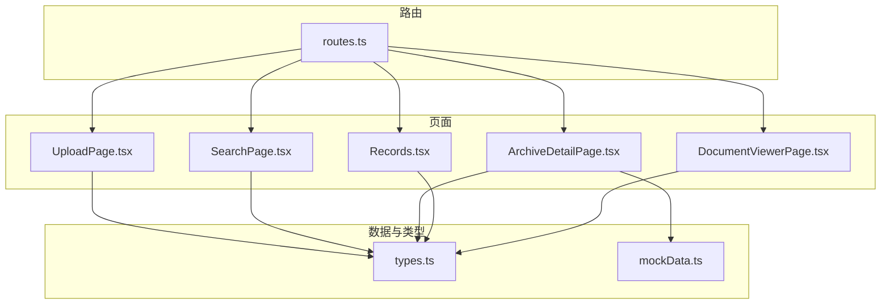
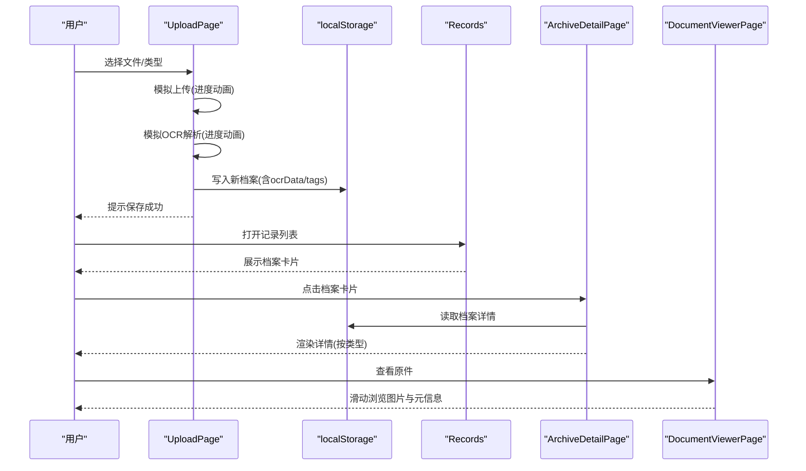
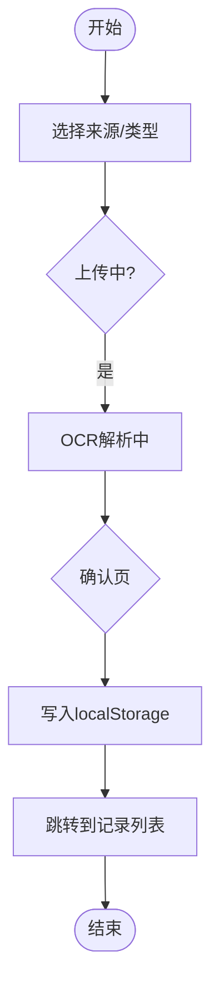
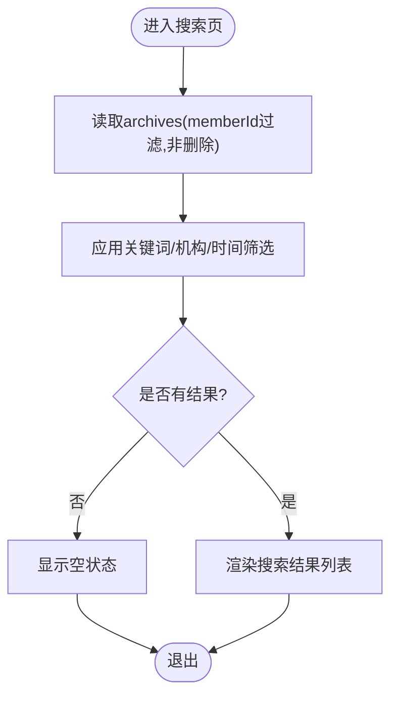
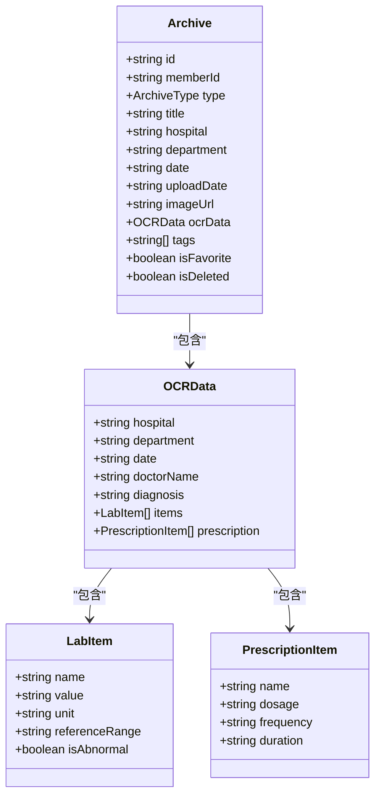
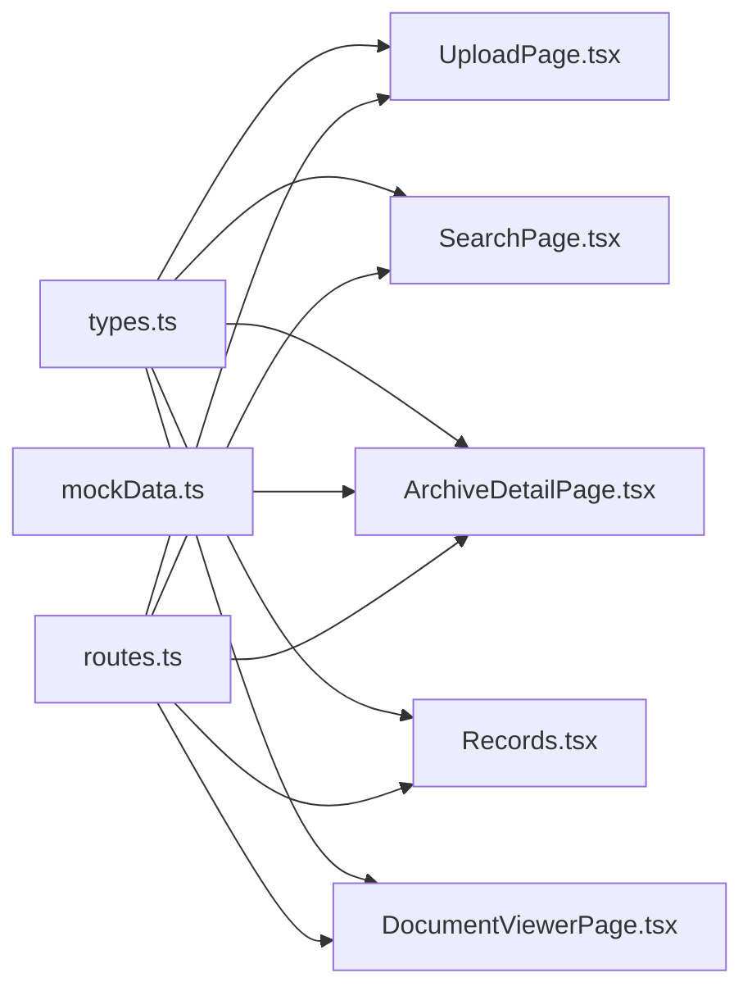

# 档案管理模块

<cite>
**本文引用的文件**
- [routes.ts](file://figma-ui/src/app/routes.ts)
- [types.ts](file://figma-ui/src/app/types.ts)
- [UploadPage.tsx](file://figma-ui/src/app/pages/UploadPage.tsx)
- [SearchPage.tsx](file://figma-ui/src/app/pages/SearchPage.tsx)
- [ArchiveDetailPage.tsx](file://figma-ui/src/app/pages/ArchiveDetailPage.tsx)
- [Records.tsx](file://figma-ui/src/app/pages/Records.tsx)
- [DocumentViewerPage.tsx](file://figma-ui/src/app/pages/DocumentViewerPage.tsx)
- [mockData.ts](file://figma-ui/src/app/utils/mockData.ts)
</cite>

## 目录
1. [简介](#简介)
2. [项目结构](#项目结构)
3. [核心组件](#核心组件)
4. [架构总览](#架构总览)
5. [详细组件分析](#详细组件分析)
6. [依赖关系分析](#依赖关系分析)
7. [性能与优化](#性能与优化)
8. [故障排查指南](#故障排查指南)
9. [结论](#结论)
10. [附录](#附录)

## 简介
本模块为医案通医疗档案网站的前端实现，聚焦“档案管理”能力：文档上传、类型识别（OCR）、标签分类、全文搜索、批量操作、档案详情查看与原件预览。当前实现采用前端本地存储（localStorage）作为数据持久化，结合模拟的 OCR 流程与 Mock 数据，提供完整的用户交互体验与页面路由组织。

## 项目结构
- 路由层：集中定义应用路由，包含档案上传、搜索、记录列表、详情、原件查看等页面。
- 页面层：按功能划分页面组件，覆盖上传、搜索、列表、详情、原件浏览等关键场景。
- 类型与数据：统一的数据模型与 Mock 数据，支撑各页面的展示与交互。
- 工具与样式：基础工具函数与 UI 样式体系（Tailwind）。

图表来源
- [routes.ts:25-106](file://figma-ui/src/app/routes.ts#L25-L106)
- [UploadPage.tsx:1-278](file://figma-ui/src/app/pages/UploadPage.tsx#L1-L278)
- [SearchPage.tsx:1-286](file://figma-ui/src/app/pages/SearchPage.tsx#L1-L286)
- [ArchiveDetailPage.tsx:1-356](file://figma-ui/src/app/pages/ArchiveDetailPage.tsx#L1-L356)
- [Records.tsx:1-421](file://figma-ui/src/app/pages/Records.tsx#L1-L421)
- [DocumentViewerPage.tsx:1-131](file://figma-ui/src/app/pages/DocumentViewerPage.tsx#L1-L131)
- [types.ts:1-95](file://figma-ui/src/app/types.ts#L1-L95)
- [mockData.ts:1-98](file://figma-ui/src/app/utils/mockData.ts#L1-L98)

章节来源
- [routes.ts:25-106](file://figma-ui/src/app/routes.ts#L25-L106)

## 核心组件
- 上传与解析：支持拍照/相册/微信文件导入，选择档案类型后进入“上传中→OCR解析→确认保存”流程，最终写入本地存储并跳转至记录列表。
- 搜索与筛选：关键词在标题、医院、科室、标签中进行匹配；支持按就诊机构与时间范围筛选。
- 档案详情：根据档案类型动态渲染不同内容区块（检验报告、处方、门诊病历、影像检查），展示元数据、AI 提取结果与标签。
- 记录列表：常规视图与指标追溯视图切换，支持分类过滤与搜索。
- 原件查看：以滑动方式浏览历史原件图片，附带元数据与下载/分享入口。

章节来源
- [UploadPage.tsx:12-52](file://figma-ui/src/app/pages/UploadPage.tsx#L12-L52)
- [SearchPage.tsx:15-69](file://figma-ui/src/app/pages/SearchPage.tsx#L15-L69)
- [ArchiveDetailPage.tsx:27-40](file://figma-ui/src/app/pages/ArchiveDetailPage.tsx#L27-L40)
- [Records.tsx:101-122](file://figma-ui/src/app/pages/Records.tsx#L101-L122)
- [DocumentViewerPage.tsx:32-47](file://figma-ui/src/app/pages/DocumentViewerPage.tsx#L32-L47)

## 架构总览
前端采用 React Router 进行页面路由管理，页面组件通过 types.ts 中的统一数据模型进行交互，使用 localStorage 作为临时数据源，mockData.ts 提供初始数据与兜底展示。

图表来源
- [UploadPage.tsx:12-52](file://figma-ui/src/app/pages/UploadPage.tsx#L12-L52)
- [ArchiveDetailPage.tsx:32-40](file://figma-ui/src/app/pages/ArchiveDetailPage.tsx#L32-L40)
- [DocumentViewerPage.tsx:32-47](file://figma-ui/src/app/pages/DocumentViewerPage.tsx#L32-L47)
- [routes.ts:44-88](file://figma-ui/src/app/routes.ts#L44-L88)

## 详细组件分析

### 上传与解析（UploadPage）
- 交互流程：选择来源（相机/相册/微信文件/特定类型）→ 进入上传状态 → 进入 OCR 解析状态 → 进入确认页 → 保存至本地存储并跳转。
- 数据结构：生成符合 Archive 类型的对象，包含 id、memberId、type、title、hospital、department、date、uploadDate、tags、isFavorite、isDeleted、ocrData。
- 错误处理：当前为模拟流程，未实现真实网络请求与异常分支；可扩展为异步上传与错误重试机制。
- 可访问性：按钮具备明确文案与图标，加载态有进度条与动画反馈。

图表来源
- [UploadPage.tsx:12-52](file://figma-ui/src/app/pages/UploadPage.tsx#L12-L52)

章节来源
- [UploadPage.tsx:12-52](file://figma-ui/src/app/pages/UploadPage.tsx#L12-L52)
- [types.ts:11-46](file://figma-ui/src/app/types.ts#L11-L46)

### 搜索与筛选（SearchPage）
- 关键词搜索：对标题、医院、科室、标签进行大小写不敏感匹配。
- 筛选条件：就诊机构（下拉多选）、时间范围（近一周/一月/三月/一年）。
- 数据源：从 localStorage 读取当前成员的非删除档案，若为空则回退到 mock 初始化数据。
- 空状态：无结果时展示友好提示与重置按钮。

图表来源
- [SearchPage.tsx:15-69](file://figma-ui/src/app/pages/SearchPage.tsx#L15-L69)

章节来源
- [SearchPage.tsx:15-69](file://figma-ui/src/app/pages/SearchPage.tsx#L15-L69)
- [mockData.ts:91-98](file://figma-ui/src/app/utils/mockData.ts#L91-L98)

### 档案详情（ArchiveDetailPage）
- 数据获取：优先从 localStorage 查找指定 id 的档案，未找到则回退到 mock 数据。
- 动态渲染：根据 type 渲染不同内容区块：
  - 检验报告：展示指标项、参考值、异常高亮与提醒。
  - 处方：展示药品清单、用量、频次、疗程与智能用药提醒。
  - 门诊病历：展示诊断、主诉、医生建议。
  - 影像检查：展示影像占位图与诊断摘要。
- 元数据展示：标题、医院、科室、日期、医生、标签。
- 操作：分享、更多菜单、下载、AI 助手入口。

图表来源
- [types.ts:11-61](file://figma-ui/src/app/types.ts#L11-L61)
- [ArchiveDetailPage.tsx:27-40](file://figma-ui/src/app/pages/ArchiveDetailPage.tsx#L27-L40)

章节来源
- [ArchiveDetailPage.tsx:27-40](file://figma-ui/src/app/pages/ArchiveDetailPage.tsx#L27-L40)
- [types.ts:11-61](file://figma-ui/src/app/types.ts#L11-L61)

### 记录列表（Records）
- 视图模式：常规视图（档案卡片）与指标追溯视图（指标类别卡片）。
- 过滤与搜索：支持按分类（全部/门诊病历/化验报告/处方记录/影像检查）与关键词（标题、医院、摘要、标签）过滤。
- 交互：顶部扫描动画提示 AI 解析进行中；卡片内展示 AI 摘要与标签；支持进入详情页或指标历史。

章节来源
- [Records.tsx:101-122](file://figma-ui/src/app/pages/Records.tsx#L101-L122)
- [Routes.ts:60-66](file://figma-ui/src/app/routes.ts#L60-L66)

### 原件查看（DocumentViewerPage）
- 展示：基于滑块组件循环展示多张原件图片，支持放大、下载、分享。
- 元数据：底部面板显示类型、日期、医院与“AI已提取数据”标识。
- 导航：返回上一页，分页指示器。

章节来源
- [DocumentViewerPage.tsx:32-47](file://figma-ui/src/app/pages/DocumentViewerPage.tsx#L32-L47)
- [routes.ts:82-88](file://figma-ui/src/app/routes.ts#L82-L88)

## 依赖关系分析
- 路由依赖：所有页面通过 routes.ts 注册，确保 URL 与组件映射一致。
- 类型依赖：各页面共享 types.ts 中的 Archive、OCRData、LabItem、PrescriptionItem 等类型，保证数据结构一致性。
- 数据依赖：SearchPage、ArchiveDetailPage、Records 均依赖 localStorage 与 mockData 提供的初始数据。
- 外部库：React Router、Lucide 图标、motion/react 动画、react-slick 滑块等。

图表来源
- [types.ts:1-95](file://figma-ui/src/app/types.ts#L1-L95)
- [mockData.ts:1-98](file://figma-ui/src/app/utils/mockData.ts#L1-L98)
- [routes.ts:25-106](file://figma-ui/src/app/routes.ts#L25-L106)

章节来源
- [routes.ts:25-106](file://figma-ui/src/app/routes.ts#L25-L106)
- [types.ts:1-95](file://figma-ui/src/app/types.ts#L1-L95)
- [mockData.ts:1-98](file://figma-ui/src/app/utils/mockData.ts#L1-L98)

## 性能与优化
- 本地存储读写：当前实现直接读写 localStorage，适合小规模数据；当档案数量增长时建议引入 IndexedDB 或后端服务以减少主线程阻塞。
- 搜索性能：关键词与筛选逻辑在前端执行，数据量大时可考虑分页、虚拟滚动与后端索引查询。
- 渲染优化：详情页按类型条件渲染，避免无关 DOM；可使用 memo/useMemo 缓存计算结果。
- 图片加载：原件查看使用外链图片，建议接入 CDN 与懒加载以提升首屏性能。
- 动画性能：大量动画可能影响低端设备，可降级为静态过渡或减少并发动画。

[本节为通用指导，不直接分析具体文件]

## 故障排查指南
- 无法找到档案：详情页会回退到 mock 数据；若仍为空，检查 localStorage 中 archives 是否被清空或键名不一致。
- 搜索无结果：确认关键词拼写、筛选条件是否过严；尝试重置条件。
- 上传失败：当前为模拟流程，无真实网络请求；如需对接后端，需补充上传接口与错误处理。
- 原件无法显示：检查外链图片地址是否有效；必要时替换为本地资源或后端托管地址。

章节来源
- [ArchiveDetailPage.tsx:32-40](file://figma-ui/src/app/pages/ArchiveDetailPage.tsx#L32-L40)
- [SearchPage.tsx:15-69](file://figma-ui/src/app/pages/SearchPage.tsx#L15-L69)
- [UploadPage.tsx:12-52](file://figma-ui/src/app/pages/UploadPage.tsx#L12-L52)
- [DocumentViewerPage.tsx:32-47](file://figma-ui/src/app/pages/DocumentViewerPage.tsx#L32-L47)

## 结论
该档案管理模块以清晰的路由组织与统一的类型定义，实现了从上传、解析、搜索到详情查看与原件浏览的完整前端流程。当前采用本地存储与模拟 OCR，便于快速验证与演示。后续可逐步引入真实 OCR 服务、后端 API、索引与分页优化，提升性能与扩展性。

[本节为总结，不直接分析具体文件]

## 附录

### 数据模型设计
- Archive：档案主实体，包含基本信息、OCR 结构化数据、标签与状态字段。
- OCRData：OCR 提取的结构化信息，支持医院、科室、日期、医生、诊断、检验项、处方等。
- LabItem/PrescriptionItem：检验项与处方项的具体字段，便于详情展示与分析。

章节来源
- [types.ts:11-61](file://figma-ui/src/app/types.ts#L11-L61)

### 存储策略
- 前端本地存储：使用 localStorage 键 archives 存储档案数组；首次启动可通过 initializeMockData 注入示例数据。
- 成员隔离：通过 memberId 区分不同用户的档案集合。

章节来源
- [mockData.ts:91-98](file://figma-ui/src/app/utils/mockData.ts#L91-L98)
- [SearchPage.tsx:15-23](file://figma-ui/src/app/pages/SearchPage.tsx#L15-L23)

### 索引机制与查询优化
- 当前为前端内存过滤，未建立索引；可按 hospital、date、type、tags 构建前端索引以提升筛选速度。
- 建议在后端引入搜索引擎（如 Elasticsearch）或数据库索引，支持全文检索与复杂条件组合。

[本节为通用指导，不直接分析具体文件]

### 文件处理流程
- 选择来源 → 模拟上传 → 模拟 OCR → 确认保存 → 写入本地存储 → 跳转记录列表。
- 详情页根据类型渲染对应内容块，支持查看原件。

章节来源
- [UploadPage.tsx:12-52](file://figma-ui/src/app/pages/UploadPage.tsx#L12-L52)
- [ArchiveDetailPage.tsx:27-40](file://figma-ui/src/app/pages/ArchiveDetailPage.tsx#L27-L40)

### 错误处理机制
- 当前页面未显式捕获网络错误；建议在上传与 OCR 阶段增加 try/catch 与用户提示。
- 空状态与回退逻辑已在详情页与搜索页体现，可进一步丰富错误码与重试策略。

章节来源
- [ArchiveDetailPage.tsx:32-40](file://figma-ui/src/app/pages/ArchiveDetailPage.tsx#L32-L40)
- [SearchPage.tsx:15-69](file://figma-ui/src/app/pages/SearchPage.tsx#L15-L69)

### 用户界面交互设计
- 上传页：分步引导、进度条与动画反馈，降低用户等待焦虑。
- 搜索页：即时过滤、可视化筛选与空状态提示。
- 详情页：类型化内容区块、异常指标高亮与智能提醒。
- 原件查看：深色主题、滑动浏览与元数据面板。

章节来源
- [UploadPage.tsx:54-186](file://figma-ui/src/app/pages/UploadPage.tsx#L54-L186)
- [SearchPage.tsx:73-286](file://figma-ui/src/app/pages/SearchPage.tsx#L73-L286)
- [ArchiveDetailPage.tsx:251-356](file://figma-ui/src/app/pages/ArchiveDetailPage.tsx#L251-L356)
- [DocumentViewerPage.tsx:49-131](file://figma-ui/src/app/pages/DocumentViewerPage.tsx#L49-L131)