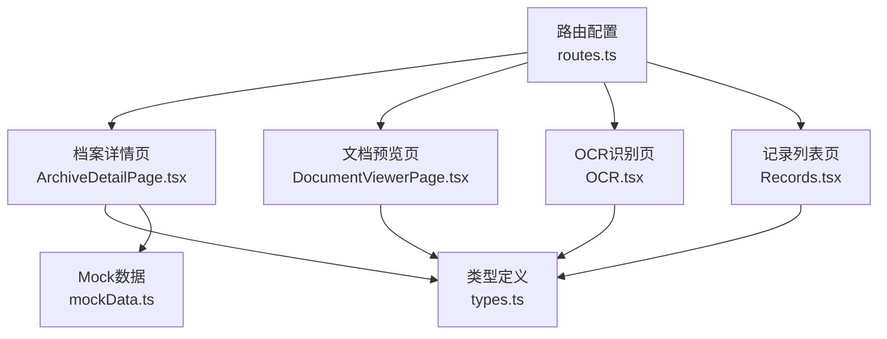
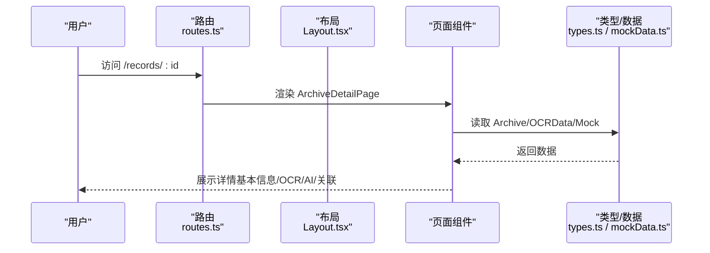
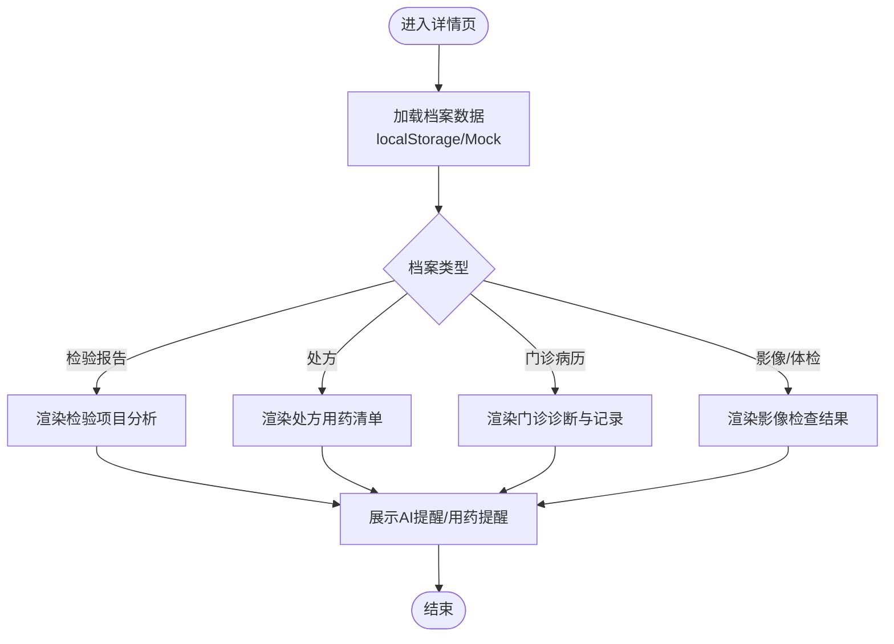
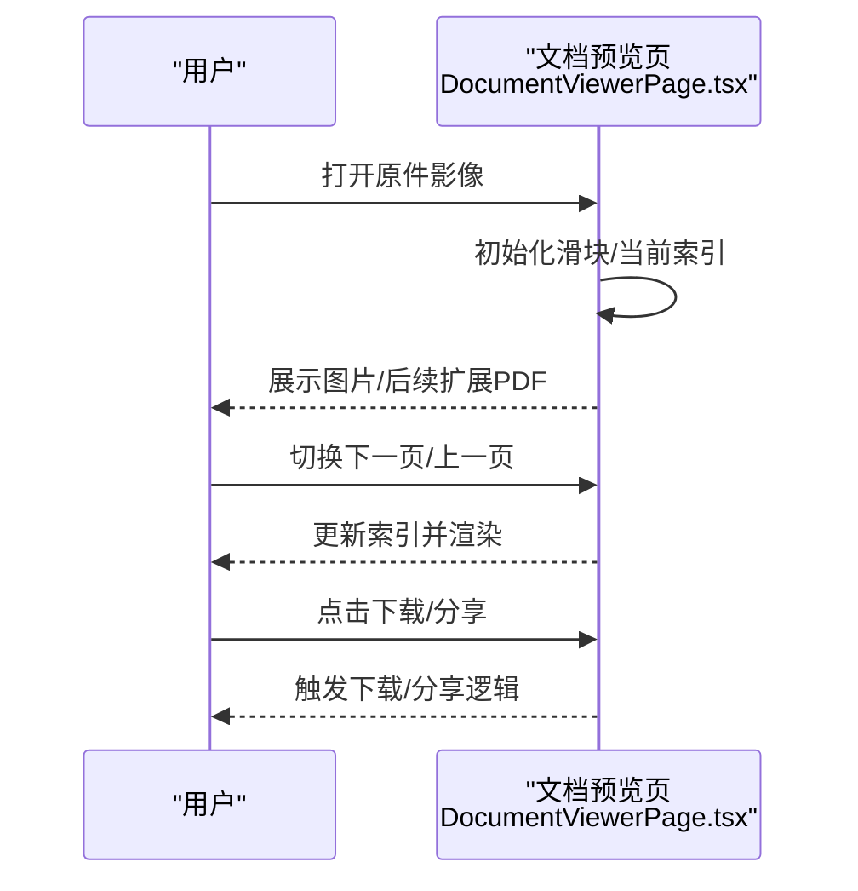
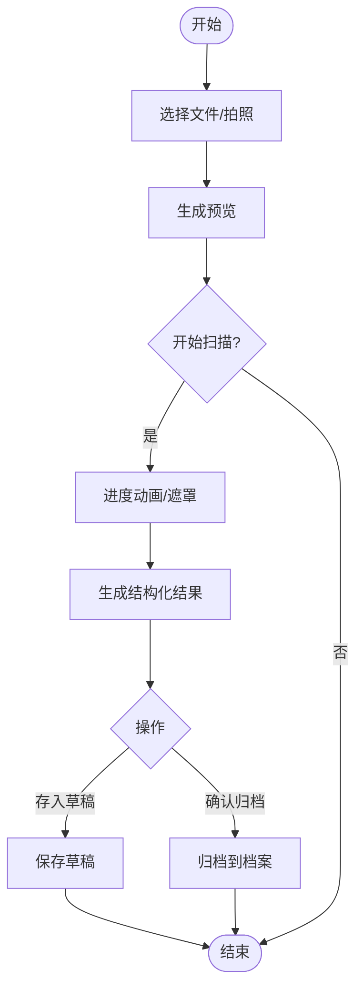
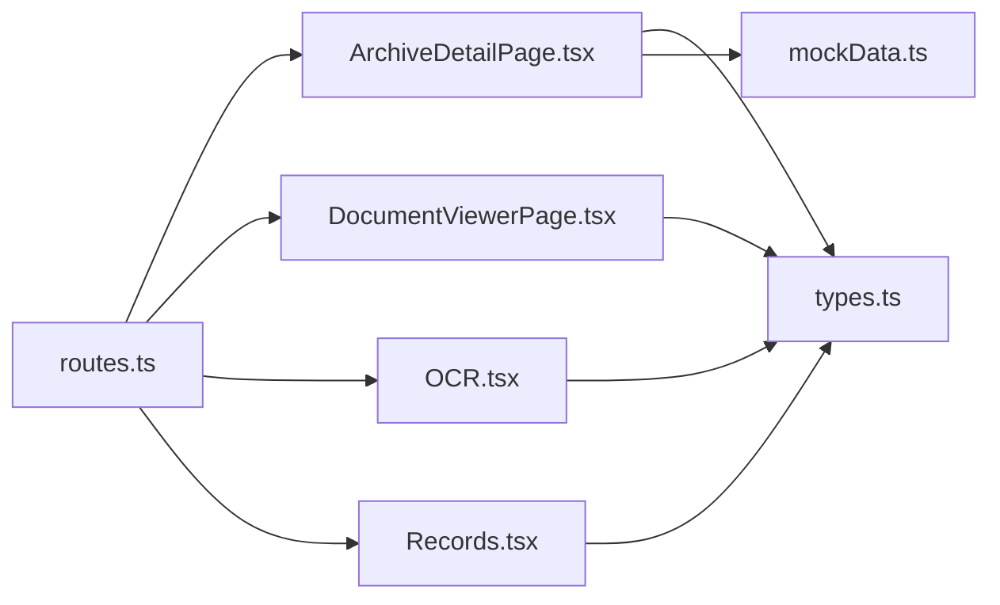
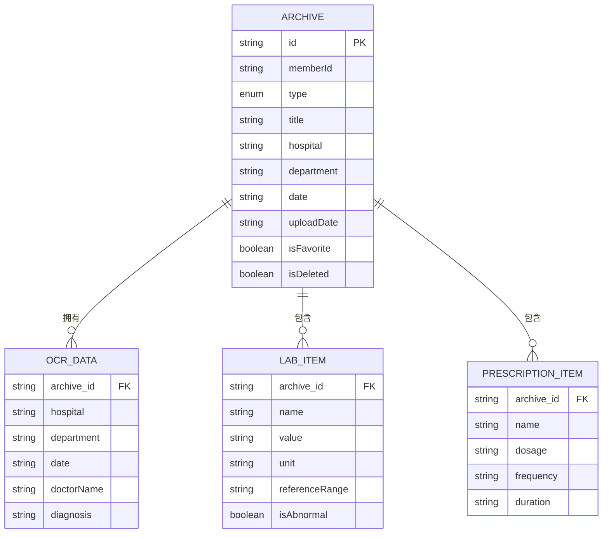

# 详情查看与编辑

<cite>
**本文引用的文件**
- [ArchiveDetailPage.tsx](file://figma-ui/src/app/pages/ArchiveDetailPage.tsx)
- [DocumentViewerPage.tsx](file://figma-ui/src/app/pages/DocumentViewerPage.tsx)
- [OCR.tsx](file://figma-ui/src/app/pages/OCR.tsx)
- [Records.tsx](file://figma-ui/src/app/pages/Records.tsx)
- [types.ts](file://figma-ui/src/app/types.ts)
- [mockData.ts](file://figma-ui/src/app/utils/mockData.ts)
- [routes.ts](file://figma-ui/src/app/routes.ts)
- [Layout.tsx](file://figma-ui/src/app/components/Layout.tsx)
</cite>

## 目录
1. [简介](#简介)
2. [项目结构](#项目结构)
3. [核心组件](#核心组件)
4. [架构总览](#架构总览)
5. [详细组件分析](#详细组件分析)
6. [依赖关系分析](#依赖关系分析)
7. [性能考量](#性能考量)
8. [故障排查指南](#故障排查指南)
9. [结论](#结论)
10. [附录](#附录)

## 简介
本章节面向医案通医疗档案网站的“详情查看与编辑”能力，围绕以下目标展开：
- 档案详情页的布局与信息展示（基本信息、OCR识别结果可视化、AI分析摘要、相关文档关联）
- 文档预览功能的技术实现（多格式渲染、缩放控制、页面导航、打印支持）
- 在线编辑能力的实现路径（富文本编辑器集成、实时保存、版本控制、冲突解决）
- 数据同步策略（本地缓存、云端同步、一致性保证）
- 权限控制、审计日志与安全防护
- 用户界面设计规范与技术实现细节

## 项目结构
本项目采用基于 React + TypeScript 的前端工程，路由由 react-router 管理，UI 使用 Tailwind CSS 与 lucide-react 图标库，动效使用 motion/react。关键页面包括：
- 档案详情页：用于展示结构化后的 OCR/AI 提取结果与元信息
- 文档预览页：用于浏览原件影像（图片/PDF 等）
- OCR 识别页：上传并模拟识别流程，输出结构化结果
- 记录列表页：提供档案入口与分类筛选
- 类型定义与 Mock 数据：统一数据结构与演示数据

图表来源
- [routes.ts:25-88](file://figma-ui/src/app/routes.ts#L25-L88)
- [ArchiveDetailPage.tsx:27-356](file://figma-ui/src/app/pages/ArchiveDetailPage.tsx#L27-L356)
- [DocumentViewerPage.tsx:32-131](file://figma-ui/src/app/pages/DocumentViewerPage.tsx#L32-L131)
- [OCR.tsx:24-270](file://figma-ui/src/app/pages/OCR.tsx#L24-L270)
- [Records.tsx:101-421](file://figma-ui/src/app/pages/Records.tsx#L101-L421)
- [types.ts:11-95](file://figma-ui/src/app/types.ts#L11-L95)
- [mockData.ts:3-98](file://figma-ui/src/app/utils/mockData.ts#L3-L98)

章节来源
- [routes.ts:25-88](file://figma-ui/src/app/routes.ts#L25-L88)
- [Layout.tsx:31-144](file://figma-ui/src/app/components/Layout.tsx#L31-L144)

## 核心组件
- 档案详情页：根据档案类型动态渲染不同内容区块（检验报告、处方、门诊诊断、影像检查），并提供 AI 指标提醒与智能用药提醒。
- 文档预览页：使用滑块组件进行多图/多页浏览，支持下载与分享；当前为图片占位，可扩展为 PDF 渲染。
- OCR 识别页：支持图片/PDF 上传、扫描进度动画、识别结果卡片、AI 总结、草稿与归档操作。
- 记录列表页：提供常规视图与历史追溯视图，支持搜索与分类过滤，点击条目进入详情页。
- 类型与数据：统一的档案类型、OCR 数据结构、标签映射与颜色体系；本地初始化 Mock 数据。

章节来源
- [ArchiveDetailPage.tsx:27-356](file://figma-ui/src/app/pages/ArchiveDetailPage.tsx#L27-L356)
- [DocumentViewerPage.tsx:32-131](file://figma-ui/src/app/pages/DocumentViewerPage.tsx#L32-L131)
- [OCR.tsx:24-270](file://figma-ui/src/app/pages/OCR.tsx#L24-L270)
- [Records.tsx:101-421](file://figma-ui/src/app/pages/Records.tsx#L101-L421)
- [types.ts:11-95](file://figma-ui/src/app/types.ts#L11-L95)
- [mockData.ts:3-98](file://figma-ui/src/app/utils/mockData.ts#L3-L98)

## 架构总览
前端以路由为中心组织页面，页面组件通过类型定义约束数据结构，并通过 Mock 数据或本地存储驱动 UI。OCR 流程在独立页面完成，识别结果可归档至档案列表，随后在详情页中结构化呈现。

图表来源
- [routes.ts:77-88](file://figma-ui/src/app/routes.ts#L77-L88)
- [Layout.tsx:31-144](file://figma-ui/src/app/components/Layout.tsx#L31-L144)
- [ArchiveDetailPage.tsx:27-356](file://figma-ui/src/app/pages/ArchiveDetailPage.tsx#L27-L356)
- [types.ts:11-95](file://figma-ui/src/app/types.ts#L11-L95)
- [mockData.ts:3-98](file://figma-ui/src/app/utils/mockData.ts#L3-L98)

## 详细组件分析

### 档案详情页：布局设计与信息展示
- 顶部导航：返回、分享、更多操作；标题区显示档案类型标签。
- 基本信息卡片：标题、医院/科室、就诊时间、主治医生、标签。
- OCR/AI 来源提示条：标注“数据由 AI 智能提取”，并提供“查看原件”入口。
- 动态内容区：
  - 检验报告：指标项列表、异常高亮、AI 指标提醒。
  - 处方清单：药品名称、用量/频次/疗程、AI 核对标识、智能用药提醒。
  - 门诊诊断：诊断结果、主诉、医生建议。
  - 影像检查：图像占位区域、AI 扫描标识、所见与诊断。
- 底部悬浮操作：下载、AI 助手问答。

图表来源
- [ArchiveDetailPage.tsx:27-356](file://figma-ui/src/app/pages/ArchiveDetailPage.tsx#L27-L356)
- [types.ts:11-95](file://figma-ui/src/app/types.ts#L11-L95)
- [mockData.ts:3-98](file://figma-ui/src/app/utils/mockData.ts#L3-L98)

章节来源
- [ArchiveDetailPage.tsx:27-356](file://figma-ui/src/app/pages/ArchiveDetailPage.tsx#L27-L356)
- [types.ts:11-95](file://figma-ui/src/app/types.ts#L11-L95)
- [mockData.ts:3-98](file://figma-ui/src/app/utils/mockData.ts#L3-L98)

### 文档预览页：多格式渲染、缩放、导航与打印
- 当前实现：使用滑块组件进行多图滑动浏览，显示医院、日期、类型等元信息，支持下载与分享。
- 扩展建议：
  - 多格式渲染：引入 PDF 渲染器（如 pdfjs-dist）以支持 PDF 分页渲染；图片保持现有方式。
  - 缩放控制：增加手势缩放或按钮缩放，适配移动端阅读。
  - 页面导航：保留当前页码指示，增加前后翻页与跳转输入框。
  - 打印支持：调用浏览器打印 API，针对 PDF 分页优化打印样式。

图表来源
- [DocumentViewerPage.tsx:32-131](file://figma-ui/src/app/pages/DocumentViewerPage.tsx#L32-L131)

章节来源
- [DocumentViewerPage.tsx:32-131](file://figma-ui/src/app/pages/DocumentViewerPage.tsx#L32-L131)

### OCR 识别流程：上传、扫描、结果与归档
- 上传与预览：支持从相册选择或上传 PDF，生成预览图。
- 扫描过程：进度条动画与遮罩提示“正在智能识别中”。
- 识别结果：结构化字段展示（检查项目、数值、正常/异常标记）、AI 总结。
- 归档操作：存入草稿或确认归档，便于后续在详情页查看。

图表来源
- [OCR.tsx:24-270](file://figma-ui/src/app/pages/OCR.tsx#L24-L270)

章节来源
- [OCR.tsx:24-270](file://figma-ui/src/app/pages/OCR.tsx#L24-L270)

### 记录列表页：入口与分类
- 常规视图：展示最近记录、AI 摘要、标签、医院与日期。
- 历史追溯视图：按指标聚合，展示趋势与最后更新时间。
- 交互：点击条目跳转到详情页；支持搜索与分类筛选。

章节来源
- [Records.tsx:101-421](file://figma-ui/src/app/pages/Records.tsx#L101-L421)

### 类型与数据结构
- 档案类型：门诊病历、检验报告、影像报告、处方、体检报告、出院记录、发票、其他。
- OCR 数据：包含医院、科室、日期、医生、诊断、检验项、处方等。
- 标签与颜色：统一映射，便于 UI 展示。

章节来源
- [types.ts:11-95](file://figma-ui/src/app/types.ts#L11-L95)

## 依赖关系分析
- 路由层：集中管理页面路由，将 /records/:id 指向档案详情页，/records/history/:categoryId/originals 指向文档预览页。
- 页面层：各页面组件依赖类型定义与 Mock 数据，确保 UI 与数据结构一致。
- 组件层：使用 lucide-react 图标、motion/react 动效、react-slick 滑块等第三方库。

图表来源
- [routes.ts:25-88](file://figma-ui/src/app/routes.ts#L25-L88)
- [ArchiveDetailPage.tsx:27-356](file://figma-ui/src/app/pages/ArchiveDetailPage.tsx#L27-L356)
- [DocumentViewerPage.tsx:32-131](file://figma-ui/src/app/pages/DocumentViewerPage.tsx#L32-L131)
- [OCR.tsx:24-270](file://figma-ui/src/app/pages/OCR.tsx#L24-L270)
- [Records.tsx:101-421](file://figma-ui/src/app/pages/Records.tsx#L101-L421)
- [types.ts:11-95](file://figma-ui/src/app/types.ts#L11-L95)
- [mockData.ts:3-98](file://figma-ui/src/app/utils/mockData.ts#L3-L98)

章节来源
- [routes.ts:25-88](file://figma-ui/src/app/routes.ts#L25-L88)

## 性能考量
- 首屏加载：详情页优先从 localStorage 读取，若无则回退到 Mock 数据，减少网络请求。
- 渲染优化：使用条件渲染与懒加载（按需渲染不同区块），避免不必要的重绘。
- 图片资源：预览页当前使用外链图片，生产环境应替换为 CDN 并启用压缩与懒加载。
- 动画与交互：合理使用 motion 动画，避免过度复杂导致卡顿。
- 扩展建议：对 PDF 渲染进行分页与虚拟滚动，降低大文档内存占用。

[本节为通用性能指导，不直接分析具体文件]

## 故障排查指南
- 未找到档案：详情页在未匹配到 id 时显示“未找到相关档案”，并提供返回按钮。检查路由参数与数据源是否一致。
- 数据为空：若 localStorage 无数据且 Mock 未初始化，可能导致空状态。可通过初始化函数写入默认数据。
- 预览失败：预览页的图片链接可能失效，需替换为有效资源或后端地址。
- 识别流程中断：OCR 页面扫描超时或异常时，应重置状态并提示重试。

章节来源
- [ArchiveDetailPage.tsx:32-52](file://figma-ui/src/app/pages/ArchiveDetailPage.tsx#L32-L52)
- [mockData.ts:92-98](file://figma-ui/src/app/utils/mockData.ts#L92-L98)
- [DocumentViewerPage.tsx:77-94](file://figma-ui/src/app/pages/DocumentViewerPage.tsx#L77-L94)
- [OCR.tsx:42-83](file://figma-ui/src/app/pages/OCR.tsx#L42-L83)

## 结论
当前代码已实现档案详情页的结构化展示与 OCR 识别流程的基础链路，文档预览页具备多图浏览能力。下一步建议：
- 完善文档预览的多格式支持与缩放/打印能力
- 引入富文本编辑器以实现在线编辑、实时保存、版本控制与冲突解决
- 建立本地缓存与云端同步机制，保障数据一致性与可用性
- 强化权限控制、审计日志与安全防护措施，满足医疗数据合规要求

[本节为总结性内容，不直接分析具体文件]

## 附录

### 数据模型（ER 风格）

图表来源
- [types.ts:11-95](file://figma-ui/src/app/types.ts#L11-L95)

### 用户界面设计规范（要点）
- 色彩与层次：使用中性色背景与强调色区分模块；异常指标使用警示色突出。
- 排版与间距：卡片式布局，圆角与阴影提升层次感；信息密度适中，留白充足。
- 交互反馈：按钮点击有缩放与过渡效果；扫描与加载提供明确进度反馈。
- 可访问性：图标与文字结合，确保语义清晰；关键操作提供明确文案。

[本节为通用设计指导，不直接分析具体文件]