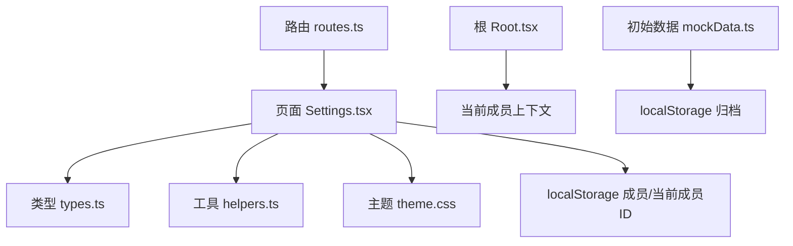
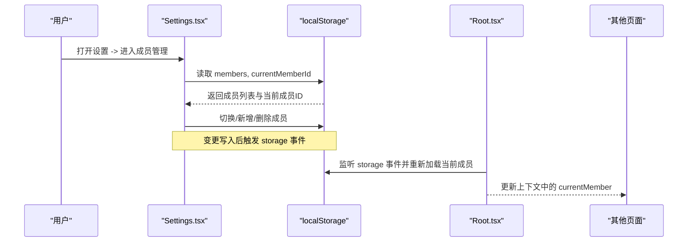
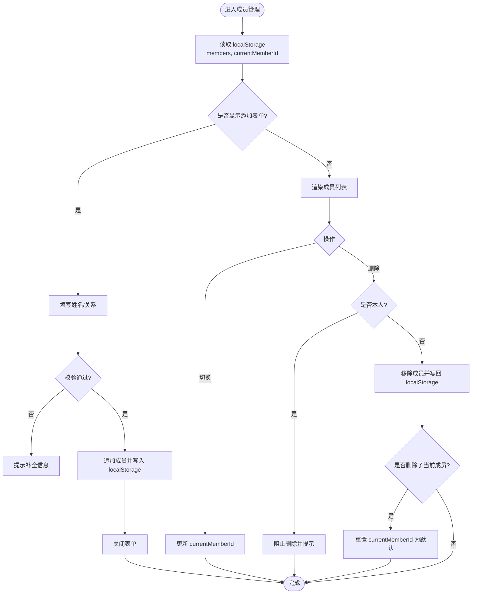
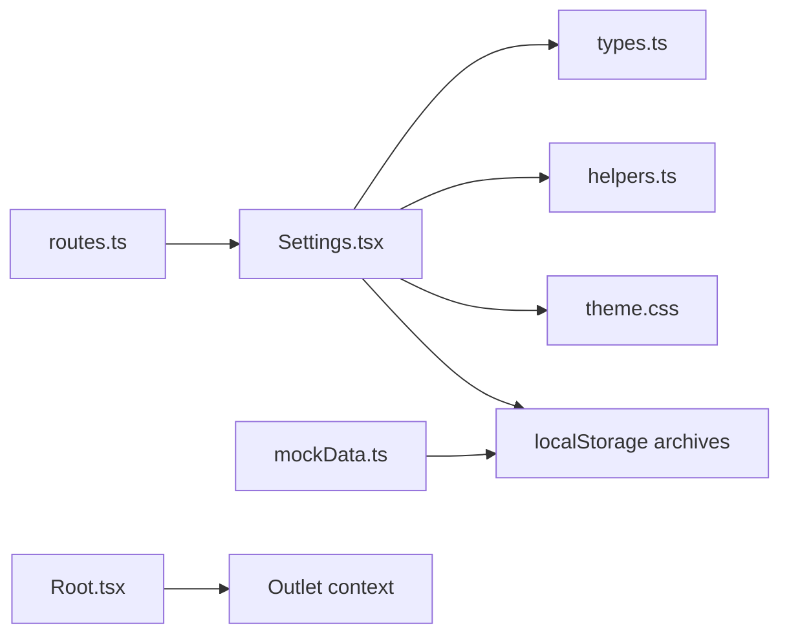

# 设置模块

<cite>
**本文引用的文件**
- [Settings.tsx](file://figma-ui/src/app/pages/Settings.tsx)
- [types.ts](file://figma-ui/src/app/types.ts)
- [Root.tsx](file://figma-ui/src/app/Root.tsx)
- [routes.ts](file://figma-ui/src/app/routes.ts)
- [helpers.ts](file://figma-ui/src/app/utils/helpers.ts)
- [theme.css](file://figma-ui/src/styles/theme.css)
- [mockData.ts](file://figma-ui/src/app/utils/mockData.ts)
</cite>

## 目录
1. [简介](#简介)
2. [项目结构](#项目结构)
3. [核心组件](#核心组件)
4. [架构总览](#架构总览)
5. [详细组件分析](#详细组件分析)
6. [依赖分析](#依赖分析)
7. [性能考虑](#性能考虑)
8. [故障排查指南](#故障排查指南)
9. [结论](#结论)
10. [附录](#附录)

## 简介
本章节面向医案通医疗档案网站的“设置”模块，系统性说明用户偏好、主题切换、数据备份与恢复、系统配置管理等能力。文档聚焦以下方面：
- 数据结构与存储方式（基于浏览器 localStorage）
- 验证规则与应用范围（成员切换、登录态、归档过滤）
- 功能实现细节（个人资料、通知、隐私、国际化占位）
- 高级特性方案（配置导入导出、默认值管理、设置迁移）

该模块当前以本地存储为核心，提供多成员管理与基础应用设置入口，为后续扩展（如云端同步、更细粒度权限控制）奠定基础。

## 项目结构
设置模块由页面路由、页面组件、类型定义、样式主题、根上下文以及工具函数共同组成：
- 路由注册：将 /settings 映射到 Settings 组件
- 页面组件：Settings.tsx 承载设置界面与交互
- 类型定义：types.ts 定义成员、档案等数据结构
- 根上下文：Root.tsx 负责加载并共享当前成员信息
- 样式主题：theme.css 提供深色模式变量
- 工具函数：helpers.ts 提供日期格式化、脱敏等通用方法
- 初始数据：mockData.ts 在首次访问时初始化示例数据

图表来源
- [routes.ts:56-58](file://figma-ui/src/app/routes.ts#L56-L58)
- [Settings.tsx:27-42](file://figma-ui/src/app/pages/Settings.tsx#L27-L42)
- [types.ts:1-95](file://figma-ui/src/app/types.ts#L1-L95)
- [Root.tsx:35-58](file://figma-ui/src/app/Root.tsx#L35-L58)
- [mockData.ts:91-97](file://figma-ui/src/app/utils/mockData.ts#L91-L97)

章节来源
- [routes.ts:56-58](file://figma-ui/src/app/routes.ts#L56-L58)
- [Settings.tsx:27-42](file://figma-ui/src/app/pages/Settings.tsx#L27-L42)
- [types.ts:1-95](file://figma-ui/src/app/types.ts#L1-L95)
- [Root.tsx:35-58](file://figma-ui/src/app/Root.tsx#L35-L58)
- [mockData.ts:91-97](file://figma-ui/src/app/utils/mockData.ts#L91-L97)

## 核心组件
- 设置主视图：展示个人中心、家庭管理、应用设置、通用设置四大分组；支持深色模式开关、语言选择占位、消息提醒、隐私与安全、数据存储管理、分享保护设置等入口。
- 家庭成员管理：支持添加、删除、切换当前成员；当前成员 ID 持久化到 localStorage；删除本人受保护。
- 登录态管理：退出登录会清除 isLoggedIn 并跳转至登录页。
- 数据读取：进入成员管理视图时从 localStorage 读取 members 与 currentMemberId。

章节来源
- [Settings.tsx:27-48](file://figma-ui/src/app/pages/Settings.tsx#L27-L48)
- [Settings.tsx:50-82](file://figma-ui/src/app/pages/Settings.tsx#L50-L82)
- [Settings.tsx:84-126](file://figma-ui/src/app/pages/Settings.tsx#L84-L126)
- [Settings.tsx:128-219](file://figma-ui/src/app/pages/Settings.tsx#L128-L219)
- [Settings.tsx:222-343](file://figma-ui/src/app/pages/Settings.tsx#L222-L343)

## 架构总览
设置模块采用“页面 + 本地存储 + 全局上下文”的轻量架构：
- 页面层：Settings.tsx 负责 UI 与交互逻辑
- 数据层：localStorage 作为持久化载体，保存 members、currentMemberId、archives 等
- 上下文层：Root.tsx 监听 storage 事件，统一加载当前成员并注入子路由上下文
- 主题层：通过 CSS 变量与 dark 类名切换深色模式
- 工具层：helpers.ts 提供日期、脱敏等通用能力

图表来源
- [Settings.tsx:36-42](file://figma-ui/src/app/pages/Settings.tsx#L36-L42)
- [Settings.tsx:84-126](file://figma-ui/src/app/pages/Settings.tsx#L84-L126)
- [Root.tsx:35-58](file://figma-ui/src/app/Root.tsx#L35-L58)

## 详细组件分析

### 设置主视图与分组
- 个人中心：显示基本信息、绑定手机、订阅状态等只读或待扩展项
- 家庭管理：跳转到成员管理视图
- 应用设置：消息与提醒、隐私与安全、数据存储管理、分享保护设置（占位入口）
- 通用：深色模式开关、语言选择（占位）、帮助与反馈

深色模式开关目前仅维护组件内状态，未持久化到 localStorage 或应用全局主题类。

章节来源
- [Settings.tsx:50-82](file://figma-ui/src/app/pages/Settings.tsx#L50-L82)
- [Settings.tsx:168-205](file://figma-ui/src/app/pages/Settings.tsx#L168-L205)

### 家庭成员管理
- 数据结构：Member 接口包含 id、name、relation 及可选字段 gender、birthday、bloodType、allergies
- 存储键：members（数组），currentMemberId（字符串）
- 操作：
  - 新增成员：校验必填字段，生成唯一 id，追加到 members 并写回 localStorage
  - 删除成员：禁止删除本人；若删除的是当前成员，则回退到默认成员
  - 切换成员：更新 currentMemberId 并提示成功
- 视图联动：当前成员高亮显示，并在其他页面通过 Root 上下文同步

图表来源
- [Settings.tsx:36-42](file://figma-ui/src/app/pages/Settings.tsx#L36-L42)
- [Settings.tsx:84-126](file://figma-ui/src/app/pages/Settings.tsx#L84-L126)
- [types.ts:1-9](file://figma-ui/src/app/types.ts#L1-L9)

章节来源
- [Settings.tsx:84-126](file://figma-ui/src/app/pages/Settings.tsx#L84-L126)
- [types.ts:1-9](file://figma-ui/src/app/types.ts#L1-L9)

### 登录态与退出
- 退出登录：清除 isLoggedIn 并跳转至登录页
- 影响范围：退出后其他页面应依据登录态进行重定向或限制访问

章节来源
- [Settings.tsx:44-48](file://figma-ui/src/app/pages/Settings.tsx#L44-L48)

### 主题与深色模式
- 主题变量：theme.css 定义了 light/dark 两套 CSS 变量并通过 @custom-variant dark 启用 dark 模式
- 当前实现：设置页深色模式开关仅维护组件级状态，未持久化或未切换 body/html 的 dark 类
- 建议扩展：将 isDarkMode 持久化到 localStorage，并在应用启动时根据存储值切换 root 元素 dark 类

章节来源
- [theme.css:1-93](file://figma-ui/src/styles/theme.css#L1-L93)
- [Settings.tsx:186-193](file://figma-ui/src/app/pages/Settings.tsx#L186-L193)

### 数据模型与关联
- Member：成员基本信息
- Archive：档案条目，包含 memberId、类型、标题、医院、科室、日期、上传时间、图片、OCR 数据、标签、收藏与删除标记
- OCRData/LabItem/PrescriptionItem：用于结构化解析报告内容
- ShareLink：分享链接元数据（密码、过期时间、撤销状态、查看次数）

这些类型在设置模块中主要用于成员与档案的关联过滤（例如首页、分享页按 memberId 过滤）。

章节来源
- [types.ts:1-95](file://figma-ui/src/app/types.ts#L1-L95)

### 根上下文与跨页面同步
- Root.tsx 在挂载时加载当前成员，并监听 window.storage 事件以响应其他页面修改后的最新数据
- 通过 Outlet context 将 currentMember 传递给子路由，保证各页面一致显示当前成员信息

章节来源
- [Root.tsx:35-58](file://figma-ui/src/app/Root.tsx#L35-L58)

## 依赖分析
- 路由依赖：/settings 路由指向 Settings 组件
- 组件依赖：
  - Settings.tsx 依赖 types.ts 的 Member 类型
  - 依赖 helpers.ts 的日期格式化与脱敏工具（可在设置页展示中使用）
  - 依赖 theme.css 的主题变量（深色模式）
  - 依赖 mockData.ts 的初始化逻辑（首次访问时写入示例归档）
- 存储依赖：
  - members、currentMemberId、archives、isLoggedIn 等键均使用 localStorage
  - 跨页面通过 storage 事件保持上下文一致性

图表来源
- [routes.ts:56-58](file://figma-ui/src/app/routes.ts#L56-L58)
- [Settings.tsx:27-42](file://figma-ui/src/app/pages/Settings.tsx#L27-L42)
- [types.ts:1-95](file://figma-ui/src/app/types.ts#L1-L95)
- [helpers.ts:1-52](file://figma-ui/src/app/utils/helpers.ts#L1-L52)
- [theme.css:1-93](file://figma-ui/src/styles/theme.css#L1-L93)
- [mockData.ts:91-97](file://figma-ui/src/app/utils/mockData.ts#L91-L97)
- [Root.tsx:35-58](file://figma-ui/src/app/Root.tsx#L35-L58)

章节来源
- [routes.ts:56-58](file://figma-ui/src/app/routes.ts#L56-L58)
- [Settings.tsx:27-42](file://figma-ui/src/app/pages/Settings.tsx#L27-L42)
- [types.ts:1-95](file://figma-ui/src/app/types.ts#L1-L95)
- [helpers.ts:1-52](file://figma-ui/src/app/utils/helpers.ts#L1-L52)
- [theme.css:1-93](file://figma-ui/src/styles/theme.css#L1-L93)
- [mockData.ts:91-97](file://figma-ui/src/app/utils/mockData.ts#L91-L97)
- [Root.tsx:35-58](file://figma-ui/src/app/Root.tsx#L35-L58)

## 性能考虑
- 本地存储读写：成员列表与当前成员 ID 频繁读写，建议在批量操作时合并写入，减少多次 localStorage 调用
- 列表渲染：成员数量增长时，可考虑虚拟滚动或分页渲染
- 事件监听：Root.tsx 的 storage 监听器仅在必要时执行，避免重复计算
- 主题切换：若未来实现全局主题持久化，应避免在每次渲染时重复查询 DOM

[本节为通用性能建议，不直接分析具体代码]

## 故障排查指南
- 成员无法删除本人：已内置保护逻辑，若误删需检查 currentMemberId 是否仍指向有效成员
- 切换成员后数据不同步：确认 Root.tsx 是否正确监听 storage 事件并刷新上下文
- 深色模式无效：当前未持久化与全局切换，需在应用启动时读取并设置 dark 类
- 登录后仍停留在设置页：检查 isLoggedIn 是否被正确清除与路由守卫是否生效
- 归档过滤异常：确认 memberId 与 isDeleted 字段是否符合预期

章节来源
- [Settings.tsx:106-120](file://figma-ui/src/app/pages/Settings.tsx#L106-L120)
- [Root.tsx:35-58](file://figma-ui/src/app/Root.tsx#L35-L58)
- [Settings.tsx:44-48](file://figma-ui/src/app/pages/Settings.tsx#L44-L48)

## 结论
设置模块以简洁的前端本地存储为核心，实现了多成员管理与基础应用设置入口。当前版本具备：
- 清晰的成员 CRUD 流程与当前成员切换
- 登录态管理与退出流程
- 主题变量体系与深色模式 UI 准备
- 与其他页面通过 Root 上下文的数据同步

后续可扩展方向包括：
- 主题持久化与全局切换
- 通知、隐私、国际化等设置的完整实现
- 数据备份与恢复、配置导入导出、默认值管理与设置迁移

## 附录

### 数据结构与存储键
- members：成员数组，键名为 members
- currentMemberId：当前成员 ID，键名为 currentMemberId
- archives：归档数组，键名为 archives（由 mockData 初始化）
- isLoggedIn：登录态标志，键名为 isLoggedIn

章节来源
- [Settings.tsx:36-42](file://figma-ui/src/app/pages/Settings.tsx#L36-L42)
- [mockData.ts:91-97](file://figma-ui/src/app/utils/mockData.ts#L91-L97)

### 验证规则与应用范围
- 新增成员：姓名与关系必填，否则提示错误
- 删除成员：禁止删除本人；若删除当前成员，自动回退到默认成员
- 切换成员：更新 currentMemberId 并提示成功
- 应用范围：成员切换会影响首页、分享页等按 memberId 过滤的数据展示

章节来源
- [Settings.tsx:84-126](file://figma-ui/src/app/pages/Settings.tsx#L84-L126)

### 高级特性技术方案（建议）
- 配置导入导出
  - 导出：序列化 members、currentMemberId、archives 等键为 JSON 文件并提供下载
  - 导入：读取 JSON 文件，校验结构与字段，合并或覆盖现有数据，失败时回滚
- 默认值管理
  - 首次访问时写入默认 members 与 currentMemberId，确保应用可用
  - 提供“恢复默认设置”入口，清空并重建默认数据
- 设置迁移
  - 为每个设置项增加版本号，迁移脚本根据旧版本结构转换为新结构
  - 迁移前备份，迁移失败时回滚到备份

[本节为概念性方案，不直接分析具体代码]