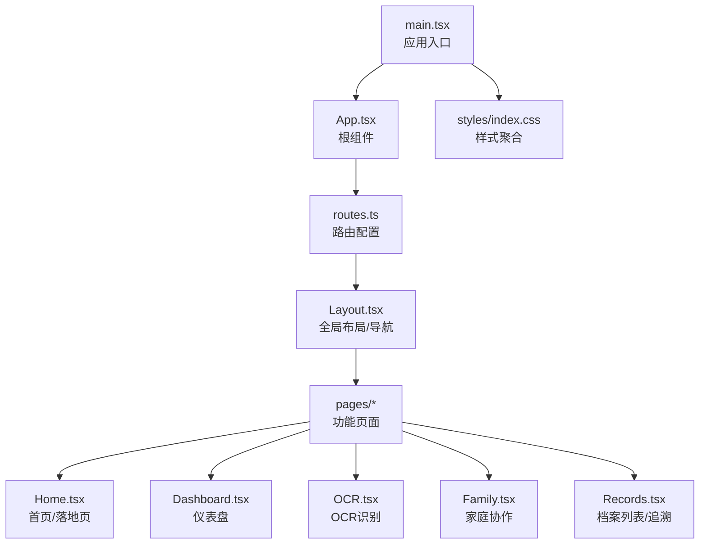
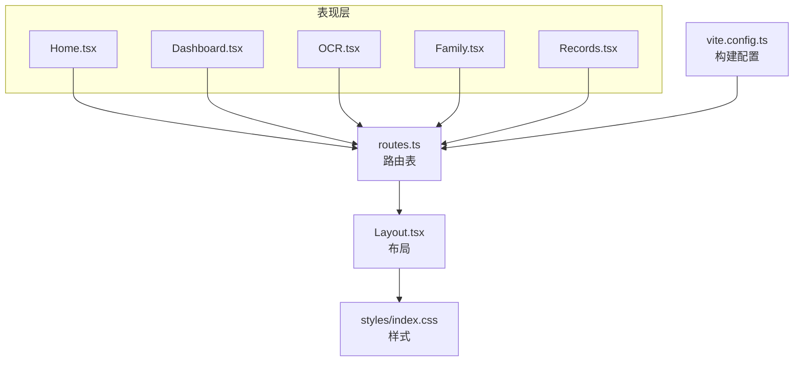
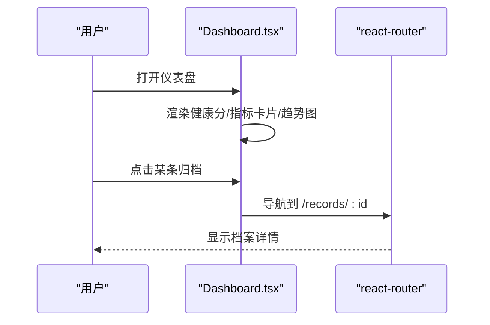
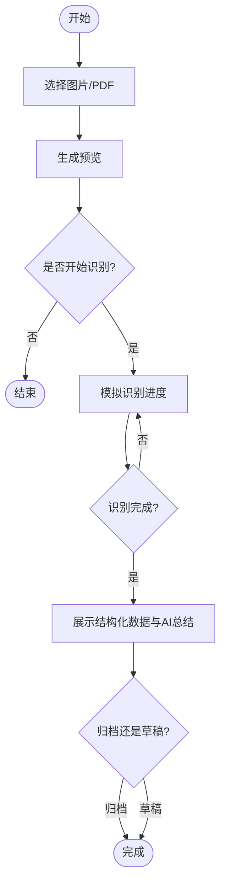
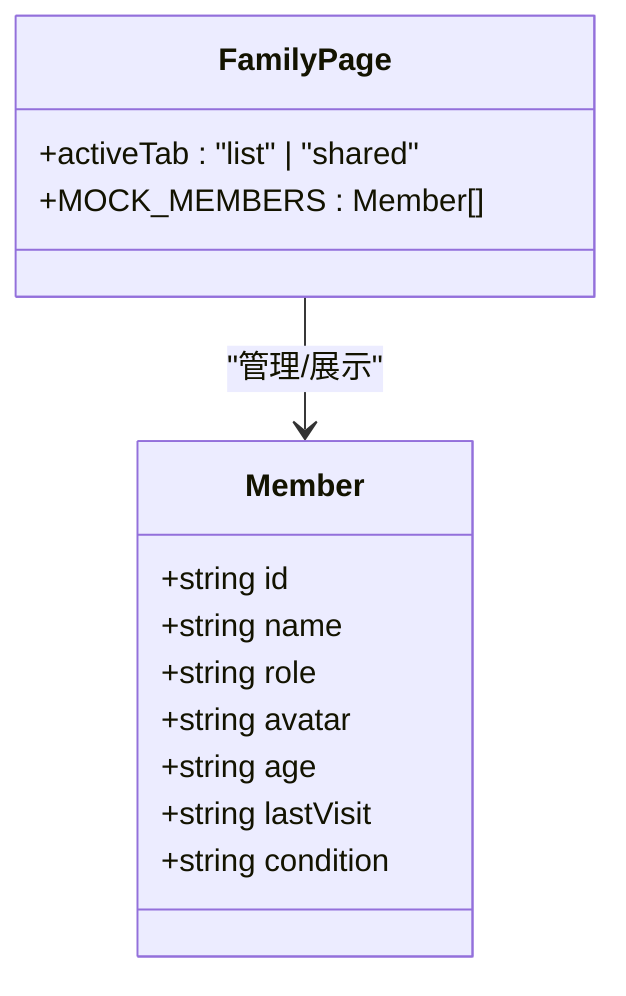
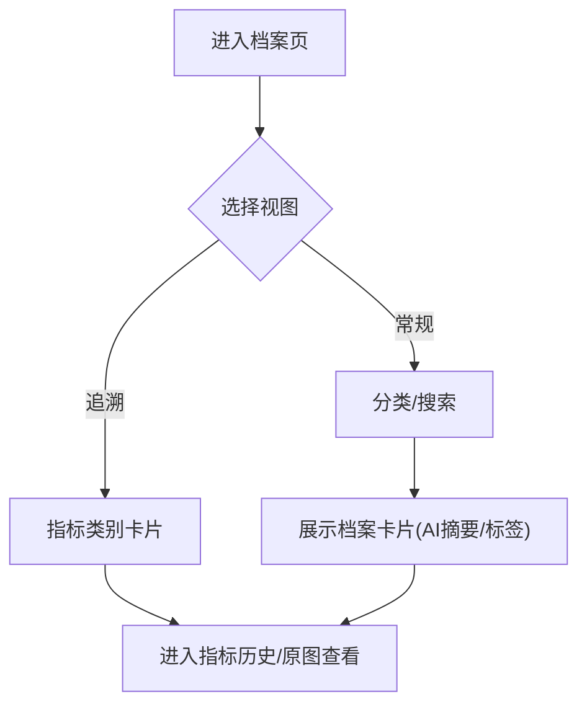
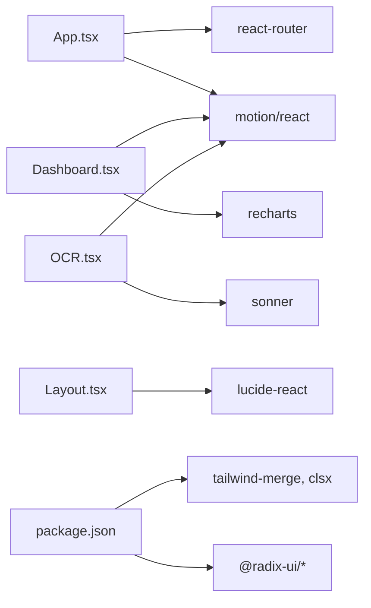

# 项目概述

<cite>
**本文引用的文件**
- [README.md](file://figma-ui/README.md)
- [package.json](file://figma-ui/package.json)
- [vite.config.ts](file://figma-ui/vite.config.ts)
- [main.tsx](file://figma-ui/src/main.tsx)
- [App.tsx](file://figma-ui/src/app/App.tsx)
- [routes.ts](file://figma-ui/src/app/routes.ts)
- [Layout.tsx](file://figma-ui/src/app/components/Layout.tsx)
- [Home.tsx](file://figma-ui/src/app/pages/Home.tsx)
- [Dashboard.tsx](file://figma-ui/src/app/pages/Dashboard.tsx)
- [OCR.tsx](file://figma-ui/src/app/pages/OCR.tsx)
- [Family.tsx](file://figma-ui/src/app/pages/Family.tsx)
- [Records.tsx](file://figma-ui/src/app/pages/Records.tsx)
- [index.css](file://figma-ui/src/styles/index.css)
- [需求.md](file://figma-ui/src/imports/需求.md)
</cite>

## 目录
1. [简介](#简介)
2. [项目结构](#项目结构)
3. [核心组件](#核心组件)
4. [架构总览](#架构总览)
5. [详细组件分析](#详细组件分析)
6. [依赖关系分析](#依赖关系分析)
7. [性能与体验考量](#性能与体验考量)
8. [故障排查指南](#故障排查指南)
9. [结论](#结论)
10. [附录：快速开始](#附录快速开始)

## 简介
医案通是一个面向个人与家庭的医疗档案网站，致力于将分散的病历、检验报告、影像检查、处方等医疗资料进行集中管理、结构化整理与安全分享。通过 OCR 智能识别与 AI 辅助理解，帮助用户把“存下来”的资料变成“真正能用起来”的健康资产；同时提供健康指标趋势展示、用药提醒与家庭协作能力，满足长期健康管理、代管陪诊与跨代照护等真实场景。

本项目采用 React + TypeScript + Vite + Tailwind CSS 的现代前端技术栈，结合 Radix UI、Recharts、Motion 等生态库，构建出高可用、易扩展、可维护的前端应用。

**章节来源**
- [README.md:1-11](file://figma-ui/README.md#L1-L11)
- [package.json:1-101](file://figma-ui/package.json#L1-L101)

## 项目结构
项目为单页应用（SPA），入口位于 src/main.tsx，挂载根组件 App，并通过 react-router 进行路由分发。页面按功能模块组织在 src/app/pages 下，通用布局与导航由 src/app/components/Layout.tsx 提供，样式通过 src/styles/index.css 统一引入。

**图表来源**
- [main.tsx:1-7](file://figma-ui/src/main.tsx#L1-L7)
- [App.tsx:1-12](file://figma-ui/src/app/App.tsx#L1-L12)
- [routes.ts:1-106](file://figma-ui/src/app/routes.ts#L1-L106)
- [Layout.tsx:1-251](file://figma-ui/src/app/components/Layout.tsx#L1-L251)
- [index.css:1-4](file://figma-ui/src/styles/index.css#L1-L4)

**章节来源**
- [main.tsx:1-7](file://figma-ui/src/main.tsx#L1-L7)
- [App.tsx:1-12](file://figma-ui/src/app/App.tsx#L1-L12)
- [routes.ts:1-106](file://figma-ui/src/app/routes.ts#L1-L106)
- [Layout.tsx:1-251](file://figma-ui/src/app/components/Layout.tsx#L1-L251)
- [index.css:1-4](file://figma-ui/src/styles/index.css#L1-L4)

## 核心组件
- 应用入口与路由
  - main.tsx 负责创建 React 根节点并渲染 App。
  - App.tsx 包裹 RouterProvider，启用路由与全局上下文（如启动提示）。
  - routes.ts 使用 createHashRouter 定义所有页面路由，包括首页、仪表盘、搜索、上传、分享、设置、档案详情、指标历史、文档查看、登录与下载页等。
- 全局布局
  - Layout.tsx 提供顶部导航、移动端菜单、滚动吸顶效果与底部信息区，承载各子页面内容。
- 页面模块
  - Home.tsx 聚合首页各区块（Hero、Why、Solution、Features、Scenarios、Principles、Privacy、TargetAudience、CTA）。
  - Dashboard.tsx 展示健康概览、指标趋势、最近归档与快捷操作。
  - OCR.tsx 实现图片/PDF 上传预览、扫描进度模拟、结构化结果展示与归档操作。
  - Family.tsx 支持家庭成员列表、共享权限管理与二维码共享。
  - Records.tsx 提供档案分类筛选、搜索、AI 摘要展示与“指标追溯”视图切换。

**章节来源**
- [main.tsx:1-7](file://figma-ui/src/main.tsx#L1-L7)
- [App.tsx:1-12](file://figma-ui/src/app/App.tsx#L1-L12)
- [routes.ts:1-106](file://figma-ui/src/app/routes.ts#L1-L106)
- [Layout.tsx:1-251](file://figma-ui/src/app/components/Layout.tsx#L1-L251)
- [Home.tsx:1-43](file://figma-ui/src/app/pages/Home.tsx#L1-L43)
- [Dashboard.tsx:1-204](file://figma-ui/src/app/pages/Dashboard.tsx#L1-L204)
- [OCR.tsx:1-270](file://figma-ui/src/app/pages/OCR.tsx#L1-L270)
- [Family.tsx:1-224](file://figma-ui/src/app/pages/Family.tsx#L1-L224)
- [Records.tsx:1-421](file://figma-ui/src/app/pages/Records.tsx#L1-L421)

## 架构总览
整体采用典型的前端 SPA 分层：
- 表现层：React 组件与页面（pages/*）
- 路由层：react-router 哈希路由（createHashRouter）
- 布局层：Layout 提供统一导航与页脚
- 样式层：Tailwind CSS + 自定义主题与字体
- 工具与状态：motion/react、recharts、sonner、radix-ui 等

**图表来源**
- [routes.ts:1-106](file://figma-ui/src/app/routes.ts#L1-L106)
- [Layout.tsx:1-251](file://figma-ui/src/app/components/Layout.tsx#L1-L251)
- [index.css:1-4](file://figma-ui/src/styles/index.css#L1-L4)
- [vite.config.ts:1-30](file://figma-ui/vite.config.ts#L1-L30)

## 详细组件分析

### 仪表盘（Dashboard）
- 功能要点
  - 欢迎信息与健康分展示
  - 搜索框用于快速定位报告、医院或科室
  - 血压、血糖等关键指标的卡片化呈现与迷你趋势图
  - 主区域健康指标趋势折线图
  - 最近归档记录列表，点击跳转至详情页
  - 复诊提醒与待服药物卡片
- 交互流程
  - 用户进入仪表盘后，系统根据当前成员信息渲染个性化问候与提醒
  - 点击归档条目跳转到 /records/:id 查看详情
  - 指标趋势通过 Recharts 渲染，支持时间范围选择

**图表来源**
- [Dashboard.tsx:1-204](file://figma-ui/src/app/pages/Dashboard.tsx#L1-L204)
- [routes.ts:77-80](file://figma-ui/src/app/routes.ts#L77-L80)

**章节来源**
- [Dashboard.tsx:1-204](file://figma-ui/src/app/pages/Dashboard.tsx#L1-L204)
- [routes.ts:77-80](file://figma-ui/src/app/routes.ts#L77-L80)

### OCR 智能识别（OCR）
- 功能要点
  - 支持从相册选择或上传 PDF
  - 图片预览与扫描进度动画
  - 模拟 OCR 识别过程，输出结构化字段与 AI 总结
  - 支持存入草稿或直接确认归档
- 处理流程
  - 选择文件 -> 生成预览 -> 触发扫描 -> 进度更新 -> 展示结果 -> 归档/草稿

**图表来源**
- [OCR.tsx:1-270](file://figma-ui/src/app/pages/OCR.tsx#L1-L270)

**章节来源**
- [OCR.tsx:1-270](file://figma-ui/src/app/pages/OCR.tsx#L1-L270)

### 家庭协作（Family）
- 功能要点
  - 成员列表展示基本信息、最近就诊与健康提示
  - 共享权限管理，支持二维码与共享密码
  - 受邀查看者与管理员角色区分
- 交互要点
  - 切换“成员列表/共享权限”标签页
  - 添加新成员或扫码绑定
  - 复制共享密码、更新二维码

**图表来源**
- [Family.tsx:1-224](file://figma-ui/src/app/pages/Family.tsx#L1-L224)

**章节来源**
- [Family.tsx:1-224](file://figma-ui/src/app/pages/Family.tsx#L1-L224)

### 档案列表与指标追溯（Records）
- 功能要点
  - 常规模式：档案分类筛选、关键词搜索、AI 摘要、标签展示
  - 指标追溯模式：按类别聚合历史指标，展示趋势与异动提示
  - 视图切换按钮带动画过渡
- 业务价值
  - 帮助患者与家属快速定位历史资料，追踪指标变化，辅助复诊决策

**图表来源**
- [Records.tsx:1-421](file://figma-ui/src/app/pages/Records.tsx#L1-L421)
- [routes.ts:77-88](file://figma-ui/src/app/routes.ts#L77-L88)

**章节来源**
- [Records.tsx:1-421](file://figma-ui/src/app/pages/Records.tsx#L1-L421)
- [routes.ts:77-88](file://figma-ui/src/app/routes.ts#L77-L88)

### 首页与产品说明（Home）
- 功能要点
  - 聚合 Hero、Why、Solution、Features、Scenarios、Principles、Privacy、TargetAudience、CTA 等区块
  - 支持平滑滚动到指定锚点
- 业务价值
  - 清晰传达产品价值、核心功能与隐私安全原则，引导用户注册体验

**章节来源**
- [Home.tsx:1-43](file://figma-ui/src/app/pages/Home.tsx#L1-L43)

## 依赖关系分析
- 运行时依赖
  - React/ReactDOM 作为 UI 框架基础
  - react-router 提供客户端路由
  - recharts 用于健康指标可视化
  - motion/react 提供流畅动画与过渡
  - sonner 用于轻量级通知
  - lucide-react 图标库
  - tailwind-merge、clsx 用于样式合并与条件类名
  - @radix-ui/* 系列提供无障碍基础组件
- 开发依赖
  - vite 构建工具
  - @vitejs/plugin-react 与 @tailwindcss/vite 插件
  - tailwindcss 样式引擎

**图表来源**
- [package.json:14-82](file://figma-ui/package.json#L14-L82)
- [App.tsx:1-12](file://figma-ui/src/app/App.tsx#L1-L12)
- [Dashboard.tsx:1-204](file://figma-ui/src/app/pages/Dashboard.tsx#L1-L204)
- [OCR.tsx:1-270](file://figma-ui/src/app/pages/OCR.tsx#L1-L270)
- [Layout.tsx:1-251](file://figma-ui/src/app/components/Layout.tsx#L1-L251)

**章节来源**
- [package.json:14-82](file://figma-ui/package.json#L14-L82)

## 性能与体验考量
- 构建与资源
  - 使用 Vite 进行快速开发与构建，支持按需加载与热更新
  - 通过 alias “@” 简化路径引用，提升可维护性
- 渲染与动画
  - 合理使用 motion/react 控制入场/退出动画，避免过度重绘
  - 图表使用 recharts 的 ResponsiveContainer 自适应容器尺寸
- 样式与主题
  - 基于 Tailwind CSS 原子化样式，配合 theme.css 统一管理主题变量
  - 通过 index.css 聚合字体、主题与 Tailwind 配置
- 用户体验
  - 导航栏滚动吸顶与移动端菜单，提升多端可用性
  - 表单与反馈：使用 sonner 提供即时操作反馈

[本节为通用指导，不直接分析具体代码文件]

## 故障排查指南
- 常见问题定位
  - 路由无法访问：检查 routes.ts 中对应 path 是否已注册，以及浏览器地址是否正确携带 #/ 前缀（哈希路由）
  - 样式未生效：确认 styles/index.css 已在 main.tsx 中引入，且 Tailwind 插件在 vite.config.ts 中正确启用
  - 图表不显示：检查 recharts 容器是否有明确宽高，并确保数据格式符合预期
  - 动画卡顿：减少复杂动画层级，必要时拆分组件或使用更轻量的过渡
- 调试建议
  - 使用浏览器开发者工具 Network 面板检查静态资源加载
  - 在关键页面增加日志输出（如 OCR 识别阶段、归档提交阶段）
  - 利用 React DevTools 检查组件状态与 props 传递

[本节为通用指导，不直接分析具体代码文件]

## 结论
医案通以现代前端技术栈构建了覆盖个人与家庭医疗健康管理的完整前端方案。通过 OCR 智能识别、结构化整理、指标趋势可视化与家庭协作能力，有效回应了医疗健康领域的数字化管理需求。项目具备良好的可扩展性与可维护性，适合持续迭代与功能增强。

[本节为总结性内容，不直接分析具体代码文件]

## 附录：快速开始
- 环境要求
  - Node.js 版本：20（见 engines 字段）
- 安装与运行
  - 安装依赖：npm i
  - 启动开发服务器：npm run dev
  - 构建与预览：npm run build / npm run preview
- 本地访问
  - 默认端口由 Vite 提供，可在浏览器访问 http://localhost:端口
- 部署说明
  - 支持 ESA Pages 或 GitHub Pages（子路径可通过环境变量 VITE_BASE_URL 配置）
  - 构建产物位于 dist 目录，可直接部署静态托管服务

**章节来源**
- [README.md:6-11](file://figma-ui/README.md#L6-L11)
- [package.json:6-12](file://figma-ui/package.json#L6-L12)
- [vite.config.ts:9-13](file://figma-ui/vite.config.ts#L9-L13)